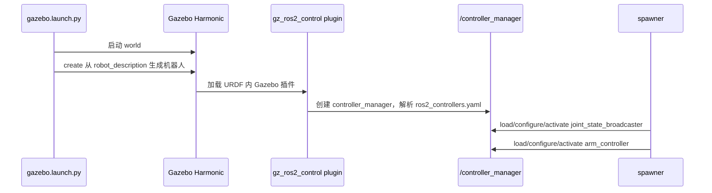
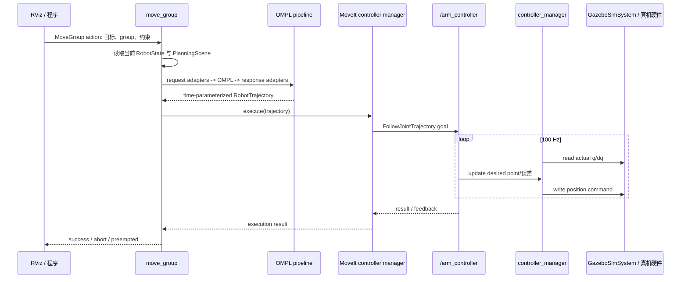
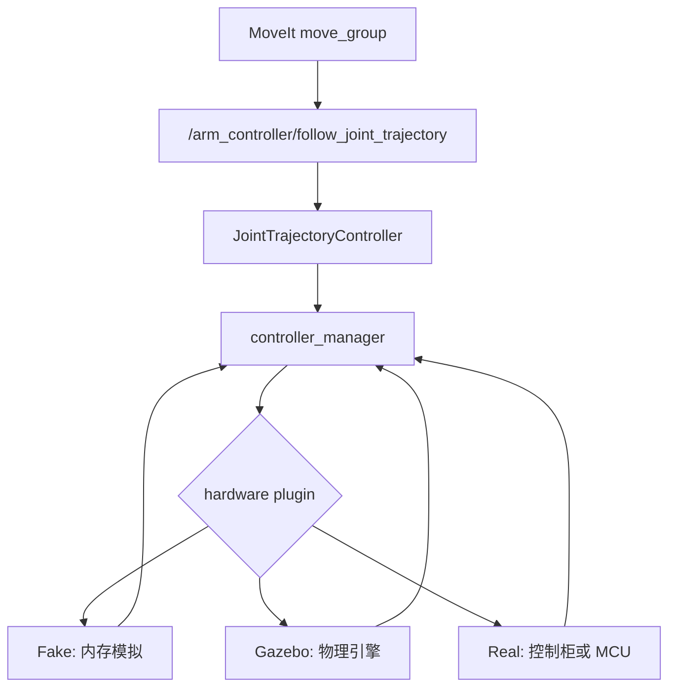
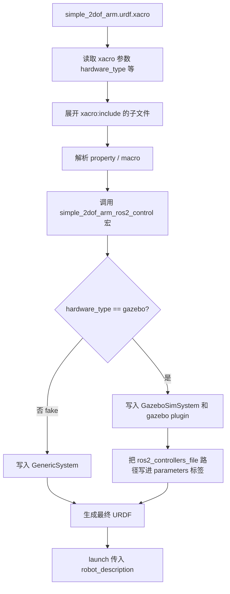
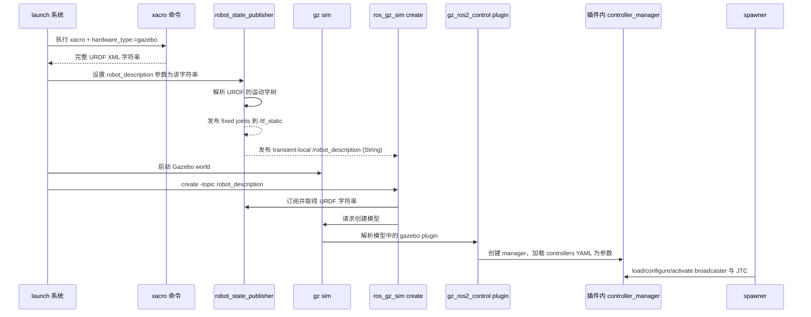
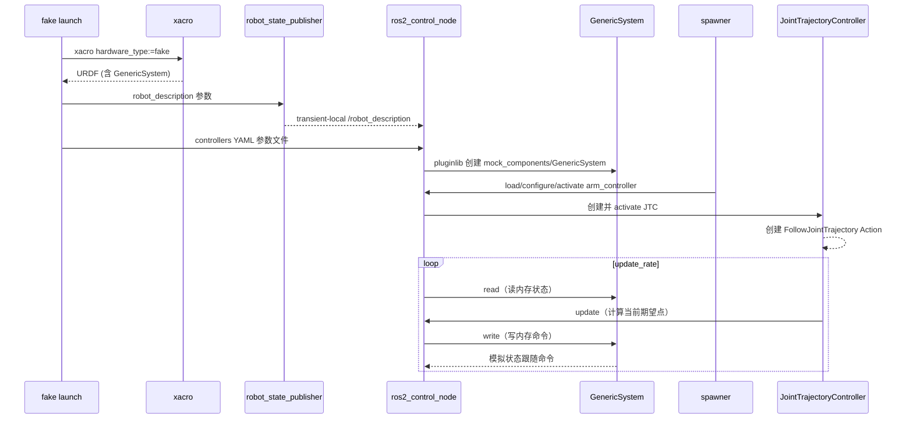
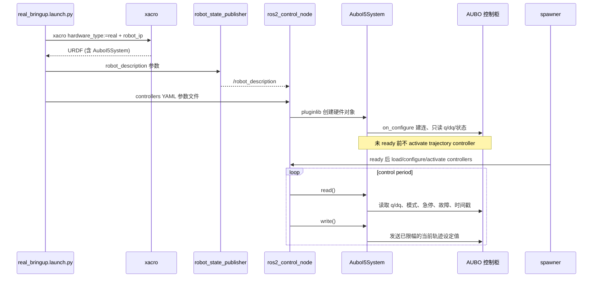

# MoveIt 与 ros2_control 加载执行全流程

> [!abstract] 先记住结论
> **MoveIt 不加载也不控制电机；ros2_control 不做碰撞规划；Gazebo 不做路径规划。**
> - MoveIt 的 `move_group` 读取模型与配置，按“前处理 -> 规划器 -> 后处理”规划，再把轨迹交给执行管理器。
> - `moveit_simple_controller_manager` 只是把 MoveIt 的轨迹映射到某个 ROS Action 名字。
> - `controller_manager` 加载真正的 ros2_control 控制器；`JointTrajectoryController` 才接收 action、按时间执行轨迹。
> - `gz_ros2_control` 是硬件接口，负责把 controller 命令写进 Gazebo、把 Gazebo 状态读回。

本章直接对应当前二维臂的文件：

```text
simple_arm_gazebo/launch/demo_gazebo.launch.py
  ├─ simple_arm_gazebo/launch/gazebo.launch.py
  └─ move_group + RViz

simple_arm_moveit_config/config/
  ├─ simple_2dof_arm.urdf.xacro           # 模型 + ros2_control 宏
  ├─ simple_2dof_arm.srdf                 # planning group / end effector
  ├─ kinematics.yaml                      # IK 插件
  ├─ ompl_planning.yaml                   # planner 与 pipeline 参数
  ├─ moveit_controllers.yaml              # MoveIt 到 action 的映射
  ├─ ros2_controllers.yaml                # 真正的 ros2_control controller
  └─ joint_limits.yaml                    # MoveIt 约束
```

## 1. 两套“控制器”不要混淆

| 名称                                 | 位于哪里                   | 负责什么                                               | 是否真的控制关节    |
| ---------------------------------- | ---------------------- | -------------------------------------------------- | ----------- |
| `moveit_simple_controller_manager` | `move_group` 内         | 根据轨迹关节名选择 controller action client                 | 否，只是客户端/映射表 |
| `JointTrajectoryController`        | `controller_manager` 内 | 接收 FollowJointTrajectory，按时间采样并写 command interface | 是           |
| `JointStateBroadcaster`            | `controller_manager` 内 | 将 state interface 广播为 joint states                 | 否，只发布状态     |
| `gz_ros2_control::GazeboSimSystem` | Gazebo 插件              | 仿真硬件 read/write                                    | 是，作为仿真后端    |
| `SystemInterface`                  | 真机硬件插件                 | 控制柜/MCU read/write                                 | 是，作为真机后端    |

因此“MoveIt 加载 controller”这句话并不准确。MoveIt 加载的是**控制器管理器插件和 action 映射**；真正被 load/configure/activate 的控制器属于 ros2_control 的 `controller_manager`。

## 2. 当前 demo 启动时发生的事情

执行：

```bash
ros2 launch simple_arm_gazebo demo_gazebo.launch.py
```

`demo_gazebo.launch.py` 完成两件并行工作：包含 `gazebo.launch.py`，并启动 `move_group`、RViz。它会用 Xacro 命令展开 `simple_2dof_arm.urdf.xacro`，关键参数为：

```text
hardware_type:=gazebo
use_world_joint:=true
initial_positions_file:=.../initial_positions.yaml
ros2_controllers_file:=.../ros2_controllers.yaml
```

`hardware_type:=gazebo` 让 `simple_2dof_arm.ros2_control.xacro` 生成：

```xml
<hardware>
  <plugin>gz_ros2_control/GazeboSimSystem</plugin>
</hardware>
<gazebo>
  <plugin filename="gz_ros2_control-system"
          name="gz_ros2_control::GazeboSimROS2ControlPlugin">
    <parameters>.../ros2_controllers.yaml</parameters>
  </plugin>
</gazebo>
```

接下来 `gazebo.launch.py` 的顺序是：



当前 launch 用 `TimerAction(period=5.0)` 再启动两个 `spawner`，防止 controller manager 尚未创建就调用服务。它是简便办法；生产 launch 建议用进程/服务就绪事件而不是固定等待时间。

## 3. ros2_control 如何加载硬件和控制器

### 3.1 URDF：声明“硬件能提供什么接口”

在 `simple_2dof_arm.ros2_control.xacro` 中，每个 joint 声明：

```xml
<joint name="joint1">
  <command_interface name="position"/>
  <state_interface name="position"/>
  <state_interface name="velocity"/>
</joint>
```

含义不是启动 controller，而是向 hardware component 说明：上层可以向 joint1 写 position 目标，且可读 position/velocity 反馈。Gazebo 插件解析后向 `controller_manager` 导出这些 interface。

验证：

```bash
ros2 control list_hardware_components
ros2 control list_hardware_interfaces
```

预期先看到 `joint1/position`、`joint2/position` 等 state/command interface。若这里都不存在，问题在 URDF/Xacro/硬件插件，**还没有到 YAML/controller 的层次**。

### 3.2 YAML：声明“要加载哪个 controller、它占用哪些接口”

`ros2_controllers.yaml` 分两层：

```yaml
controller_manager:
  ros__parameters:
    update_rate: 100
    joint_state_broadcaster:
      type: joint_state_broadcaster/JointStateBroadcaster
    arm_controller:
      type: joint_trajectory_controller/JointTrajectoryController

arm_controller:
  ros__parameters:
    joints: [joint1, joint2]
    command_interfaces: [position]
    state_interfaces: [position, velocity]
```

第一段告诉 manager：“存在名为 `arm_controller` 的 plugin，类类型是 `joint_trajectory_controller/JointTrajectoryController`。”第二段才给这个 controller 自己参数。这里的 `type` 由 pluginlib 动态加载；它不是 CMake target 名字。

### 3.3 生命周期：load、configure、activate

controller 的典型状态为 `unconfigured -> inactive -> active`：

1. **load**：manager 用 pluginlib 创建 controller 对象。
2. **configure**：读取 YAML 参数，检查 joint/interface 是否存在。
3. **activate**：claim command interfaces，开始进入每个 control cycle 的 update。

`spawner` 默认依次完成这些步骤：

```bash
ros2 run controller_manager spawner joint_state_broadcaster \
  --controller-manager /controller_manager
ros2 run controller_manager spawner arm_controller \
  --controller-manager /controller_manager
```

观察状态和接口 claim：

```bash
ros2 control list_controllers
ros2 control list_hardware_interfaces
```

预期 `joint_state_broadcaster`、`arm_controller` 为 `active`；`joint1/position` command interface 显示被 `arm_controller` claimed。若 `arm_controller` active 失败，常见原因是 joint 名不一致、请求 velocity 接口但硬件只导出了 position、controller 插件未安装。

### 3.4 每一个控制周期

当 controller 已 active，manager 按 `update_rate=100` Hz 做：

```text
hardware.read()             # Gazebo 读 q/dq；真机读编码器/控制柜
controller_manager.update() # broadcaster 发布状态；JTC 按当前时刻采样轨迹
hardware.write()            # JTC 的 position command 写到 Gazebo/真机
```

JTC 收到一个 trajectory 并不会“一次性把所有点交给 Gazebo”。它保存轨迹，在每个周期用当前时间插值/采样产生当前 setpoint，持续比较反馈误差，直到 goal tolerance 达成、超时或被取消。

## 4. MoveIt 的模型和插件加载

`move_group` 启动时不扫描磁盘猜配置；launch 将一组 ROS parameters 传给它。当前使用：

```python
moveit_config = (
  MoveItConfigsBuilder("simple_2dof_arm", package_name="simple_arm_moveit_config")
  .planning_pipelines(default_planning_pipeline="ompl", pipelines=["ompl"])
  .to_moveit_configs()
)

Node(... executable="move_group",
     parameters=[moveit_config.to_dict(), gazebo_robot_description,
                 OMPL_PARAMETERS, {"use_sim_time": True}])
```

参数来源与用途：

| 参数组 | 主要来源 | move_group 用途 |
|---|---|---|
| `robot_description` | Xacro 展开 | link/joint/limit/碰撞几何 |
| `robot_description_semantic` | SRDF | group、tip、禁用碰撞对、默认姿态 |
| `robot_description_kinematics` | kinematics.yaml | 为 group 加载 KDL/其他 IK plugin |
| `robot_description_planning` | joint_limits.yaml | 速度/加速度等规划约束 |
| planning pipeline | ompl_planning.yaml 或 `OMPL_PARAMETERS` | plugin、planner、adapter |
| controller manager | moveit_controllers.yaml | 轨迹由哪个 action 执行 |

> [!warning] 当前代码中的配置优先级
> 当前多个 launch 在 Python 中定义 `OMPL_PARAMETERS`，并将其作为后面的 parameters 传入。ROS 2 同名参数以后面的字典为准，因此它会覆盖 `ompl_planning.yaml` 中同名项。学习时推荐只保留一个真源：要么删掉 Python 重复字典并加载 YAML，要么明确把 Python 字典当作唯一配置；否则改 YAML 后“没有任何变化”会非常困惑。

## 5. 规划管线：前处理、规划器、后处理

你当前的 `OMPL_PARAMETERS` 给 `ompl` pipeline 配置了三个阶段：


### 5.1 前处理：request adapters

当前顺序为：

1. `ResolveConstraintFrames`：将约束表达在统一参考坐标。
2. `ValidateWorkspaceBounds`：目标/工作空间是否合法。
3. `CheckStartStateBounds`：当前关节状态是否超过 limit。
4. `CheckStartStateCollision`：起始姿态是否自碰撞/环境碰撞。

这些 adapter 在调用 OMPL **之前**执行。某些标准配置还会加入 `FixWorkspaceBounds`、`FixStartStateBounds`、`FixStartStateCollision`、`FixStartStatePathConstraints` 等“尝试修复” adapter；教学阶段先用 Check 更安全，因为它明确拒绝问题状态而不悄悄篡改起点。

### 5.2 规划器：OMPLPlanner

参数：

```yaml
planning_plugins: [ompl_interface/OMPLPlanner]
planner_configs:
  RRTConnectkConfigDefault:
    type: geometric::RRTConnect
arm:
  default_planner_config: RRTConnectkConfigDefault
```

加载关系：pipeline `ompl` 通过 pluginlib 加载 `ompl_interface/OMPLPlanner`；该 plugin 根据 `arm.default_planner_config` 为 planning group `arm` 选择 `geometric::RRTConnect`。`range: 0.0` 通常表示由 OMPL 自动估计范围。

如何实验切换：先只改 group 默认项为 `RRTkConfigDefault`，重新 build/source，重新启动 move_group，重复相同起终点 20 次并记录成功率、规划时间、路径长度。采样规划具有随机性，单次结果不能下结论。RRTConnect 常适合快速找到可行路径；RRTstar 更关注渐近最优，规划时间通常更长；PRM 可用于多次查询同一静态场景。

### 5.3 后处理：response adapters

当前顺序：

1. `AddTimeOptimalParameterization`：为只有几何路径的点列增加时间、速度、加速度信息；它受 joint limit 约束。
2. `ValidateSolution`：再次检查解是否满足条件/碰撞。
3. `DisplayMotionPath`：发布显示用路径供 RViz 查看。

重要：后处理没有把“任何路径”变成物理可执行轨迹。若真机有扭矩、jerk、柔顺、通信延迟限制，还需更严格的 time parameterization/控制器限制/驱动器限制。

## 6. MoveIt 如何选择并调用轨迹执行器

`moveit_controllers.yaml` 不是 ros2_control YAML，它运行在 MoveIt 一侧：

```yaml
moveit_controller_manager: moveit_simple_controller_manager/MoveItSimpleControllerManager
moveit_simple_controller_manager:
  controller_names: [arm_controller]
  arm_controller:
    type: FollowJointTrajectory
    joints: [joint1, joint2]
    action_ns: follow_joint_trajectory
    default: true
```

解析规则：controller 的 ROS 名称是 `arm_controller`，action namespace 是 `follow_joint_trajectory`，完整 action 名是：

```text
/arm_controller/follow_joint_trajectory
```

当 MoveIt 得到轨迹，它用轨迹 joint names 匹配上表中的 controller；选择 `default: true` 的 controller 后，作为 Action client 向完整 action 名发送 `control_msgs/action/FollowJointTrajectory` goal。`JointTrajectoryController` 就是这个 action 的 Action server。

验证双方是否匹配：

```bash
ros2 action list -t
ros2 action info /arm_controller/follow_joint_trajectory
ros2 param get /move_group moveit_controller_manager
ros2 control list_controllers
```

若“Plan 成功、Execute 失败”，将问题切为三类：

1. action 不存在：controller 未 spawn/未 active 或 action 名映射错。
2. action 存在但拒绝 goal：joint names/顺序、点的时间递增、limit 或起始状态错误。
3. action 接受但不运动：command interface/hardware write/Gazebo dynamics/反馈链出错。

## 7. 一个完整请求的时序



## 8. 建议你亲自做的“拆开启动”实验

目标是让你不再把一条 launch 当黑盒。每步都执行检查，失败时不要进入下一步。

### 实验 A：只验证硬件接口和 controller

```bash
ros2 launch simple_arm_gazebo gazebo.launch.py
ros2 control list_hardware_components
ros2 control list_hardware_interfaces
ros2 control list_controllers
ros2 action list -t
```

成功条件：硬件 active、两个 controller active、action 存在。然后用 CLI 发一个小幅 `FollowJointTrajectory`；这证明“执行层”独立成立，尚不需要 MoveIt。

### 实验 B：只验证 MoveIt 能加载 pipeline

新终端启动：

```bash
ros2 launch simple_arm_moveit_config move_group.launch.py
ros2 param list /move_group | grep -E 'planning|ompl|kinematics|robot_description'
ros2 param get /move_group default_planning_pipeline
ros2 param get /move_group ompl.planning_plugins
```

日志中应出现 OMPL planner plugin 加载成功、KDL IK plugin 加载成功等信息。这个 launch 不启动 ros2_control，故规划可验证，执行会失败是预期现象。

### 实验 C：fake hardware 下完整拆解

`planning_execution.launch.py` 可以启动 fake hardware 的 controller_manager、move_group、RViz 与 spawner。建议先用：

```bash
ros2 launch simple_arm_moveit_config planning_execution.launch.py \
  use_sim_time:=false use_ros2_control:=true spawn_controllers:=true
```

随后按先 controller 后 MoveIt 的命令检查。它适合隔离 Gazebo 物理/bridge 问题；fake hardware 中 state 会跟随 command，不可用于验证动力学和真实反馈。

### 实验 D：故意制造三种失败

每次只改一个配置，观察日志并恢复：

1. 将 `moveit_controllers.yaml` 的 `action_ns` 改为错误字符串：Plan 成功，Execute 找不到 server。
2. 将 `ros2_controllers.yaml` 的 `joint2` 改为不存在的名字：spawner configure/activate 失败。
3. 将 `kinematics.yaml` 中 IK plugin 类名写错：Pose 目标 IK 不可用；Joint 目标仍可能规划。

将每一类失败的日志、`ros2 control list_controllers`、`ros2 action list -t` 截图写入实验记录。这比背流程有效得多。

## 9. 面试可背诵回答

**问：MoveIt 的规划、前后处理和执行流程是什么？**  
答：`move_group` 根据 URDF、SRDF、joint states 和 planning scene 构造请求；request adapters 在规划前做约束坐标解析、起始状态范围和碰撞检查；planning pipeline 通过 pluginlib 加载 OMPL 等规划器生成几何路径；response adapters 进行时间参数化和解验证；最后 MoveIt 的 controller manager 根据 `moveit_controllers.yaml` 将轨迹发送到对应的 FollowJointTrajectory action。真正按周期执行和闭环跟踪的是 ros2_control 的 JointTrajectoryController，硬件接口再将命令写到 Gazebo 或真机。

**问：ros2_control 的 controller 如何加载？**  
答：URDF 的 ros2_control 标签先声明硬件插件及可用 command/state interfaces；controller_manager 读取 YAML，pluginlib 创建控制器对象；spawner 调用 load、configure、activate 生命周期，active 控制器 claim command interfaces。每个控制周期依次 read 硬件状态、controller update、write 命令。用 `ros2 control list_hardware_interfaces`、`list_controllers` 和 action list 分别验证接口、生命周期和执行入口。

## 10. 同一套 ros2_control 的三种硬件后端

### 10.1 先区分 ROS 1 的 ros_control 与 ROS 2 的 ros2_control

ROS 1 中常称 `ros_control`；本工程运行在 ROS 2 Jazzy，对应实现是 **`ros2_control`**。两者都有硬件抽象、controller manager 和控制器，但插件 API、生命周期、命令和 Gazebo 集成不同。后续所有操作应使用 Jazzy 的 `ros2_control`，不要照搬 ROS 1 的 controller spawner 或 Gazebo Classic 插件。

无论后端是什么，上层执行链不变：

```text
MoveIt 规划 RobotTrajectory
  -> moveit_simple_controller_manager 选择 action
  -> /arm_controller/follow_joint_trajectory
  -> JointTrajectoryController
  -> joint1/position、joint2/position 等 command interface
  -> 不同 hardware plugin
```

也就是说，`JointTrajectoryController`、MoveIt action 映射、`ros2_controllers.yaml` 尽量保持不变；变的是最后的 hardware plugin：命令写去哪里，状态从哪里读回来。



### 10.2 Fake hardware：先验证软件闭环

当前 Xacro 设置 `hardware_type:=fake` 时会选择：

```xml
<hardware>
  <plugin>mock_components/GenericSystem</plugin>
</hardware>
```

`GenericSystem` 是内存中的模拟硬件：控制器写 position command 后，内部状态会模拟反馈。它没有重力、碰撞、质量、摩擦、接触、相机、雷达和网络延迟。它的目标是快速验证 URDF/SRDF、IK、MoveIt、joint name、controller action 和轨迹时间字段。

Fake 没有 Gazebo，因此由 launch 显式创建 controller manager：

```python
Node(
  package="controller_manager",
  executable="ros2_control_node",
  parameters=[robot_description, ros2_controllers_yaml],
)
```

当前 `simple_arm_moveit_config/launch/planning_execution.launch.py` 就是这个模式。启动和检查：

```bash
ros2 launch simple_arm_moveit_config planning_execution.launch.py \
  use_sim_time:=false use_ros2_control:=true spawn_controllers:=true
ros2 control list_hardware_components
ros2 control list_hardware_interfaces
ros2 control list_controllers
ros2 action list -t
```

预期看到 GenericSystem、active 的 `joint_state_broadcaster` 与 `arm_controller`、以及 FollowJointTrajectory action。Fake 的 action 成功只证明软件配置闭环，**不证明真机到位或动力学正确**。

### 10.3 Gazebo Sim：将硬件接口接到物理引擎

当 `hardware_type:=gazebo`，当前 Xacro 会同时生成两部分：

```xml
<hardware>
  <plugin>gz_ros2_control/GazeboSimSystem</plugin>
</hardware>
<gazebo>
  <plugin filename="gz_ros2_control-system"
          name="gz_ros2_control::GazeboSimROS2ControlPlugin">
    <parameters>.../ros2_controllers.yaml</parameters>
  </plugin>
</gazebo>
```

两者不要混淆：`GazeboSimSystem` 是 controller manager 看见的 hardware interface；`GazeboSimROS2ControlPlugin` 是 Gazebo 在创建模型时加载的插件。它负责在 Gazebo 进程中创建/托管 controller manager，并解析 controller YAML。

因此 Gazebo 模式的启动顺序是：Gazebo 启动世界 -> create 根据 robot_description 生成模型 -> Gazebo 加载 URDF 中的 plugin -> plugin 创建 controller manager -> spawner load/configure/activate 控制器。当前 `simple_arm_gazebo/gazebo.launch.py` 的 5 秒 TimerAction 正是等待这一过程完成。

**Gazebo 下不要再额外启动 `ros2_control_node` 控制同一模型。** 否则会形成两个 `/controller_manager` 或接口竞争。正确验证方法：

```bash
ros2 launch simple_arm_gazebo gazebo.launch.py
# 等待当前 5 秒 spawner 延迟
ros2 control list_hardware_components
ros2 control list_controllers
ros2 topic echo /clock --once
ros2 topic echo /joint_states --once
```

Gazebo 比 Fake 多验证了惯量、重力、接触、摩擦、碰撞和传感器，但仍不能代表真实电机、控制柜延迟、线缆、磨损或地面打滑。Gazebo 相关节点必须 `use_sim_time:=true`，而 Fake/真机通常为 false。

#### 10.3.1 逐行回答：`<parameters>` 到底做了什么？

以你的代码为例：

```xml
<gazebo>
  <plugin filename="gz_ros2_control-system"
          name="gz_ros2_control::GazeboSimROS2ControlPlugin">
    <parameters>${ros2_controllers_file}</parameters>
  </plugin>
</gazebo>
```

把它理解成下面这条因果链，而不是“YAML 直接生成控制器”：

```text
1. xacro 展开 ${ros2_controllers_file}
   -> 得到真实 YAML 路径，例如 .../config/ros2_controllers.yaml

2. Gazebo create 机器人模型
   -> Gazebo 发现 <gazebo><plugin ...> 标签
   -> 动态加载 GazeboSimROS2ControlPlugin

3. 该 plugin 在 Gazebo 进程中
   -> 解析 <ros2_control> 标签，创建 GazeboSimSystem 硬件接口
   -> 自己创建一个 controller_manager（等价职责，不是外部 ros2_control_node 进程）
   -> 将 <parameters> 指向的 YAML 作为 controller_manager 的 ROS 参数文件加载

4. YAML 进入 controller_manager 参数服务器后，只是“注册控制器说明”
   controller_manager.ros__parameters.arm_controller.type
     = joint_trajectory_controller/JointTrajectoryController
   arm_controller.ros__parameters.joints = [joint1, joint2]
   ...

5. 外部 spawner 调用 /controller_manager 服务
   -> load_controller("arm_controller")
   -> configure_controller("arm_controller")
   -> switch_controllers(... activate arm_controller ...)

6. controller_manager 用 pluginlib 实例化 JTC
   -> JTC 读取第 4 步的参数
   -> 检查 joint/interface
   -> claim joint1/position、joint2/position
   -> 创建 /arm_controller/follow_joint_trajectory Action server
```

因此，`<parameters>` 的作用是**把 YAML 参数交给 Gazebo 插件内部创建的 controller_manager**；它不等于调用 `ros2_control_node`，也不等于立刻 activate 控制器。真正使 controller 实例出现并变为 active 的动作是 `spawner`。

当前 `simple_arm_gazebo/launch/gazebo.launch.py` 的这两段就是第 5 步：

```python
joint_state_broadcaster_spawner = Node(
  package="controller_manager", executable="spawner",
  arguments=["joint_state_broadcaster", "--controller-manager", "/controller_manager"],
)
arm_controller_spawner = Node(
  package="controller_manager", executable="spawner",
  arguments=["arm_controller", "--controller-manager", "/controller_manager"],
)
```

它们没有提供 `--param-file`，因为参数文件已经在 `<parameters>` 中由 Gazebo plugin 加载。Fake/真机模式则没有 Gazebo plugin，所以通常在 `ros2_control_node` 的 `parameters=[robot_description, controllers_yaml]` 中加载 YAML；Jazzy 也允许把参数文件通过 spawner 的 `--param-file` 传入，但同一个 controller 的参数只应有一个明确来源。

#### 10.3.2 为什么 Gazebo 模式没有 `ros2_control_node`？

`ros2_control_node` 是 controller_manager 提供的一个“通用外部可执行程序”：它读取 URDF 与 YAML，创建 ResourceManager、hardware plugin 和 controller manager。Fake/真机没有仿真进程替它做这件事，所以要显式启动该 executable。

Gazebo 中的 `GazeboSimROS2ControlPlugin` 已经在 Gazebo 进程内完成同等职责，并把 `GazeboSimSystem` 绑定到 Gazebo joint。因此再启动一个 `ros2_control_node` 不是“多加载一个 controller”，而是为同一机器人创建第二套 manager/hardware，导致服务名冲突、接口被重复 claim 或状态源混乱。

#### 10.3.3 用命令亲眼验证六个阶段

启动前，另开终端按顺序执行：

```bash
# 终端 A：只启动 Gazebo 链路
ros2 launch simple_arm_gazebo gazebo.launch.py

# 终端 B：先看 manager 是否已由 plugin 创建
ros2 node list | grep controller_manager
ros2 service list | grep controller_manager

# TimerAction 后：检查 YAML 已成为参数、controller 已被 spawner 激活
ros2 param list /controller_manager
ros2 param get /controller_manager arm_controller.type
ros2 control list_hardware_interfaces
ros2 control list_controllers
ros2 action list -t | grep follow_joint_trajectory
```

典型预期顺序：先出现 `/controller_manager` 服务；再能读到 `arm_controller.type` 参数；spawner 成功后 `list_controllers` 显示 active；最后才有 `/arm_controller/follow_joint_trajectory` action。若第 2 步失败，检查 Gazebo plugin/Xacro；若参数不存在，检查 `<parameters>` 展开路径和 YAML 语法；若参数存在但 controller inactive，检查 spawner 日志、joint name 与 interface。

> [!warning] Jazzy plugin 文件名
> Jazzy 官方 `gz_ros2_control` 示例使用 `filename="libgz_ros2_control-system.so"`。当前项目写的是 `gz_ros2_control-system`，不同安装/解析环境可能接受不同形式。不要盲目改动；先观察 Gazebo 日志是否成功加载 `GazeboSimROS2ControlPlugin`。若出现“plugin not found”，以本机 Jazzy 包提供的 plugin 文件和官方 Jazzy 文档为准，再统一修正 Xacro。

### 10.4 Real hardware：将硬件接口接到控制柜

真机不使用 Gazebo plugin，应将当前 Xacro 扩展为 `hardware_type:=real`：

```xml
<xacro:if value="${hardware_type == 'real'}">
  <plugin>aubo_i5_hardware/AuboI5System</plugin>
  <param name="robot_ip">${robot_ip}</param>
  <param name="command_timeout_ms">100</param>
</xacro:if>
```

`AuboI5System` 可以是兼容 Jazzy 的厂商硬件插件，或自写的 `hardware_interface::SystemInterface`。它要导出与 Gazebo 相同的关节名和 command/state interface，才能保持 MoveIt 与 controller YAML 不变。

真机没有 Gazebo 托管 manager，所以 launch 需显式启动：

```python
Node(
  package="controller_manager",
  executable="ros2_control_node",
  parameters=[real_robot_description, real_controllers_yaml],
)
```

再用 spawner 加载 controller，但只有硬件处于 ready、急停/保护停正常、真实反馈可信时才允许激活轨迹 controller。

真实硬件插件的生命周期要求：

| 回调 | 应做什么 | 绝不能做什么 |
|---|---|---|
| `on_init` | 读取参数、校验关节顺序、预分配内存 | 使能或运动 |
| `on_configure` | 建连、读状态、检查故障 | 假定零位/发轨迹 |
| `on_activate` | 用当前反馈初始化命令并 hold | 将目标 0 发送导致突跳 |
| `read` | 读 q/dq/故障/模式/时间戳 | 阻塞网络、高频打印 |
| `write` | 检查超时/限位/模式后发命令 | 故障后保持旧命令 |
| `on_deactivate` | 停轨迹、hold、降级通信 | 静默丢弃运动 |

私密 IP、标定偏置和凭据应来自 `.gitignore` 的 `robot.local.yaml`，提交一个不含敏感数据的 `robot.example.yaml` 作为模板。

### 10.5 三种模式加载对照

| 问题 | Fake | Gazebo Sim | 真机 |
|---|---|---|---|
| hardware plugin | `mock_components/GenericSystem` | `gz_ros2_control/GazeboSimSystem` | 厂商插件/`SystemInterface` |
| 谁创建 manager | launch 的 `ros2_control_node` | Gazebo plugin | launch 的 `ros2_control_node` |
| controller YAML | 同一份 | 同一份 | 尽量同一份，可额外收紧真机参数 |
| 状态来自哪里 | 内存模拟 | Gazebo joint/physics | 编码器/控制柜 |
| 命令去哪里 | 内存模拟 | Gazebo joint | 控制柜/MCU |
| `use_sim_time` | false | true | false |
| 最强验证能力 | 配置/Action | 物理模型 | 实际行为与安全 |

### 10.6 推荐迁移路线

1. **Fake**：MoveIt 能规划/执行 20 次 home/ready；验证 SRDF、IK、action、controller joint 名。
2. **Gazebo**：验证 plugin、物理、时间、取消动作、碰撞障碍，且 `/joint_states` 来自 Gazebo feedback。
3. **真机只读**：不激活轨迹 controller，逐轴对照示教器与 ROS q/dq、单位、零位、方向，演练通信超时和急停状态。
4. **真机低速**：用 current state hold，做单轴小幅、短轨迹、TCP/负载验证；记录误差和停止时间。

### 10.7 六个最高频误区

1. Fake 不是 Gazebo；Fake 没有物理引擎。
2. Gazebo plugin 不是 `JointTrajectoryController`；它是硬件桥和 manager 托管者。
3. MoveIt controller YAML 不是 ros2_control controller YAML；前者是 Action 映射，后者加载插件。
4. `robot_state_publisher` 消费 `/joint_states` 并发布 TF，它不制造真实关节反馈。
5. controller active 不等于真机可以运动；仍须检查控制柜模式、急停和保护停。
6. 不能用命令值回填 `/joint_states` 来冒充真实反馈；那会掩盖反向、卡滞和丢命令。

**面试背诵：Fake、Gazebo 和真机是否使用不同控制器？**  
答：上层 MoveIt、JointTrajectoryController 与 controller YAML 尽量不变，变化的是 hardware plugin。Fake 用 GenericSystem 模拟接口，Gazebo 用 gz_ros2_control 接物理引擎，真机用厂商驱动或 SystemInterface 接控制柜。通过统一接口可以依次验证软件配置、物理模型和真实安全行为，降低迁移风险。

## 11. 从 launch 调用 Xacro 到得到 `robot_description` 的全过程

这一节回答另一个常见困惑：`ros2_controllers.yaml` 为什么能出现在 Xacro 中？它不是由 ROS 参数服务器“读进 Xacro”的，而是 **launch 先在本地执行 `xacro` 命令，把文件路径作为命令行参数传进去**；Xacro 再输出一整段 URDF XML 字符串，最后 launch 才将这个字符串赋给各节点的 `robot_description` 参数。

### 11.1 当前代码的入口

在 `simple_arm_gazebo/launch/gazebo.launch.py` 中：

```python
moveit_config_share = FindPackageShare("simple_arm_moveit_config")

robot_description_xacro = PathJoinSubstitution(
  [moveit_config_share, "config", "simple_2dof_arm.urdf.xacro"]
)
initial_positions_file = PathJoinSubstitution(
  [moveit_config_share, "config", "initial_positions.yaml"]
)
ros2_controllers_file = PathJoinSubstitution(
  [moveit_config_share, "config", "ros2_controllers.yaml"]
)
```

这里还没有读取文件内容：

- `FindPackageShare` 在已 source 的环境中查找包的 `share/simple_arm_moveit_config` 安装路径。
- `PathJoinSubstitution` 只是延迟求值的“路径拼接对象”。launch 实际执行时才得到绝对路径。
- 因为使用 `--symlink-install`，这些路径通常指向源码文件；如果改变 install 规则或未重新 source，可能仍指向旧版本。

接着构造一个 shell 命令替换：

```python
robot_description_content = Command([
  FindExecutable(name="xacro"), " ",
  robot_description_xacro, " ",
  "hardware_type:=gazebo", " ",
  "use_world_joint:=true", " ",
  "initial_positions_file:=", initial_positions_file, " ",
  "ros2_controllers_file:=", ros2_controllers_file,
])

robot_description = {
  "robot_description": ParameterValue(robot_description_content, value_type=str)
}
```

Launch 最终运行的命令在概念上等价于：

```bash
xacro /绝对路径/simple_2dof_arm.urdf.xacro \
  hardware_type:=gazebo \
  use_world_joint:=true \
  initial_positions_file:=/绝对路径/initial_positions.yaml \
  ros2_controllers_file:=/绝对路径/ros2_controllers.yaml
```

`Command(...)` 的标准输出是一整段展开后的 URDF XML。`ParameterValue(..., value_type=str)` 强制将该输出作为字符串参数，而不是把它当作 YAML/数字解析。于是 `robot_description` 变成：

```text
robot_description = "<robot name='simple_2dof_arm'> ... 完整 URDF XML ... </robot>"
```

### 11.2 Xacro 在内部如何展开

Xacro 不是运行时节点。它是启动前的一次文本/宏处理器，输入 Xacro 和命令行 key-value，输出纯 URDF。对当前模型可按以下顺序理解：



重点区分四种语法：

| Xacro 写法 | 含义 | 当前项目例子 |
|---|---|---|
| `xacro:include` | 将另一个 Xacro 文件展开到当前位置 | 主 URDF include ros2_control Xacro |
| `xacro:macro` | 定义可复用 XML 模板 | `simple_2dof_arm_ros2_control` |
| `${变量}` | 在 Xacro 展开时替换变量/表达式 | `${ros2_controllers_file}` |
| `xacro:if` | Xacro 展开时按条件保留/删除 XML | `hardware_type == 'gazebo'` |

`simple_2dof_arm.ros2_control.xacro` 中的宏有参数：

```xml
<xacro:macro name="simple_2dof_arm_ros2_control"
  params="name initial_positions_file hardware_type:=fake ros2_controllers_file:=''">
```

主 Xacro 调用它时会把 launch 命令行传入的 `hardware_type`、`initial_positions_file`、`ros2_controllers_file` 继续传递。宏里：

```xml
<xacro:property name="initial_positions"
 value="${xacro.load_yaml(initial_positions_file)['initial_positions']}"/>
```

表示 Xacro 在展开阶段读取 `initial_positions.yaml`，提取 `initial_positions` 字典，并把每个关节的初始值写入最终 URDF 的 state interface。它和 `<parameters>${ros2_controllers_file}</parameters>` 不同：前者是 **Xacro 直接读取 YAML 内容**；后者只把 **YAML 路径字符串** 留给 Gazebo plugin 在随后启动时读取。

### 11.3 最终 URDF 被谁使用

同一段展开后的 XML 会传给多个节点/进程，但用途不同：

| 接收者 | 如何获得 robot_description | 使用目的 |
|---|---|---|
| `robot_state_publisher` | launch parameters | 读取 link/joint 树，消费 joint_states 后发布 TF |
| `ros2_control_node`（Fake/真机） | launch parameters | 解析 ros2_control 标签，创建硬件和 manager |
| Gazebo `create` | `-topic robot_description` | 生成 Gazebo 模型，发现 gazebo plugin |
| `GazeboSimROS2ControlPlugin` | 模型中的 ros2_control/plugin 标签 | 绑定 Gazebo joint、创建 manager |
| `move_group` | launch parameters | 读取模型、关节 limit、碰撞几何 |
| RViz | launch parameters/TF | 显示机器人和规划轨迹 |

因此同一 `robot_description` 必须在 MoveIt、Gazebo 与 robot_state_publisher 中一致。一个常见错误是 Gazebo 使用 `hardware_type:=gazebo` 展开的 URDF，但 MoveIt 使用默认 `fake` 的 URDF；模型外观可能相同，控制插件和初始状态却可能不同。当前 `demo_gazebo.launch.py` 专门构造 `gazebo_robot_description` 并传给 move_group/RViz，就是在避免这种不一致。

### 11.4 手工展开：最重要的调试实验

当 launch 报 Xacro、plugin、路径或 controller 参数错误时，先不要猜。把 launch 中的实际命令复制到终端，手工展开：

```bash
cd ~/manipulator-control/robot_control_ros2
source /opt/ros/jazzy/setup.bash
source install/setup.bash

ros2 run xacro xacro \
  src/simple_arm_moveit_config/config/simple_2dof_arm.urdf.xacro \
  hardware_type:=gazebo \
  use_world_joint:=true \
  initial_positions_file:=$(ros2 pkg prefix simple_arm_moveit_config)/share/simple_arm_moveit_config/config/initial_positions.yaml \
  ros2_controllers_file:=$(ros2 pkg prefix simple_arm_moveit_config)/share/simple_arm_moveit_config/config/ros2_controllers.yaml \
  > /tmp/simple_arm_gazebo.urdf

check_urdf /tmp/simple_arm_gazebo.urdf
```

然后检查展开结果，不要只看源 Xacro：

```bash
grep -n -E "ros2_control|GazeboSimSystem|GazeboSimROS2ControlPlugin|parameters|joint1" \
  /tmp/simple_arm_gazebo.urdf
```

你应能在输出中看到：

1. `gz_ros2_control/GazeboSimSystem`；
2. `gz_ros2_control::GazeboSimROS2ControlPlugin`；
3. `<parameters>` 内为 **绝对** `ros2_controllers.yaml` 路径；
4. `joint1/joint2` 的 command/state interface；
5. initial value 已被写成数字，而不是残留 `${...}`。

再用 fake 参数重复一次：

```bash
ros2 run xacro xacro \
  src/simple_arm_moveit_config/config/simple_2dof_arm.urdf.xacro \
  hardware_type:=fake \
  initial_positions_file:=$(ros2 pkg prefix simple_arm_moveit_config)/share/simple_arm_moveit_config/config/initial_positions.yaml \
  ros2_controllers_file:=$(ros2 pkg prefix simple_arm_moveit_config)/share/simple_arm_moveit_config/config/ros2_controllers.yaml \
  > /tmp/simple_arm_fake.urdf

diff -u /tmp/simple_arm_fake.urdf /tmp/simple_arm_gazebo.urdf
```

重点观察：Fake 输出应含 `mock_components/GenericSystem`，Gazebo 输出应含 GazeboSimSystem 与 gazebo plugin。这个对比实验能直观看出 `hardware_type` 不是 ROS 运行时参数，而是**启动前改变 URDF 内容的 Xacro 参数**。

### 11.5 Xacro/launch 高发错误

| 症状 | 根因 | 先做什么 |
|---|---|---|
| `xacro` 提示未定义变量 | launch 没传 macro 需要的参数，或拼写错 | 手动运行 xacro，检查宏 params 与调用 |
| YAML 加载失败 | `xacro.load_yaml` 路径错误/缩进错误 | 确认路径绝对化，单独检查 YAML |
| Gazebo 找不到 controller YAML | `<parameters>` 留的是错误相对路径 | grep 展开 URDF，确认绝对路径和 install 路径 |
| Gazebo 未加载 plugin | Xacro 条件未选 gazebo 或 filename 不匹配 | grep `GazeboSimROS2ControlPlugin`，再看 Gazebo 日志 |
| MoveIt/仿真模型不一致 | 两个 launch 用不同 xacro 参数展开 | 将同一 `gazebo_robot_description` 传给两边 |
| 改 Xacro 没生效 | source 了旧 overlay 或 install 资源未更新 | `colcon build --symlink-install` 后重新 source |

**面试背诵：Xacro、URDF 与 robot_description 的关系？**  
答：Xacro 是启动前的宏处理器，输入带参数的 XML 并输出纯 URDF；launch 使用 `Command(xacro ...)` 获得输出字符串，再以 `robot_description` 参数传给 robot_state_publisher、MoveIt 和 ros2_control/Gazebo。Xacro 负责生成不同硬件后端的模型描述，运行期 controller manager 则解析最终 URDF 中的 ros2_control 标签并加载插件；二者不在同一阶段。

### 11.6 以当前 `gazebo.launch.py` 为准的真实运行时序

下面逐句修正最容易产生的误解。你的理解可改写成：

> **不是** robot_state_publisher 读取 Xacro；而是 launch 先执行 Xacro，再把其输出作为参数给 robot_state_publisher。robot_state_publisher 会将这个参数转发为 transient-local 的 `/robot_description` topic，并把固定关节发布到 `/tf_static`。

当前 `gazebo.launch.py` 声明的 action 会被 launch 系统尽快启动，并非 Python 文件中严格的串行阻塞执行；但运行依赖关系可按下列顺序理解：



#### 问题 1：`robot_state_publisher` 是否读取 Xacro？

**不读取。** 它接收到的已经是 launch 中 `Command([xacro ...])` 执行后的纯 URDF 字符串。它只关心 URDF 的 link、joint、origin、axis 等运动学信息。Xacro 宏、`xacro:if`、`${变量}` 在它启动前已消失。

#### 问题 2：它是否发布 `robot_description` 和 static TF？

**是，但要准确命名。** Jazzy 的 robot_state_publisher 从 `robot_description` 参数取得 URDF，并以 transient-local QoS 重发布到同名的 `/robot_description`（`std_msgs/msg/String`）topic；当前 `create -topic robot_description` 正是从这里拿模型文本。它把 URDF 的 fixed joints 发布到 `/tf_static`；活动关节在收到 `/joint_states` 后发布到 `/tf`。`static_tf` 不是一个独立 topic，正确的 topic 名是 `/tf_static`。

当前二维臂在 `use_world_joint:=true` 时，`world -> base_link` 等固定关系也应由 URDF/RSP 发布；不要再启动另一个节点发布同一条 world 到 base_link 静态变换。

#### 问题 3：`robot_description` 字符串是否包含 ros2_control 与 Gazebo plugin？

**包含。** 因为 Xacro 在 `hardware_type:=gazebo` 分支中保留了：

```xml
<ros2_control> ... GazeboSimSystem ... </ros2_control>
<gazebo> ... GazeboSimROS2ControlPlugin ... <parameters>YAML 路径</parameters> ... </gazebo>
```

但“包含”不等于 RSP 使用它们：RSP 只解析运动学树并忽略它不负责的扩展标签；`ros_gz_sim create` 将整段 XML 交给 Gazebo；**Gazebo** 才会识别 `<gazebo><plugin>`，而其中的 `gz_ros2_control` 插件再识别 `<ros2_control>` 与 `<parameters>`。

#### 问题 4：控制器 YAML 是在 RSP 读取 Xacro 时加载的吗？

**不是。** 时间和责任应分为三层：

```text
Xacro 阶段：只将 ${ros2_controllers_file} 替换为 YAML 的绝对路径文字
RSP 阶段：只转发包含该路径的 URDF；不打开 YAML 文件
Gazebo plugin 阶段：打开该 YAML，并将内容作为内部 controller_manager 参数
spawner 阶段：请求 manager 按这些参数实例化、配置、激活 controller
```

所以 `<parameters>${ros2_controllers_file}</parameters>` 中不是 YAML 内容，而是路径。例如展开 URDF 后它可能是：

```xml
<parameters>/home/user/.../install/simple_arm_moveit_config/share/
simple_arm_moveit_config/config/ros2_controllers.yaml</parameters>
```

Gazebo plugin 开始运行后才打开该文件。YAML 中的：

```yaml
controller_manager:
  ros__parameters:
    arm_controller:
      type: joint_trajectory_controller/JointTrajectoryController
```

只是告诉 manager：名字为 `arm_controller` 时，应由 pluginlib 创建什么类；它不会自动创建对象。当前 launch 的 spawner 在 5 秒后调用 manager 服务，才完成实际 load、configure、activate。

#### 问题 5：怎样不用猜，亲眼确认每一步？

```bash
# 1. RSP 是否将参数转发成 topic（transient-local，echo 仍应收到）
ros2 topic info /robot_description -v
ros2 topic echo /robot_description --once

# 2. RSP 是否在发布固定/动态 TF
ros2 topic info /tf_static -v
ros2 run tf2_tools view_frames

# 3. Gazebo plugin 是否创建 manager
ros2 node list | grep controller_manager
ros2 service list | grep controller_manager

# 4. plugin 是否已加载 YAML 参数
ros2 param get /controller_manager arm_controller.type

# 5. spawner 是否真正激活 controller
ros2 control list_controllers
ros2 action list -t | grep follow_joint_trajectory
```

判断规则：有 `robot_description` 但没有 manager，查 create/Gazebo plugin；有 manager 但无 `arm_controller.type`，查 `<parameters>` 展开路径/YAML；有 type 但 controller 非 active，查 spawner、joint names、command/state interfaces；active 后无 action，查 JTC 插件和 controller 日志。

### 11.7 Fake 与真机：不经过 Gazebo 时的真实运行过程

Gazebo 的特殊点是：模型内的 `GazeboSimROS2ControlPlugin` 代替你创建了 controller manager。Fake 与真机没有这个 Gazebo plugin，因此二者都需要 launch 显式启动外部进程：

```python
Node(
  package="controller_manager",
  executable="ros2_control_node",
  # controllers YAML 作为参数文件传给 manager
  parameters=[ros2_controllers_yaml],
)
```

注意 Jazzy 的推荐机制：`controller_manager` 从 `/robot_description` **topic** 接收 URDF，而不是把 `robot_description` 当作它自己的长期参数来源。因此应先启动 RSP，令它以 transient-local QoS 重发布 description；`ros2_control_node` 订阅到该 topic 后解析其中的 `<ros2_control>` 标签。当前项目的旧式 launch 把 `moveit_config.robot_description` 同时传给 RSP 和 `ros2_control_node`；在 Jazzy 学习/改造时，应以“RSP 参数 -> `/robot_description` -> controller_manager 订阅”作为正确心智模型，并在日志中确认 manager 收到 description。

#### Fake 的时序



Xacro 的差别只有硬件分支：

```xml
<xacro:if value="${hardware_type == 'fake'}">
  <plugin>mock_components/GenericSystem</plugin>
</xacro:if>
```

没有 `<gazebo>` plugin，也没有 GZ、`create`、`/clock`。因此 Fake 常用 `use_sim_time:=false`。`GenericSystem` 导出的 `joint1/position`、`joint1/velocity` 等接口会被 controller manager 注册；JTC claim position command interface 后，内存状态会模拟变化，JointStateBroadcaster 据此发布 `/joint_states`，RSP 再发布 `/tf`。

**Fake 实验中的关键观测：**

```bash
ros2 launch simple_arm_moveit_config planning_execution.launch.py \
  use_sim_time:=false use_ros2_control:=true spawn_controllers:=true

ros2 topic echo /robot_description --once
ros2 node list | grep -E 'robot_state_publisher|controller_manager'
ros2 control list_hardware_components
ros2 control list_controllers
ros2 topic echo /joint_states --once
```

你应该看到：RSP 和 controller_manager 是两个独立 ROS 进程；硬件组件类型为 GenericSystem；没有 Gazebo 节点和 `/clock`；action 执行后 `/joint_states` 会变化。这里的“反馈”来自 GenericSystem 的内存模型，不是编码器也不是物理仿真。

#### 真机的时序

真机与 Fake 的拓扑完全相同，但 Xacro 选择你实现/安装的真实 hardware plugin，例如：

```xml
<xacro:if value="${hardware_type == 'real'}">
  <plugin>aubo_i5_hardware/AuboI5System</plugin>
  <param name="robot_ip">${robot_ip}</param>
  <param name="command_timeout_ms">100</param>
</xacro:if>
```



`read()` 的实际反馈经 JointStateBroadcaster 变成 `/joint_states`；RSP 再做 FK 发布 TF。`write()` 只有在轨迹 controller active、控制柜已 ready、急停/保护停正常、通信未超时、指令合法时才允许发送。这样 `/joint_states` 才是真实编码器反馈，不能用执行目标或 MoveIt 期望轨迹回填它。

#### Fake、Gazebo、真机的一句话对照

```text
Fake：ros2_control_node + GenericSystem，命令和反馈都在内存里。
Gazebo：Gazebo plugin 内部的 controller_manager + GazeboSimSystem，命令/反馈都连接物理引擎。
真机：ros2_control_node + 厂商/SystemInterface，命令去控制柜，反馈来自编码器和故障状态。
```

#### 真机启动顺序比 Fake 多出的安全门禁

```text
上电 -> 仅启动 RSP/硬件/manager -> read 真实状态
  -> 校验 joint name、单位、零位、方向、急停/保护停、通信质量
  -> hardware ready，但 trajectory controller 仍 inactive
  -> 人工确认后 spawner 激活 broadcaster/JTC
  -> 用当前反馈做 hold -> 单轴低速 -> 短轨迹 -> MoveIt
```

Fake 可以启动后马上 activate；真机绝不能照搬。特别是 `on_activate` 必须把 command 初始化为当前 q，否则 controller 的默认零目标可能导致机械臂突跳。
