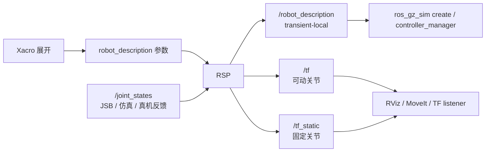

# robot_state_publisher（RSP）详解

> [!abstract] 一句话
> RSP 是机器人的**运动学与 TF 发布器**：它拿到 URDF 这棵关节树，再订阅真实/仿真的 `/joint_states`，通过正运动学计算每个 link 位姿，并发布 `/tf` 与 `/tf_static`。它不控制机器人、不做规划、不读取 Xacro、不产生真实关节反馈。

## 1. RSP 在系统里的位置



本项目中，Xacro 在 launch 启动前被 `Command(xacro ...)` 展开；RSP 只收到最终纯 URDF 字符串。Gazebo 的 create 从 RSP 重发布的 `/robot_description` 获取模型；`ros2_control_node`（Fake/真机）也订阅该 topic 来解析 `<ros2_control>`。

## 2. RSP 的输入、输出与参数

| 类别 | 名称 | 类型 | 意义 |
|---|---|---|---|
| 参数 | `robot_description` | string | 完整 URDF XML；启动时必需 |
| 订阅 | `/joint_states` | `sensor_msgs/msg/JointState` | 可动关节的测量/仿真状态 |
| 发布 | `/robot_description` | `std_msgs/msg/String` | 重发布 URDF，QoS 为 transient-local |
| 发布 | `/tf_static` | `tf2_msgs/msg/TFMessage` | fixed joint 的固定变换，启动时发布 |
| 发布 | `/tf` | `tf2_msgs/msg/TFMessage` | revolute/prismatic joint 的动态变换 |
| 参数 | `publish_frequency` | double | 动态 TF 的最大发布频率 |
| 参数 | `ignore_timestamp` | bool | 是否忽略 joint_states 的时间戳限制 |
| 参数 | `frame_prefix` | string | 给 RSP 发布的所有 frame 加前缀，多机器人使用 |

> [!important] 参数与 topic 同名不是一回事
> `robot_description` 首先是 RSP 接收的**参数**；RSP 启动后会把它重发布为同名的**topic**。launch 中 `parameters=[robot_description]` 是设置参数；`ros_gz_sim create -topic robot_description` 是订阅 topic。不要把两种动作混为一谈。

## 3. RSP 启动时做什么

以当前 launch 为例：

```python
robot_state_publisher = Node(
  package="robot_state_publisher",
  executable="robot_state_publisher",
  parameters=[robot_description, {"use_sim_time": use_sim_time}],
)
```

实际过程：

```text
1. launch 运行 xacro，得到最终 URDF XML 字符串。
2. launch 把字符串写入 RSP 的 robot_description 参数。
3. RSP 解析 URDF，建立“parent link -- joint -- child link”的树。
4. RSP 将 URDF 字符串以 transient-local QoS 发布到 /robot_description。
5. 对所有 fixed joint，RSP 在启动时发布 parent->child 到 /tf_static。
6. RSP 订阅 /joint_states，等待活动关节的 position。
7. 每收到有效 joint_states，RSP 做 FK，并将相应 parent->child 发布到 /tf。
```

若 URDF 不合法、根 link 不唯一、joint/link 重名或 `robot_description` 缺失，RSP 不能正确启动。先用 Xacro 手工展开并 `check_urdf`，不要只在 RViz 内猜错误。

## 4. RSP 如何做正运动学

URDF 给出每条 joint 的：parent、child、origin、axis、type。对一条 revolute joint，RSP 将固定安装变换与当前关节角的绕轴旋转相乘：

```text
T(parent -> child) = T(origin xyz/rpy) × R(axis, joint_position)
```

沿着根 link 到末端逐段相乘，即得到每个 link 在根坐标系的位姿。这就是 FK。RSP 不做 IK、不处理碰撞、不做动力学；它只依据已有 joint position 推导 link TF。

例：若 URDF 关系为 `base_link -> joint1 -> link1 -> joint2 -> link2`，且 `/joint_states` 中有 `joint1=0.5, joint2=-0.3`，RSP 发布：

```text
base_link -> link1   （由 joint1 的 0.5 rad 算得）
link1 -> link2       （由 joint2 的 -0.3 rad 算得）
```

TF listener 查 `base_link -> link2` 时，tf2 自动将两段变换组合；RSP 不需要为每对 link 单独发布全局变换。

## 5. fixed joint、movable joint 与两个 TF topic

| joint type | RSP 行为 | topic | 发布时机 |
|---|---|---|---|
| `fixed` | 只取 URDF origin | `/tf_static` | 启动时一次，transient-local |
| `revolute` / `continuous` | 使用 `/joint_states.position` | `/tf` | 收到关节状态时 |
| `prismatic` | 使用 `/joint_states.position` 平移 | `/tf` | 收到关节状态时 |

`world -> base_link` 如果是 URDF 中 fixed joint，应由 RSP 发布到 `/tf_static`。不要再用 `static_transform_publisher` 发布同一对 frame，否则 TF 会出现重复发布/跳变。`base_link -> laser`、`wrist3_link -> camera` 同理。

## 6. `/joint_states` 如何被 RSP 使用

`sensor_msgs/msg/JointState` 的重要字段：

```text
header.stamp        状态采样时间
name[i]             第 i 个关节名
position[i]         第 i 个位置，旋转关节是 rad、移动关节是 m
velocity[i]         可选；RSP 发布 TF 通常主要用 position
effort[i]           可选；RSP 不用于 FK
```

规则：`name` 与 `position` 必须同索引对应；关节名必须和 URDF 中活动 joint 完全一致；position 不能用 degree。RSP 可接收部分关节状态：有值的关节更新，缺失的活动关节没有对应动态 TF 或沿用已有状态，具体表现要用 TF 图验证。真机/仿真应由 `JointStateBroadcaster` 发布唯一、完整、可信的 `/joint_states`。

> [!danger] 不要伪造反馈
> 教学节点可以将位置命令转换为 joint_states 以演示 RViz；但 Gazebo/真机时这样做会让模型“看起来已经到位”，即使执行器反向、卡住、通信丢失。此时必须关闭该教学发布者，仅保留 Gazebo/硬件的 JointStateBroadcaster。

## 7. 与 Fake、Gazebo、真机的关系

| 模式 | `/joint_states` 应来自哪里 | RSP 做什么 | `use_sim_time` |
|---|---|---|---|
| 教学 RViz | 自定义转发节点/GUI | 仅显示 FK/TF | false |
| Fake | GenericSystem + JointStateBroadcaster | 发布 FK/TF/description | false |
| Gazebo Sim | GazeboSimSystem + JointStateBroadcaster | 发布 FK/TF/description | true |
| 真机 | 编码器反馈 + JointStateBroadcaster | 发布 FK/TF/description | false |

不管后端怎样，RSP 的功能不变。变的只有 joint_states 的来源。这样 MoveIt、RViz 与 TF 工具无需知道底层是 Fake、Gazebo 还是真机。

## 8. RSP 不做什么

| 不负责的任务 | 负责者 |
|---|---|
| 执行轨迹、PID、限位 | JointTrajectoryController/硬件驱动 |
| 关节状态测量 | Gazebo/hardware plugin + JSB |
| 逆运动学、碰撞、路径规划 | MoveIt move_group |
| 创建 Gazebo 物理实体 | `ros_gz_sim create` |
| 管理 controller 生命周期 | controller_manager/spawner |
| 发布 static TF 以外的外部定位 | SLAM、AMCL、EKF、static_transform_publisher |

## 9. 必做调试实验

### 实验 A：检查 description 与固定 TF

启动任一 RSP launch 后：

```bash
ros2 topic info /robot_description -v
ros2 topic echo /robot_description --once
ros2 topic info /tf_static -v
ros2 run tf2_tools view_frames
```

你应看到 RSP 是 `/robot_description` publisher；TF 图中 fixed link 关系存在。新开终端仍能收到 description，说明 transient-local QoS 生效。

### 实验 B：手动发布一个关节状态

仅用于无硬件/无控制器时：

```bash
ros2 topic pub --once /joint_states sensor_msgs/msg/JointState \
  "{name: [joint1, joint2], position: [0.5, -0.3]}"
```

在 RViz/`tf2_echo` 中观察 link 姿态变化：

```bash
ros2 run tf2_ros tf2_echo base_link link2
```

如果无变化，先查 joint 名、URDF link 名、RSP 是否在运行和消息时间戳。该实验运行时不得同时运行 JSB 或真实机器人，以免多个 publisher 混淆来源。

### 实验 C：验证谁在发布 joint_states

```bash
ros2 topic info /joint_states -v
ros2 topic hz /joint_states
ros2 topic echo /joint_states --once
```

Fake/Gazebo/真机运行时应只有权威状态源（通常 JSB）作为 publisher。发现自定义 `joint_position_cmd_to_states` 同时发布时，应停止它。

## 10. 高频错误

| 症状 | 原因 | 修复 |
|---|---|---|
| RViz 有模型但不动 | 没有 joint_states/名字不匹配 | echo joint_states，核对 URDF joint 名 |
| TF 重复或跳变 | 两个节点发同一 parent-child | `view_frames`，保留唯一发布者 |
| create 收不到模型 | RSP 没启动/description QoS 不匹配 | `topic info -v`，先启动 RSP |
| 关节方向反 | URDF axis/origin 错，非 RSP 算错 | 单关节测试，修 URDF 轴向 |
| 变换时间错误 | 仿真节点未 use_sim_time | Gazebo 模式所有相关节点设 true |
| frame 有前缀找不到 | 使用 frame_prefix 但下游仍用旧 frame 名 | 统一 Nav2/MoveIt/RViz frame 配置 |

## 11. 面试背诵

**问：robot_state_publisher 做什么？**  
答：它接收 URDF 运动学树和 joint_states，进行正运动学并发布 TF。固定关节发布到 tf_static，活动关节随 joint_states 发布到 tf；在 Jazzy 中它还将 robot_description 参数以 transient-local topic 重发布，供 controller manager、仿真 create 等组件获取模型。它不产生真实关节状态，也不执行控制或规划。

**问：为什么 RSP 与 ros2_control 要分离？**  
答：ros2_control 负责硬件读写和控制器生命周期，RSP 只做模型运动学和 TF。分离后同一 RSP 能消费 Fake、Gazebo 或真实编码器的 joint_states，上层 MoveIt/RViz 不依赖具体硬件后端，系统更容易测试和迁移。
