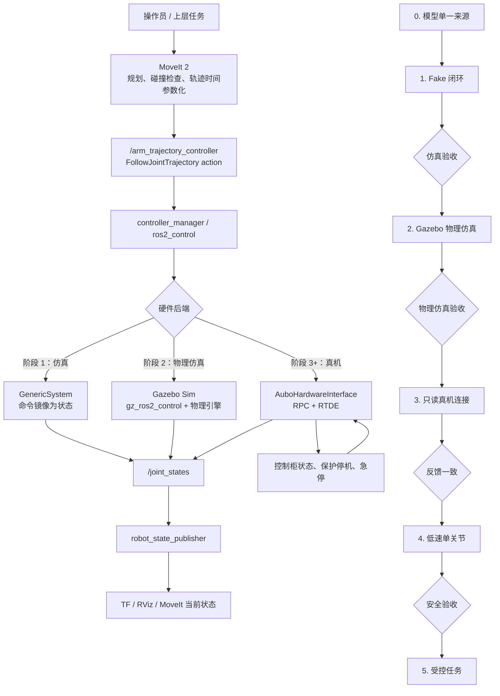
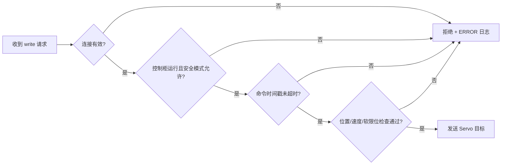

# AUBO 参考驱动审计与仿真到真机实施手册

> [!abstract] 本笔记的目标
> 基于 `D:\files\code\aubo_ros2_driver` 的实现经验，把当前仓库的 AUBO i5 从 **RViz/MoveIt 仿真** 逐步升级为 **可测试、可回退、低速安全接入真机** 的 ROS 2 系统。本文给出每一步要改什么、为什么改、如何验证，以及失败后如何停止。

> [!danger] 真机动作前提
> 本文中的真机步骤不是“复制命令即可运行”。必须有现场监护、可用急停、明确的安全空间、厂家规定的控制柜模式，并且先通过前一阶段的验收。MoveIt 的碰撞检测和速度缩放不能替代实体安全措施。

## 1. 一图看懂：最终系统与迁移顺序



这张图的关键是：**规划器永远只面对标准的 ROS 2 控制器接口；仿真与真机的差异只放在 `ros2_control` 硬件后端。** 因此，仿真验证通过的 MoveIt、控制器和任务节点可以复用到真机，但仍要重新做动力学、标定与安全验证。

## 2. 参考仓库到底提供了什么

参考根目录：`D:\files\code\aubo_ros2_driver`

| 组件                                | 观察到的职责                                                                   | 对当前项目的价值                   | 迁移原则                         |
| --------------------------------- | ------------------------------------------------------------------------ | -------------------------- | ---------------------------- |
| `aubo_ros2_driver`                | 自定义 `hardware_interface::SystemInterface`；通过 RPC 与 RTDE 读取状态、发送 Servo 目标 | 真机通讯与 `ros2_control` 接口的参考 | 借鉴架构；不要原样复制。                 |
| `aubo_moveit_config`              | MoveIt 启动、运动学、关节限位、OMPL/Pilz、控制器映射                                       | 对齐 MoveIt 执行链路的参考          | 逐项对比，不覆盖本仓库的夹爪、相机、SRDF。      |
| `aubo_description`                | 官方/参考机器人描述及标定脚本                                                          | 校验型号和标定流程                  | 它是 Git 子模块，当前目录未检出；先锁定版本再使用。 |
| `ros_joints_plan`                 | 点到点关节轨迹示例                                                                | 真机联调中最小动作测试的参考             | 先改造成低速、可中止、参数化的测试节点。         |
| `aubo_msgs`、`aubo_dashboard_msgs` | 控制柜服务、状态消息定义                                                             | 后续诊断与运维接口的参考               | 先建立最小运动闭环，再按需求接入。            |

### 2.1 参考驱动中必须修正的地方

不要将参考仓库直接当作生产驱动，原因如下：

1. `aubo_hardware_interface.cpp` 中存在硬编码登录凭据；凭据必须改成现场环境变量或受保护的参数文件，绝不提交 Git。
2. RPC/RTDE 的 `connect()`、`login()`、订阅和 Servo 调用需要逐项检查返回值；连接失败必须进入 `ERROR` 状态，不能继续发送命令。
3. `write()` 中捕获异常但没有报告的写法不可接受；必须记录错误、停止继续写入，并通知上层控制器。
4. 参考实现使用 RPC `30004` 和 RTDE `30010`；端口、SDK 版本和控制柜软件版本须与现场设备确认，不能假设完全一致。
5. 真机周期、Servo 指令频率和 `controller_manager` 的 `update_rate` 必须通过实测确定。简单把 `100 Hz` 改成 `200 Hz` 不是性能优化。

> [!warning] 结论
> 可复用的是 **接口分层、启动参数、控制器结构与测试策略**；不能直接复用的是 **网络连接、认证、控制周期、限位和标定数据**。

## 3. 当前工程基线：先确认我们在哪里

当前 AUBO 相关代码位于：

```text
aubo_i5_ros2_control/src/
  robot_description/
    urdf/arm.xacro                 # 机械臂本体参数
    urdf/aubo_i5.xacro             # 机械臂 + 夹爪组合
    urdf/aubo_i5_arm.urdf          # 当前 MoveIt 引用的展开模型
  aubo_i5_moveit_config/
    config/aubo_i5.urdf.xacro      # 当前 ros2_control 模型入口
    config/aubo_i5.ros2_control.xacro
    config/ros2_controllers.yaml
    config/joint_limits.yaml
```

当前 `aubo_i5.ros2_control.xacro` 使用 `mock_components/GenericSystem`。其含义是：控制器收到位置命令后，仿真后端把命令镜像为关节状态；它能验证 MoveIt 与控制器接口，但**不会连接控制柜，也不能代表实际动力学或安全性**。

## 4. 实施前的统一约定

在开始改代码前，先建立以下表格，并保存到团队文档。任何参数未确认时，真机阶段停止。

| 项目     | 必须确认的值                                                              | 如何确认               |
| ------ | ------------------------------------------------------------------- | ------------------ |
| 机器人型号  | AUBO i5 的具体型号/代际/控制柜版本                                              | 铭牌、控制柜信息、厂家文档。     |
| 关节顺序   | `shoulder → upperArm → foreArm → wrist1 → wrist2 → wrist3` 是否与控制柜一致 | 只读反馈下逐关节小幅手动点动比对。  |
| 单位     | ROS 全部使用 rad、rad/s、m；控制柜接口是否同单位                                     | SDK 文档 + 只读反馈数值验证。 |
| 零位与正方向 | 每个关节的零位、正方向、机械限位                                                    | 示教器与 RViz 同步对比。    |
| TCP    | 法兰、夹爪末端、工具中心点之间的变换                                                  | 厂家工具参数 + 三点/四点标定。  |
| 网络     | IP、网段、RPC/RTDE 端口、超时                                                | 在部署主机使用只读网络测试确认。   |
| 安全     | 急停、保护停机、速度上限、工作空间                                                   | 现场风险评估和控制柜配置。      |

## 5. 阶段 0：模型与配置单一来源

### 目标

解决“RViz 看到一个模型、MoveIt 读取另一个模型、真机又是第三套标定参数”的根源问题。

### 需要完成的改动

1. 以 `robot_description/urdf/arm.xacro` 为机械臂参数的唯一来源。
2. 让 `aubo_i5_moveit_config/config/aubo_i5.urdf.xacro` 包含顶层 `aubo_i5.xacro` 或其共享宏；不再手动维护同一机械臂的独立 `aubo_i5_arm.urdf`。
3. 保留已修复的 `upperArm_Link` 惯量；其他 link 也执行同一套惯量检查。
4. 明确 `world → base_link → ... → wrist3_Link → TCP` 的 TF 链。夹爪和相机应使用固定关节接到相应的父 link。
5. 把机器人型号、URDF Git 提交号、标定文件版本写到启动日志中，便于复现实验。

### 必须通过的检查

在 Linux ROS 2 工作空间中执行（以下 `<ws>` 为工作空间根目录）：

```bash
cd <ws>
source /opt/ros/jazzy/setup.bash
colcon build --packages-select robot_description aubo_i5_moveit_config
source install/setup.bash

# 展开 xacro：需按最终包名和文件位置调整
ros2 run xacro xacro \
  $(ros2 pkg prefix robot_description)/share/robot_description/urdf/aubo_i5.xacro \
  > /tmp/aubo_i5.urdf
check_urdf /tmp/aubo_i5.urdf
```

预期结果：Xacro 展开成功；`check_urdf` 没有 XML、树结构或 link/joint 定义错误；RViz 不再报告 `unrealistic inertia`。

### 失败时如何定位

| 现象 | 首先检查 | 处理方式 |
| --- | --- | --- |
| RViz 仍提示 `upperArm_Link` 惯量不真实 | MoveIt 实际加载的 `robot_description` | 打印参数，确认不是旧的 install 空间或 `aubo_i5_arm.urdf`。 |
| `check_urdf` 报 link 多父节点 | 顶层 Xacro 是否重复 include | 每个 link 只能有一个父 joint。 |
| TF 中缺 `world` 或 TCP | 固定 joint、`robot_state_publisher`、静态 TF | 只保留一种 world 到 base 的发布方式。 |
| 模型方向与示教器不同 | joint origin 的 `rpy` 和 axis | 在只读/仿真模式一次只检查一个关节。 |

知识点：[[25-robot_state_publisher-RSP详解]]、URDF/Xacro、刚体惯量、TF2、DH 参数、TCP。

## 6. 阶段 1：先做可重复的 Fake 硬件闭环

### 目标

让以下链路在**完全不连接真机**的情况下工作：

```text
MoveIt 规划
  → FollowJointTrajectory
  → arm_trajectory_controller
  → GenericSystem
  → /joint_states
  → robot_state_publisher / RViz
```

### 具体工作

1. 在启动文件显式声明 `use_fake_hardware`，默认值为 `true`。
2. 把真实硬件和 fake 硬件做成同一份 Xacro 的条件分支：

```xml
<xacro:if value="$(arg use_fake_hardware)">
  <hardware>
    <plugin>mock_components/GenericSystem</plugin>
  </hardware>
</xacro:if>
<xacro:unless value="$(arg use_fake_hardware)">
  <hardware>
    <plugin>aubo_i5_hardware/AuboHardwareInterface</plugin>
    <param name="robot_ip">$(arg robot_ip)</param>
  </hardware>
</xacro:unless>
```

3. 轨迹控制器必须使用六个机械臂关节，且名称、顺序、控制器 YAML、MoveIt YAML、URDF 中完全一致。
4. Fake 阶段建议轨迹控制器至少声明：位置 command interface、位置/速度 state interface、状态发布速率和 action 监控速率。
5. `joint_limits.yaml` 的速度应使用真实量纲（rad/s），不要沿用 `100` 这类不具物理意义的占位值。初始执行缩放保持 `0.1` 或更低。

### 建议的控制器配置目标形态

```yaml
controller_manager:
  ros__parameters:
    update_rate: 100
    joint_state_broadcaster:
      type: joint_state_broadcaster/JointStateBroadcaster
    arm_trajectory_controller:
      type: joint_trajectory_controller/JointTrajectoryController

arm_trajectory_controller:
  ros__parameters:
    joints: [shoulder_joint, upperArm_joint, foreArm_joint,
             wrist1_joint, wrist2_joint, wrist3_joint]
    command_interfaces: [position]
    state_interfaces: [position, velocity]
    state_publish_rate: 50.0
    action_monitor_rate: 20.0
    allow_partial_joints_goal: false
```

> [!note] 为什么阶段 1 不急着上 Gazebo
> `GenericSystem` 能以最低复杂度验证 MoveIt、控制器、关节名称、action 和 TF。Gazebo 用于验证动力学、接触和传感器时再加入；同时调 Gazebo、MoveIt 和真机接口会使故障定位失控。

### 验收命令

```bash
# 终端 1：启动 fake 后端与控制器（以最终 bringup 包为准）
ros2 launch aubo_i5_bringup simulation.launch.py

# 终端 2：检查控制器
ros2 control list_controllers
ros2 control list_hardware_interfaces

# 终端 3：观察反馈；不应该全为 NaN，也不应该没有消息
ros2 topic echo /joint_states --once

# 终端 4：检查轨迹 action 是否存在
ros2 action list | grep follow_joint_trajectory
```

通过条件：`joint_state_broadcaster` 和 `arm_trajectory_controller` 均为 `active`；MoveIt 能规划并执行无碰撞路径；RViz 中实际姿态随 `/joint_states` 更新。

知识点：[[22-MoveIt与ros2_control加载执行全流程]]、[[24-ros2_control_node详解]]、`FollowJointTrajectory`、`JointTrajectoryController`、OMPL、时间参数化。

## 7. 阶段 2：Gazebo 物理仿真

### 目标

Fake 后端只验证接口，不计算质量、惯量、重力、碰撞接触或传感器。Gazebo 阶段的目标是让同一份 Xacro 以 `gz_ros2_control` 作为后端运行，从而验证物理属性、关节限制、碰撞模型、工作台和相机/夹爪的仿真集成。

### 具体工作

1. 新建 `aubo_i5_gazebo` 包，或在现有 `robot_description` 中新增 Gazebo 专用 Xacro；不要把 Gazebo 插件直接写死在纯 RViz 模型中。
2. 在顶层 Xacro 引入 `hardware_type:=fake|gazebo|real` 参数：

```xml
<xacro:if value="${hardware_type == 'gazebo'}">
  <gazebo>
    <plugin filename="gz_ros2_control-system"
            name="gz_ros2_control::GazeboSimROS2ControlPlugin">
      <parameters>$(find aubo_i5_moveit_config)/config/ros2_controllers.yaml</parameters>
    </plugin>
  </gazebo>
</xacro:if>
```

3. 为每个 link 检查质量、质心、惯量和 collision 网格。视觉 DAE 用于显示，collision STL 用于接触；不要让高面数视觉网格承担碰撞计算。
4. 建立包含地面、工作台、机械臂、夹爪和可选相机的 world；机器人以固定 base 安装到工作台时，Gazebo 与 TF 中的安装位姿必须一致。
5. 使用与 Fake 模式相同的 `arm_trajectory_controller`、关节顺序和 MoveIt controller mapping；差别应仅在硬件后端。
6. 若使用 Jazzy，优先采用 Gazebo Harmonic 与 `ros_gz_sim`/`gz_ros2_control`；不要把 Gazebo Classic 插件和 Gazebo Sim 插件混用。

### 推荐启动顺序

```bash
# 终端 1：启动 world、机器人和 gz_ros2_control
ros2 launch aubo_i5_gazebo aubo_i5_gazebo.launch.py

# 终端 2：确认 Gazebo 内部的 controller_manager 已出现
ros2 control list_controllers
ros2 topic echo /joint_states --once

# 终端 3：启动 MoveIt；它只连接控制器，不重复 spawn 机器人
ros2 launch aubo_i5_bringup moveit.launch.py hardware_type:=gazebo
```

### Gazebo 验收用例

| 用例 | 操作 | 通过标准 |
| --- | --- | --- |
| 重力稳定性 | 不发命令，观察 10 秒 | 固定基座不漂移；关节不因异常惯量抖动或爆炸。 |
| 单关节轨迹 | MoveIt 发送小幅轨迹 | Gazebo、`/joint_states` 和 RViz 姿态一致。 |
| 关节限位 | 规划接近软限位的目标 | 规划或控制器拒绝越界目标，不穿透机械限位。 |
| 工作台碰撞 | 在 planning scene 和 Gazebo 中放置同一张工作台 | MoveIt 拒绝碰撞路径；Gazebo 中无明显穿模。 |
| 夹爪/相机 | 分别启动各自控制或传感器插件 | 不影响六轴轨迹控制器，话题与 TF 可用。 |

> [!important] Gazebo 的定位
> Gazebo 用来发现模型、接触、惯量和系统集成问题；它不能替代真机标定或安全认证。Gazebo 轨迹通过后，仍需先进入只读真机阶段。

知识点：Gazebo Harmonic、SDF/URDF 转换、`gz_ros2_control`、`ros_gz_sim`、碰撞网格、接触参数、传感器插件。

## 8. 阶段 3：新建真机硬件包，但先只读

### 目标

新增一个隔离的真机包，而不破坏已经验收的仿真入口。

建议目录：

```text
aubo_i5_ros2_control/src/aubo_i5_hardware/
  include/aubo_i5_hardware/aubo_hardware_interface.hpp
  src/aubo_hardware_interface.cpp
  hardware_interface_plugin.xml
  config/hardware_defaults.yaml
  launch/aubo_control.launch.py
  test/test_connection_validation.cpp
  test/test_safety_gate.cpp
```

### 接口职责

| 生命周期函数 | 必须做什么 | 绝不能做什么 |
| --- | --- | --- |
| `on_init()` | 校验 6 个关节、接口类型、IP/端口/超时参数 | 直接运动或假定配置正确。 |
| `on_activate()` | 建立连接、登录、订阅真实反馈；将命令初值设为当前关节值 | 连接失败后仍返回成功；一激活就发送非零位移。 |
| `read()` | 以线程安全方式复制最新位置、速度和状态时间戳 | 用陈旧状态伪装成正常反馈。 |
| `write()` | 仅在安全门通过、命令新鲜且控制柜允许时发送位置目标 | 吞掉异常；在断线、急停或保护停机时发送命令。 |
| `on_deactivate()` | 停止 Servo/退出控制模式、释放连接、报告结果 | 留下持续的 Servo 会话。 |

### 安全门的最小逻辑



建议在 `write()` 前检查：

- 网络连接和 RTDE 数据时间戳；
- 机器人运行模式和安全模式；
- 急停、保护停机、远程控制状态；
- 全部关节命令是否有限值；
- 软限位、最大单周期位移、最大速度；
- `enable_motion` 是否由操作者显式设置为 `true`。

### 配置与凭据

提交到仓库的配置只允许包含非敏感默认值：

```yaml
robot_ip: ""
rpc_port: 30004
rtde_port: 30010
connect_timeout_ms: 1000
command_timeout_ms: 100
enable_motion: false
```

运行时从环境变量或本机不提交的文件传入敏感信息。代码必须在 IP 为空、凭据缺失或 `enable_motion:=false` 时拒绝运动命令。

### 只读联调验收

1. 首次连接时 `enable_motion:=false`。
2. 只启动状态订阅和 `joint_state_broadcaster`，不要启动轨迹控制器。
3. 手动在示教器上小幅点动一个关节，确认 `/joint_states` 的关节名、单位、方向和 RViz 一致。
4. 断开网络，确认节点转入错误状态，且没有继续发布“看似正常”的新鲜状态。
5. 触发控制柜保护停机，确认 ROS 日志和硬件状态明确反映不可执行状态。

通过条件：在任何通信异常或安全状态异常下，节点均拒绝写命令；恢复后须显式重新激活，不能自动继续运动。

## 9. 阶段 4：低速真机运动的逐项操作

> [!warning] 本阶段只能在阶段 0–2 的验收记录齐全后执行。

### 8.1 现场启动前检查表

- [ ] 急停按钮可触及且确认可用。
- [ ] 机械臂工作空间内无人、无松散物体、无未建模障碍物。
- [ ] 夹爪为空载或已知载荷，工具和 TCP 已确认。
- [ ] 示教器显示正常运行、远程控制与厂家要求的模式。
- [ ] `robot_ip` 指向正确设备；网络未经过不稳定 Wi-Fi。
- [ ] 启动参数显示 `enable_motion:=true` 是操作者明确提供的。
- [ ] MoveIt 初始速度和加速度缩放不高于 `0.05`。
- [ ] 当前关节角与规划起始状态一致；不一致时先同步，禁止强行执行。

### 8.2 动作顺序

1. **仅反馈**：在 RViz 中观察真实关节状态 30 秒，无跳变或方向错误。
2. **单关节小幅动作**：每次一个关节、幅度不超过 2°、低速往返；确认命令方向和实际方向一致。
3. **安全 home 姿态**：只使用已人工验证无碰撞的关节空间姿态。
4. **双关节协调动作**：低速验证控制器插值和末端轨迹是否符合预期。
5. **短距离笛卡尔动作**：在空载、无障碍区域内，先用 1–2 cm 小步长验证 TCP。
6. **夹爪动作**：与六轴轨迹分开测试，确认夹爪不会被误纳入 arm 的六关节控制器。

每一步都应记录：启动命令、URDF/标定版本、速度缩放、起止关节角、控制柜状态、实际最大误差、是否触发任何报警。

### 8.3 立即停止的条件

出现以下任一情况，立即停止并退回只读状态：

- 关节实际方向与 RViz/命令方向不一致；
- 关节反馈跳变、卡顿或明显超出预期；
- 控制器报告跟随误差、路径偏差或 action 超时；
- TCP 与标定点偏差不可解释；
- 网络、控制柜状态或安全状态不稳定；
- 人员进入工作空间，或急停/保护停机触发。

## 10. 阶段 5：把任务层接到已验证的执行链路

本仓库已有 `robot_control_ros2/src/robot_control` 中的轨迹缓冲、插值、限幅和雅可比工具。建议把它们用在 MoveIt 之上的任务层，而不是绕过 `ros2_control` 直接向硬件发送关节数组：

```text
任务状态机
  → 生成目标位姿或关节目标
  → MoveIt 碰撞检查与规划
  → SafetyLimiter 二次检查
  → FollowJointTrajectory
  → ros2_control 硬件接口
```

任务状态机至少包含：`预检查 → 规划 → 操作者确认 → 执行 → 结果校验 → 成功/回退`。动态障碍物、视觉抓取和自动恢复应在基础闭环稳定后再加入。

## 11. 建议的五个代码提交里程碑

| 提交 | 只包含什么 | 验收证据 |
| --- | --- | --- |
| `model-single-source` | Xacro 单一来源、URDF 检查、惯量修复 | `check_urdf`、RViz 截图/日志。 |
| `fake-control-loop` | fake 启动入口、控制器配置、MoveIt action 对齐 | `list_controllers`、轨迹成功日志。 |
| `gazebo-physics-loop` | Gazebo world、`gz_ros2_control`、碰撞与物理参数 | 重力稳定、轨迹、限位与碰撞用例记录。 |
| `hardware-readonly` | 硬件包、连接参数、只读反馈、断线测试 | `/joint_states` 对比、断线错误日志。 |
| `hardware-safe-motion` | 安全门、显式使能、低速写入、停机流程 | 现场验收记录与回退验证。 |

这种拆分能保证：真机问题不会破坏仿真；任何回归都能明确定位到模型、控制器、驱动或任务层。

## 12. 第一周可立即开始的任务

1. 建立 `aubo_i5_bringup` 包，提供明确的 `simulation.launch.py`，默认 fake 模式。
2. 将 MoveIt 用到的机械臂模型改为从 Xacro 展开，去除 `aubo_i5_arm.urdf` 的双维护风险。
3. 新建 `aubo_i5_gazebo` 包，先完成固定底座、地面和单关节物理仿真。
4. 增加 `check_urdf`、Xacro 展开、Gazebo spawn 和控制器启动的自动检查脚本。
5. 整理现场参数表（型号、IP、零位、TCP、控制柜版本），但不要在仓库中提交凭据。
6. 拉取并审计参考仓库的 `aubo_description` 子模块；确认其许可证、机器人型号与本项目网格/坐标系是否匹配。

## 14. 当前 AUBO i5 工程：真机接口实施操作教程

本节对应当前工作区 `aubo_i5_ros2_control`。目标是保留已经可用的 Gazebo 入口，另建默认只读的真机入口；未明确启用运动时，绝不向控制柜写入轨迹。

> [!danger] 操作边界
> 仅在实体急停可用、工作区隔离、关节/TCP/负载参数已核验，并由现场操作者明确设置 `enable_motion:=true` 时才允许发送运动命令。真机 launch 不得与 Gazebo launch 同时运行。

### 14.1 三种后端的边界

| 后端 | hardware plugin | controller manager 宿主 | 连接控制柜 |
| --- | --- | --- | --- |
| Fake | `mock_components/GenericSystem` | `ros2_control_node` | 否 |
| Gazebo | `gz_ros2_control/GazeboSimSystem` | Gazebo 内的 `gz_ros2_control` 插件 | 否 |
| 真机 | `aubo_i5_hardware/AuboI5System` | 外部 `ros2_control_node` | 是 |

真机 launch 不得 include `aubo_i5_gazebo.launch.py`，也不得启动 `gz sim`、`ros_gz_bridge` 或模型 spawn。否则会出现重复 `/controller_manager`、重复 `/joint_states`，使 MoveIt 使用错误的状态源。

### 14.2 步骤 1：核对模型与参考驱动

参考 `D:\files\code\aubo_ros2_driver\aubo_ros2_driver` 的通信分层：

```text
RTDE (30010) -> actual_q / actual_qd -> read() -> state interfaces
JointTrajectoryController -> position command -> write() -> RPC servoJoint (30004)
```

当前工程必须沿用以下关节名和顺序：

```yaml
- shoulder_joint
- upperArm_joint
- foreArm_joint
- wrist1_joint
- wrist2_joint
- wrist3_joint
```

在 Linux 中先验证 real Xacro 能展开（尚未连接真机）：

```bash
cd ~/cpp_practice/aubo_i5_ros2_control
source /opt/ros/jazzy/setup.bash
source install/setup.bash

CFG=$(ros2 pkg prefix aubo_i5_moveit_config)/share/aubo_i5_moveit_config/config
ros2 run xacro xacro "$CFG/aubo_i5.urdf.xacro" \
  hardware_type:=real \
  initial_positions_file:="$CFG/initial_positions.yaml" \
  ros2_controllers_file:="$CFG/real_controllers.yaml" \
  > /tmp/aubo_i5_real.urdf

check_urdf /tmp/aubo_i5_real.urdf
grep -nE 'ros2_control|shoulder_joint|AuboI5System' /tmp/aubo_i5_real.urdf
```

上述检查未通过时，不得连接真机“边运行边调”。

### 14.3 步骤 2：建立独立真机包

在 `src/` 新建包，而不是把 SDK/RPC 代码写进描述、MoveIt 或 Gazebo 包：

```text
aubo_i5_hardware/
├── include/aubo_i5_hardware/aubo_i5_system.hpp
├── src/aubo_i5_system.cpp
├── config/real_controllers.yaml
├── launch/aubo_i5_real.launch.py
├── hardware_interface_plugin.xml
├── CMakeLists.txt
└── package.xml
```

包依赖至少包含 `hardware_interface`、`controller_manager`、`pluginlib`、`rclcpp`、`rclcpp_lifecycle` 与厂商 AUBO SDK。SDK 版本、控制柜软件版本、RPC/RTDE 端口必须与现场确认。

不要复制参考驱动中硬编码的登录凭据。IP、账号和口令只能从本机未提交配置或环境变量读取；仓库 YAML 只保留非敏感默认值。

### 14.4 步骤 3：增加 real Xacro 分支

在 `aubo_i5.ros2_control.xacro` 保留 `fake`、`gazebo` 分支，并添加：

```xml
<xacro:if value="${hardware_type == 'real'}">
  <hardware>
    <plugin>aubo_i5_hardware/AuboI5System</plugin>
    <param name="robot_ip">$(arg robot_ip)</param>
    <param name="rpc_port">30004</param>
    <param name="rtde_port">30010</param>
    <param name="connect_timeout_ms">1000</param>
    <param name="command_timeout_ms">100</param>
    <param name="enable_motion">$(arg enable_motion)</param>
  </hardware>
</xacro:if>
```

六轴关节统一声明：

```xml
<command_interface name="position"/>
<state_interface name="position"/>
<state_interface name="velocity"/>
```

第一版不开放 velocity command；夹爪未实现真机接口时，`joint1`、`joint2` 不进入六轴控制器。

### 14.5 步骤 4：实现 SystemInterface 的安全契约

| 生命周期函数 | 必须做的事 | 失败时 |
| --- | --- | --- |
| `on_init()` | 校验 6 个关节、名称、接口、IP/端口/超时参数 | 返回 `ERROR`，不连接、不运动 |
| `on_activate()` | 建立 RPC/RTDE、订阅 q/dq/模式/安全状态、等待第一帧反馈 | 连接或反馈失败则 `ERROR`，不进入 Servo |
| `read()` | 线程安全复制位置、速度和状态；检查反馈新鲜度 | 超时则 `ERROR` |
| `write()` | 仅在连接、控制柜状态、显式使能、命令时效和软限位均通过时发送目标 | 拒绝写入并记录原因 |
| `on_deactivate()` | 停止 Servo、停止写入、断开连接 | 不遗留 Servo 会话 |

激活阶段必须先读取真实状态，再初始化命令：

```cpp
read_latest_state_or_fail();
position_command_ = position_state_;  // 初始 hold，绝不能归零
```

这可防止控制器激活后将机械臂拉回 `initial_positions.yaml` 的零位。参考驱动中的自动 Servo、吞掉异常和硬编码凭据均不得照搬。

### 14.6 步骤 5：真机控制器与限速

`real_controllers.yaml` 保持 MoveIt 使用的控制器名：

```yaml
controller_manager:
  ros__parameters:
    update_rate: 100
    joint_state_broadcaster:
      type: joint_state_broadcaster/JointStateBroadcaster
    arm_trajectory_controller:
      type: joint_trajectory_controller/JointTrajectoryController

arm_trajectory_controller:
  ros__parameters:
    joints: [shoulder_joint, upperArm_joint, foreArm_joint,
             wrist1_joint, wrist2_joint, wrist3_joint]
    command_interfaces: [position]
    state_interfaces: [position, velocity]
    state_publish_rate: 50.0
    action_monitor_rate: 20.0
    allow_partial_joints_goal: false
```

参考驱动给出的速度值为：肩/大臂/小臂 `3.15 rad/s`，三个腕关节 `3.20 rad/s`。但参考 `joint_limits.yaml` 的 `has_acceleration_limits: false`，并未给出可直接复用的真机加速度上限；在厂商确认本机型、负载与控制柜版本前，不得因此关闭加速度限制。首次真机试验的 MoveIt 速度、加速度缩放均保持 `0.05` 或更低。

### 14.7 步骤 6：只读启动与验收

真机第一阶段只启动 `robot_state_publisher`、外部 `ros2_control_node` 与 `joint_state_broadcaster`，不激活轨迹控制器，且 `enable_motion:=false`。

```bash
ros2 node list | grep controller_manager
ros2 control list_hardware_components
ros2 control list_hardware_interfaces
ros2 control list_controllers
ros2 topic echo /joint_states --once
```

通过条件：只有一个 `/controller_manager`、只有一个 `/joint_states` publisher；`name` 和 `position` 都有六个元素；示教器点动后 ROS/RViz 的方向、单位和角度一致。此时 `arm_trajectory_controller` 必须保持 inactive。

### 14.8 步骤 7：受控低速运动与回退

只读验收通过后，现场操作者显式设定 `enable_motion:=true`，再激活控制器：

```bash
ros2 control load_controller --set-state active joint_state_broadcaster
ros2 control load_controller --set-state active arm_trajectory_controller
ros2 control list_controllers
ros2 topic echo /joint_states --once
```

首次只允许空载、单关节、极小幅度、低缩放动作。若出现反馈超时、方向相反、首帧跳变、控制柜告警或人员进入工作区，立即停止、退出 Servo，并退回只读阶段。

| 现象 | 首先处理 |
| --- | --- |
| MoveIt 从零位规划或首帧突跳 | 停止运动；确认激活时 `command = current q`，确认唯一且非空的 `/joint_states` |
| `/joint_states` 为 `name: []` | 不激活轨迹控制器；检查 plugin 是否导出 6 组 state interface，排除重复 `/controller_manager` |
| `position` command 不可用 | 核对 real Xacro 的六组 command interface 与 `export_command_interfaces()` 一一对应 |
| Gazebo 与真机同时出现 | 停止其中一个；二者不能共用默认 `/controller_manager` 或 `/joint_states` |
| RTDE 断线或数据过期 | 进入错误状态并停止写入；禁止自动重连后继续旧轨迹 |

完成本节验收后，才允许将 MoveIt 接到 `arm_trajectory_controller/follow_joint_trajectory` action。

### 14.9 迁移清单：复制什么，不复制什么

参考工作区包含多个功能包，但真机接入不等于把整个工作区复制进当前工程。按下表处理：

| 参考内容                                                 | 处理方式                                                                 | 原因                                                                           |
| ---------------------------------------------------- | -------------------------------------------------------------------- | ---------------------------------------------------------------------------- |
| `aubo_ros2_driver/include/aubo_hardware_interface.h` | 借鉴类划分、RPC/RTDE 数据流；在 `aubo_i5_hardware` 中重新实现                        | 当前项目的包名、启动方式、安全门和参数管理应独立维护                                                   |
| `aubo_ros2_driver/src/aubo_hardware_interface.cpp`   | 逐项移植已验证的 SDK 调用语义：连接、订阅 `R1_actual_q`/`R1_actual_qd`、发送 `servoJoint` | 不复制硬编码凭据、自动 Servo、吞异常、无限重试等行为                                                |
| `hardware_interface_plugin.xml`                      | 改名后直接作为模板                                                            | 这是 pluginlib 发现 `SystemInterface` 的必需清单                                      |
| `aubo_controllers.yaml`                              | 参考 JTC 的 position command + position/velocity state 配置               | 控制器名必须保持当前工程的 `arm_trajectory_controller`，不能改成 `joint_trajectory_controller` |
| `aubo_moveit_config/config/joint_limits.yaml`        | 仅复用速度上限；加速度仍待厂家/现场确认                                                 | 参考文件没有启用加速度约束，不能把“未限制”误认为“真实上限”                                              |
| `aubo_description`、`aubo_moveit_config`              | 不迁移                                                                  | 当前工程已有 `robot_description`、SRDF、夹爪和相机，复制会造成双模型来源                             |
| `aubo_gazebo`                                        | 不迁移                                                                  | 真机后端不应依赖 Gazebo，也不能与 Gazebo manager 共存                                       |
| `aubo_msgs`、`aubo_dashboard_msgs`                    | 可选依赖，第二阶段再加入                                                         | 首个闭环只需要 q/dq、模式、安全状态与轨迹执行；仪表盘服务可后续接入                                         |
| AUBO SDK 的头文件、共享库、CMake package                      | 必须以厂商许可与控制柜版本为准安装                                                    | 这是硬件包唯一必要的厂商库，不应把二进制或凭据直接提交到本仓库                                              |

建议的首版范围：只做六轴位置轨迹执行和真实 q/dq 反馈。力控、IO、TCP 力、夹爪、仪表盘、速度控制和笛卡尔 Servo 都延后；每增加一种控制模式，就增加一种安全状态和回退路径。

### 14.10 真机包的文件职责与构建配置

创建包：

```bash
cd ~/cpp_practice/aubo_i5_ros2_control/src
ros2 pkg create aubo_i5_hardware \
  --build-type ament_cmake \
  --dependencies hardware_interface controller_manager pluginlib rclcpp rclcpp_lifecycle
```

随后将目录调整为：

```text
aubo_i5_hardware/
├── include/aubo_i5_hardware/
│   ├── aubo_i5_system.hpp          # SystemInterface 声明与状态数据
│   └── visibility_control.hpp       # 共享库导出宏（可选但推荐）
├── src/
│   └── aubo_i5_system.cpp           # SDK 连接、RTDE 回调、read/write、安全门
├── config/
│   └── real_controllers.yaml        # 真机 controller_manager/JTC 参数
├── launch/
│   └── aubo_i5_real.launch.py       # 只读/运动两个显式参数的 bringup
├── test/
│   ├── test_configuration.cpp       # 关节、接口、参数校验；不连接控制柜
│   └── test_safety_gate.cpp          # 超时、未使能、越界时拒绝 write
├── hardware_interface_plugin.xml    # pluginlib 注册
├── CMakeLists.txt
└── package.xml
```

`package.xml` 的最小运行依赖：

```xml
<depend>hardware_interface</depend>
<depend>controller_manager</depend>
<depend>pluginlib</depend>
<depend>rclcpp</depend>
<depend>rclcpp_lifecycle</depend>
<exec_depend>joint_state_broadcaster</exec_depend>
<exec_depend>joint_trajectory_controller</exec_depend>
<exec_depend>robot_state_publisher</exec_depend>
<exec_depend>xacro</exec_depend>
```

若需要运行 SDK 的诊断消息，再按需增加 `aubo_msgs` 与 `aubo_dashboard_msgs`。不要为了首版硬件接口而复制参考仓库中未使用的 Python 客户端、测试发布者或 Universal Robots 遗留描述。

`CMakeLists.txt` 的关键是构建为共享库并导出 plugin 描述：

```cmake
find_package(ament_cmake REQUIRED)
find_package(hardware_interface REQUIRED)
find_package(pluginlib REQUIRED)
find_package(rclcpp REQUIRED)
find_package(rclcpp_lifecycle REQUIRED)
find_package(aubo_sdk REQUIRED)  # 名称以厂家 SDK 实际 CMake package 为准

add_library(aubo_i5_hardware_plugin SHARED
  src/aubo_i5_system.cpp)
target_link_libraries(aubo_i5_hardware_plugin aubo_sdk::aubo_sdk)
ament_target_dependencies(aubo_i5_hardware_plugin
  hardware_interface pluginlib rclcpp rclcpp_lifecycle)

pluginlib_export_plugin_description_file(
  hardware_interface hardware_interface_plugin.xml)

install(TARGETS aubo_i5_hardware_plugin DESTINATION lib)
install(DIRECTORY include config launch DESTINATION share/${PROJECT_NAME})
ament_package()
```

参考驱动使用 `FetchContent` 在线下载 SDK。对于真机 bringup，更建议在受控的部署机上由厂家安装包或锁定校验和的内部制品提供 SDK，再通过 `aubo_sdk_DIR`/`CMAKE_PREFIX_PATH` 找到它；构建真机驱动时不应隐式从互联网下载未知版本的二进制。

`hardware_interface_plugin.xml` 只需注册一个真实插件：

```xml
<library path="aubo_i5_hardware_plugin">
  <class name="aubo_i5_hardware/AuboI5System"
         type="aubo_i5_hardware::AuboI5System"
         base_class_type="hardware_interface::SystemInterface">
    <description>AUBO i5 RPC/RTDE ros2_control hardware interface.</description>
  </class>
</library>
```

#### 14.10.1 AUBO i5：SDK 应如何迁移和部署

当前参考仓库并没有将 SDK 源码或二进制提交到 `aubo_ros2_driver/`；它的 `CMakeLists.txt` 在构建时下载厂商发布的 `aubo_sdk`，并使用：

```text
include/                         # <aubo/...>、aubo_sdk/rtde.h、aubo_sdk/rpc.h
lib/                             # libaubo_sdkd.so 等运行库
lib/cmake/aubo_sdk/              # aubo_sdkConfig.cmake，供 find_package 使用
```

对 AUBO i5，迁移的是 SDK 的通用通信能力，而不是另一个 i5 URDF：

| SDK 项目 | 在 `AuboI5System` 中的用途 |
| --- | --- |
| `RpcClient` | 连接 RPC 服务、读取机器人名/模式、进入/退出 Servo、调用 `servoJoint` |
| `RtdeClient` | 订阅实时状态 |
| `R1_actual_q` | 写入六轴 `position` state interface，单位应核验为 rad |
| `R1_actual_qd` | 写入六轴 `velocity` state interface，单位应核验为 rad/s |
| `R1_robot_mode`、`R1_safety_mode`、`runtime_state` | 作为 `write()` 的安全门条件，不能仅打印日志 |

不要迁移参考仓库的 `aubo_description` 来替换当前 `robot_description`：本项目继续使用已经验证的 AUBO i5 link、joint、夹爪和 TCP 模型；SDK 只提供“真实状态从哪里读、轨迹命令往哪里写”。

推荐将已获厂家授权、已校验架构的 SDK 安装在部署机，例如：

```text
/opt/aubo-sdk/0.24.1-rc.3/
├── include/
├── lib/
└── lib/cmake/aubo_sdk/
```

构建前显式指向 SDK，而不是依赖在线下载：

```bash
export aubo_sdk_DIR=/opt/aubo-sdk/0.24.1-rc.3/lib/cmake/aubo_sdk
export LD_LIBRARY_PATH=/opt/aubo-sdk/0.24.1-rc.3/lib:${LD_LIBRARY_PATH}

cd ~/cpp_practice/aubo_i5_ros2_control
colcon build --packages-select aubo_i5_hardware \
  --cmake-args -Daubo_sdk_DIR="$aubo_sdk_DIR"
source install/setup.bash
```

部署前验证动态链接库，而不连接控制柜：

```bash
ldd install/aubo_i5_hardware/lib/libaubo_i5_hardware_plugin.so | grep -i aubo
```

输出应解析到预期的 `/opt/aubo-sdk/.../lib`，不能指向未知旧版本。若 SDK 与控制柜版本或 CPU 架构不匹配，停止在构建/只读阶段，向 AUBO 厂家确认兼容版本；不要尝试用仿真 SDK 或随意替换共享库绕过问题。

### 14.11 接口类应该继承什么、保存什么数据

类继承：

```cpp
class AuboI5System : public hardware_interface::SystemInterface
```

实现时以本机安装的 ROS 2 Jazzy `hardware_interface/system_interface.hpp` 的函数签名为准；参考仓库的 API 若与 Jazzy 不同，应只迁移通信逻辑，不能机械复制旧版 `export_*_interfaces()` 写法。无论具体 API 名称是否为 `export_*_interfaces()` 或 Jazzy 对应的导出钩子，生命周期职责不变：初始化、配置/激活、读取状态、写入命令、停用。

内部状态建议固定为 6 元数组，避免在高频控制循环中分配内存：

```cpp
std::array<double, 6> position_state_{};     // 最新真实 q，单位 rad
std::array<double, 6> velocity_state_{};     // 最新真实 qd，单位 rad/s
std::array<double, 6> position_command_{};   // JTC 目标，单位 rad
std::array<double, 6> previous_command_{};

std::mutex state_mutex_;
std::atomic<bool> connected_{false};
std::atomic<bool> feedback_valid_{false};
std::atomic<bool> motion_enabled_{false};
std::chrono::steady_clock::time_point last_feedback_time_;
```

还需要维护控制柜模式和安全状态，例如 `running`、`protective_stop`、`emergency_stop`、`fault`。不要只要 TCP 连接成功就允许 `write()`；网络正常不代表控制柜允许运动。

RTDE 回调只做两件事：解析数据、在锁保护下更新 `position_state_`、`velocity_state_`、模式和最后反馈时间。回调中不做 MoveIt 调用、不阻塞等待、不执行 Servo。`read()` 只复制已接收的快照；`write()` 使用独立的 command 快照发送给 SDK。

### 14.12 生命周期与 read/write 的实现顺序

以下是应实现的顺序，而不是可直接粘贴的厂商 SDK 代码：

```text
on_init
  1. 调用基类初始化
  2. 验证恰有 6 个关节，名称和顺序完全匹配
  3. 验证每关节有 position command、position/velocity state
  4. 读取 robot_ip、端口、超时、enable_motion 参数；空 IP 直接 ERROR
  5. 初始化 command/state 数组为 NaN 或明确的“无反馈”状态

on_activate
  1. 建立 RPC 与 RTDE 连接，检查每个返回值
  2. 登录/鉴权（凭据不写入日志）
  3. 订阅 q、qd、机器人运行模式、安全模式和故障状态
  4. 等待一帧新鲜、长度为 6、非 NaN 的反馈；超时则断开并 ERROR
  5. position_command = position_state，进入 hold
  6. 若 enable_motion=false，只允许 read；不得启动 Servo

read
  1. 检查连接、反馈时间戳、q/dq 长度和有限数值
  2. 超时或异常：标记 feedback_valid=false，返回 ERROR
  3. 复制 q/dq 至 ros2_control state interfaces，返回 OK

write
  1. 若 enable_motion=false，拒绝并保持 hold
  2. 检查控制柜处于允许的运行/安全模式
  3. 检查反馈未超时、全部 command 有限、命令在软限位内
  4. 限制单控制周期最大位移和最大速度
  5. 首次通过后才显式启动 Servo，并发送 position command
  6. SDK 失败、保护停、断线：立即停止后续写入，返回 ERROR

on_deactivate
  1. 停止新的 write
  2. 请求退出 Servo；若失败，明确记录并交由现场急停/控制柜处理
  3. 取消 RTDE 订阅、断开连接、清空 feedback_valid
```

关键伪代码：

```cpp
hardware_interface::return_type AuboI5System::write(
    const rclcpp::Time &, const rclcpp::Duration &period)
{
  if (!motion_enabled_ || !connected_ || !feedback_is_fresh()) {
    return hardware_interface::return_type::ERROR;
  }
  if (!controller_allows_motion() || !commands_are_safe(period)) {
    return hardware_interface::return_type::ERROR;
  }
  if (!servo_joint(position_command_)) {
    connected_ = false;
    return hardware_interface::return_type::ERROR;
  }
  previous_command_ = position_command_;
  return hardware_interface::return_type::OK;
}
```

`commands_are_safe()` 至少检查：六个值均有限、URDF/MoveIt 软限位、单周期位移、从 `previous_command_` 计算的速度、命令超时。控制柜的硬限位、急停与保护停仍是最终保护层，软件检查不能替代它们。

### 14.13 真机 launch 如何编写

不要移植参考仓库自定义 `aubo_ros2_control_node.cpp` 的控制循环作为第一选择。Jazzy 已提供标准 `controller_manager` 的 `ros2_control_node`，它更容易维护，launch 应负责给它传入最终 URDF 与 `real_controllers.yaml`：

```python
control_node = Node(
    package="controller_manager",
    executable="ros2_control_node",
    parameters=[robot_description, real_controllers_file],
    output="screen",
)

robot_state_publisher = Node(
    package="robot_state_publisher",
    executable="robot_state_publisher",
    parameters=[robot_description, {"use_sim_time": False}],
    output="screen",
)
```

launch 参数必须至少有：

```text
robot_ip                 无默认真实地址
hardware_type:=real
enable_motion:=false     默认只读
controllers_file         real_controllers.yaml
robot_username_env       环境变量名，而非明文密码
robot_password_env       环境变量名，而非明文密码
```

只读模式仅启动 `joint_state_broadcaster`；轨迹控制器的 spawner 应由 `enable_motion` 条件控制，避免无意间提供可执行 action。真机不使用 `use_sim_time:=true`，也不 bridge `/clock`。

### 14.14 从编译到真机动作的验收阶梯

| 层级 | 是否连接真机 | 允许做什么 | 必须通过的证据 |
| --- | --- | --- | --- |
| A：静态构建 | 否 | 编译 plugin、展开 Xacro、运行单元测试 | `colcon build`、`check_urdf`、安全门测试通过 |
| B：fake 回归 | 否 | 启动 `mock_components`、JTC、MoveIt | 六关节 `/joint_states`、action、当前状态同步 |
| C：只读连接 | 是 | 读取 q/dq、人工示教器点动 | 唯一且完整 `/joint_states`，方向/单位/零位一致 |
| D：hold 验收 | 是 | 激活硬件与 JSB，不发运动轨迹 | 激活前后姿态不跳变；关闭/重连不自动运动 |
| E：单关节低速 | 是 | 小幅、空载、单轴动作 | 方向正确、误差/停止时间可接受、急停有效 |
| F：MoveIt 短轨迹 | 是 | 已审查的低速短路径 | 实际起点等于 `/joint_states`，无越界/碰撞/告警 |

每次只推进一层。任何一层失败都回退到上一层，不允许通过提高速度、绕过安全门或重复启动多个 controller manager 来“试出来”。

### 14.15 将 AUBO SDK 随 `aubo_i5_hardware` 一起迁移

#### 目标与边界

为了把工作区复制到另一台 Ubuntu 控制电脑后仍能构建真机插件，可以将**已获厂家授权、且与控制柜兼容的 Linux SDK**放在硬件包内，而不是依赖每台电脑都存在 `/opt/aubo-sdk`。本项目约定 SDK 的唯一源代码位置为：

```text
src/aubo_i5_hardware/
├── CMakeLists.txt
├── src/
└── third_party/
    └── aubo_sdk/                         # 必须是这个目录名
        ├── include/
        │   ├── aubo/
        │   └── aubo_sdk/
        └── lib/
            ├── libaubo_sdk.so             # 名称可能带版本后缀
            └── cmake/aubo_sdk/
                └── aubo_sdkConfig.cmake
```

`aubo_sdkConfig.cmake` 是关键文件。`find_package(aubo_sdk REQUIRED)` 不是靠看到 `libaubo_sdk.so` 就能工作；它需要这个 CMake 配置文件来得知头文件、链接库和依赖关系。

SDK 是厂商二进制软件，是否可重新分发由厂家许可决定。因此 `third_party/.gitignore` 已排除 `aubo_sdk/`：可以把它随整个工作区压缩、U 盘或内网制品库一起迁移，但不要未经许可提交到公开 Git 仓库。保留 SDK 原始的 license/notice 文件。

#### 第 1 步：放置 SDK

若旧电脑已经按系统级方式安装了 SDK，可复制到包内：

```bash
cd ~/cpp_practice/aubo_i5_ros2_control/src/aubo_i5_hardware
mkdir -p third_party
cp -a /opt/aubo-sdk/0.24.1-rc.3 third_party/aubo_sdk
```

若来自压缩包，解压后不要保留多余的版本目录层级；最终必须满足：

```bash
test -f third_party/aubo_sdk/lib/cmake/aubo_sdk/aubo_sdkConfig.cmake && echo "SDK layout OK"
```

若没有输出 `SDK layout OK`，先检查实际文件位置：

```bash
find third_party -type f \( -name aubo_sdkConfig.cmake -o -name aubo_sdk-config.cmake \)
```

然后调整目录为上面的规范结构，不要通过随意复制 `.so` 来绕过配置问题。

#### 第 2 步：CMake 如何查找和安装 SDK

`aubo_i5_hardware/CMakeLists.txt` 的策略是：

1. 默认在 `third_party/aubo_sdk/lib/cmake/aubo_sdk` 查找 SDK；
2. 允许临时用 `-Daubo_sdk_DIR=/其他目录/lib/cmake/aubo_sdk` 覆盖；
3. 构建时链接 `aubo_sdk::aubo_sdk`；
4. 安装时把 SDK 的 `.so` 文件复制到：

   ```text
   install/aubo_i5_hardware/lib/aubo_i5_hardware/aubo_sdk/
   ```

5. 硬件插件写入相对 RPATH，因此从该 `install/` 空间启动时，插件可在自己的安装目录中找到 SDK，通常不需要 `/opt/aubo-sdk` 或手动设置 `LD_LIBRARY_PATH`。

这保证的是“**带 SDK 的源码工作区**”和“**该工作区生成的 install 空间**”均可迁移；目标电脑仍须是匹配的 Linux 架构，例如普通工控机使用 x86_64 SDK，不能将 x86_64 SDK 复制到 aarch64 控制机。

#### 第 3 步：清理硬件包缓存并构建

SDK 的路径会被 CMake 缓存。第一次加入 SDK、替换 SDK 版本或修改 `aubo_sdk_DIR` 后，只清理该包即可：

```bash
cd ~/cpp_practice/aubo_i5_ros2_control
rm -rf build/aubo_i5_hardware install/aubo_i5_hardware
colcon build --packages-select aubo_msgs aubo_dashboard_msgs aubo_i5_hardware \
  --event-handlers console_direct+
source install/setup.bash
```

`aubo_msgs` 和 `aubo_dashboard_msgs` 是硬件包的 ROS 接口依赖，必须先成功构建。构建完成后先做不连接控制柜的动态链接检查：

```bash
ldd install/aubo_i5_hardware/lib/libaubo_i5_hardware_plugin.so | grep -i aubo
```

输出应指向当前工作区的 `install/aubo_i5_hardware/lib/aubo_i5_hardware/aubo_sdk/`（或在构建环境中指向明确的 SDK 路径），绝不能显示 `not found`。

#### 第 4 步：本次编译错误的定位范例

出现下面错误时：

```text
InputParser has not been declared
cannot convert lambda(...) to std::function<void(arcs::aubo_sdk::InputParser&)>
```

这说明 SDK **已被找到并已参与编译**；问题在调用代码的类型名，而非 SDK 目录。查看 SDK 头文件 `aubo_sdk/rtde.h` 中 `RtdeClient::subscribe()` 的声明可知，它要求：

```cpp
std::function<void(arcs::aubo_sdk::InputParser &)>
```

因此回调参数必须写成：

```cpp
rtde_client_->subscribe(topic, [this](arcs::aubo_sdk::InputParser & parser) {
  const auto q = parser.popVectorDouble();
  const auto qd = parser.popVectorDouble();
  // 更新 q、qd、robot mode 和 safety mode 的状态快照
});
```

不能写成 `arcs::common_interface::InputParser`。`RobotModeType`、`SafetyModeType` 等数据类型可以属于 `arcs::common_interface`，但本 SDK 版本的 RTDE 回调解析器属于 `arcs::aubo_sdk`。遇到命名空间错误时，优先以本机 `third_party/aubo_sdk/include/` 中的函数声明为准，不要只依据其他版本 SDK 或参考仓库的 `using namespace` 写法推测。

#### 第 5 步：如何读懂本次日志

| 日志现象 | 含义 | 是否阻塞 | 处理 |
| --- | --- | --- | --- |
| `Could not find ... aubo_sdkConfig.cmake` | SDK 未按约定目录放置，或 CMake 没有得到正确的 `aubo_sdk_DIR` | 是 | 按第 1 步检查配置文件位置，清理该包缓存后重编译 |
| `InputParser has not been declared` | SDK 已加载，但源代码使用了不匹配的 SDK API/命名空间 | 是 | 对照本机 SDK 头文件修正类型；本项目应为 `arcs::aubo_sdk::InputParser` |
| `tl_expected is deprecated` | ROS Jazzy 依赖链给出的弃用提示 | 否 | 可暂时忽略；不要为消除警告而改动控制逻辑 |
| `on_init(...) is deprecated`、`setServoMode` deprecated | Jazzy 或厂家 SDK 的兼容接口提示 | 否 | 记录并规划后续 API 升级；当前先确保安全门和 read/write 逻辑正确 |
| `not found: ... local_setup.bash` | 前一个 `colcon build` 失败，故该包没有生成安装环境脚本 | 是（但只是后果） | 修复真正的编译错误后重新执行 `source install/setup.bash` |

编译通过不等于允许连接真机。下一步仍应遵循第 14.14 节的 A→B→C 阶梯：先做静态链接检查和 fake 回归，再用 `enable_motion:=false` 只读连接验证六轴 `/joint_states`，最后才进入低速运动验收。

## 13. 相关笔记

- [[04-AUBO-i5仿真到真机部署]]：现有 AUBO 总体部署说明。
- [[13-实验3-AUBO-i5建模-Gazebo与MoveIt配置]]：模型和仿真练习。
- [[14-实验4-机械臂真机接口-标定与安全验证]]：真机操作实验。
- [[22-MoveIt与ros2_control加载执行全流程]]：规划到执行的内部机制。
- [[24-ros2_control_node详解]]：controller manager 与硬件接口。
- [[29-AUBO-i5从ROS1风格迁移到Jazzy实施方案]]：面向 Jazzy 的迁移方案。
