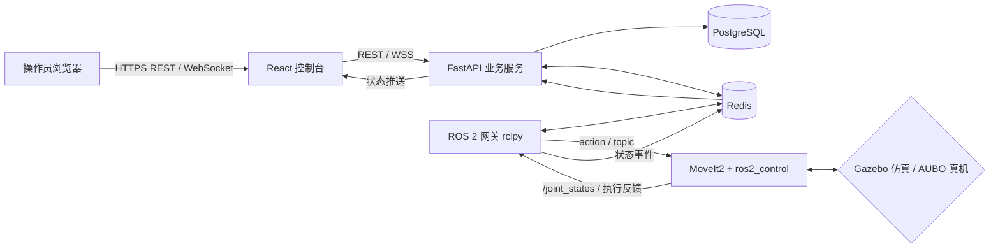

# 机械臂远程控制与任务编排平台实施文档

> [!abstract] 项目目标
> 基于本仓库现有的 AUBO i5 / 二维机械臂 ROS 2 仿真资产，实现一个可从浏览器完成设备监控、关节遥操、任务编排、执行追踪和告警审计的平台。默认只允许仿真控制；真机连接必须显式开启、二次确认，并沿用 [[14-实验4-机械臂真机接口-标定与安全验证]] 的安全门禁。

## 1. 简历中的项目定义

**名称：** 机械臂远程控制与任务编排平台（Simulation-first）

**要解决的问题：** ROS 2 的 topic、action 与 RViz 对开发者友好，但不适合非 ROS 用户远程查看设备状态、下发规范化任务或追溯一次异常执行。本项目以“浏览器控制台 + 后端业务服务 + ROS 2 网关”把两类用户隔离开：操作员只接触受限的业务能力，机器人控制保持在 ROS 2 工作空间内。

**最终演示：**

1. 登录后查看 AUBO i5 仿真器在线状态、六轴关节值、末端位姿、当前告警和最近任务；
2. 选择已保存的抓取/回零/巡检任务，进行参数校验、审批确认并提交；
3. 后端将任务派发给 ROS 2 网关，网关通过 MoveIt2 规划、执行，并实时回传进度；
4. 页面显示轨迹阶段、执行结果和可查询的审计记录；
5. 演示急停：平台立即拒绝新任务并向 ROS 2 网关发布停止指令；恢复须由管理员确认。

**非目标：** 不在本项目中承诺任意网络环境的真机遥操、碰撞安全认证、多机械臂协同或视觉抓取。它们可作为后续迭代，不能写成已经实现的能力。

## 2. 技术选型与边界

| 层次 | 选型 | 职责 | 不选它的原因 |
| --- | --- | --- | --- |
| 前端 | React + TypeScript + Vite + Ant Design + ECharts | 控制台、表单、看板、实时曲线 | 不让浏览器直接访问 ROS 2 |
| 业务后端 | FastAPI + SQLAlchemy + Alembic | REST API、鉴权、任务编排、审计、WebSocket 聚合 | 不在此层执行运动控制 |
| 数据 | PostgreSQL + Redis | 任务/审计持久化；Redis 做状态缓存、锁和 WebSocket 广播 | ROS 消息不能替代业务审计库 |
| 机器人网关 | Python `rclpy` 节点 | ROS 2 action/topic 与 HTTP/Redis 消息之间的适配 | 网关是唯一可向 ROS 下发控制意图的应用层进程 |
| 机器人执行 | 现有 ROS 2 Jazzy + Gazebo Harmonic + MoveIt2 + `ros2_control` | 仿真、规划、执行、状态发布 | 真机驱动依然由现有 AUBO SDK 接口管理 |
| 部署 | Docker Compose（平台服务）+ `colcon` 工作空间（ROS） | 一键启动平台；独立启动仿真 | 先避免将 GPU/GUI Gazebo 强塞进容器 |

> [!important] 控制边界
> 网页端只能提交“意图”（如回零、移动到命名点位、执行已审查任务），不能直接发布 `/joint_trajectory` 或任意关节角。网关必须再做模式、限位、速度、工作空间、急停与任务状态检查。真机模式中，AUBO 控制柜的硬件急停和安全配置始终优先于本平台。

## 3. 总体架构与数据流



一次任务的状态机为：

```text
DRAFT -> PENDING_APPROVAL -> QUEUED -> VALIDATING -> PLANNING
      -> RUNNING -> SUCCEEDED
                   -> FAILED | CANCELLED | REJECTED | EMERGENCY_STOPPED
```

- `DRAFT`、`PENDING_APPROVAL` 只存在于业务系统，不能到达 ROS；
- 同一机器人同一时刻只允许一个 `RUNNING` 任务；通过 Redis 分布式锁 `robot:{id}:execution-lock` 保证；
- `EMERGENCY_STOPPED` 只能由急停事件进入，不能自动恢复；
- 任何状态转移都写入 `task_events`，使任务时间线可追溯。

## 4. 仓库增量结构

保持现有三个 ROS 工作空间独立构建。在仓库根目录新增平台目录，ROS 网关作为 `aubo_i5_ros2_control` 内的新包：

```text
manipulator-control/
├── platform/
│   ├── frontend/                 # React + TypeScript
│   ├── backend/                  # FastAPI 服务
│   ├── compose.yaml              # Postgres、Redis、backend、frontend
│   ├── .env.example
│   └── README.md                 # 一键复现、账号与演示脚本
├── aubo_i5_ros2_control/
│   └── src/
│       └── robot_platform_gateway/  # rclpy 网关包
└── docs/
    └── 35-机械臂远程控制与任务编排平台实施文档.md
```

`robot_platform_gateway` 不修改 AUBO 硬件驱动，只订阅状态、调用 MoveIt2 接口、执行停止动作。先接入二维机械臂的 `simple_arm_gazebo` 验证链路，再切换到 AUBO i5 Gazebo；这符合本仓库“先状态可信、再命令可控、最后接规划”的已有路线。

## 5. 业务模型与数据库

### 5.1 核心表

| 表 | 关键字段 | 用途 |
| --- | --- | --- |
| `users` | `id, username, password_hash, role, is_active` | 账号与角色：`admin`、`operator`、`viewer` |
| `robots` | `id, name, ros_namespace, mode, connection_status, motion_enabled` | 机器人注册与模式：`SIMULATION` / `REAL_READONLY` / `REAL_ENABLED` |
| `waypoints` | `id, robot_id, name, pose_json, joint_values_json, version` | 受控的命名点位；一版一存，禁止覆盖历史 |
| `task_templates` | `id, name, robot_id, definition_json, requires_approval` | 可复用任务模板，如回零、取放、巡检 |
| `tasks` | `id, robot_id, template_id, status, requested_by, approved_by, parameters_json, idempotency_key` | 某次实际执行 |
| `task_events` | `id, task_id, event_type, payload_json, created_at` | 状态机和进度时间线 |
| `robot_snapshots` | `robot_id, recorded_at, joint_state_json, tcp_pose_json, safety_state` | 降采样后的历史状态，用于趋势图 |
| `audit_logs` | `actor_id, action, resource_type, resource_id, ip, detail_json` | 登录、审批、提交、取消、急停、恢复等审计 |

### 5.2 示例任务定义

任务模板的 `definition_json` 使用有限步骤集合，避免用户输入任意 ROS 指令：

```json
{
  "version": 1,
  "steps": [
    {"type": "move_joint", "waypoint": "home", "velocity_scale": 0.15},
    {"type": "move_pose", "waypoint": "pick_ready", "velocity_scale": 0.10},
    {"type": "wait", "seconds": 1},
    {"type": "move_joint", "waypoint": "home", "velocity_scale": 0.15}
  ]
}
```

后端校验 `velocity_scale` 在 `[0.01, 0.20]`；网关再次校验。简历演示中默认速度上限保持低速，所有运动均在 Gazebo 完成。

## 6. API 与实时事件契约

### 6.1 REST API（`/api/v1`）

| 方法与路径 | 权限 | 行为 |
| --- | --- | --- |
| `POST /auth/login` | 匿名 | 登录并返回短期 access token 与刷新 token |
| `GET /robots` | viewer+ | 机器人列表及连接、模式、安全状态 |
| `GET /robots/{id}/snapshot` | viewer+ | 当前关节、TCP 位姿、任务摘要 |
| `GET/POST /waypoints` | viewer+ / admin | 查询/新建命名点位；只允许仿真录点 |
| `GET/POST /task-templates` | viewer+ / admin | 查询/维护模板 |
| `POST /tasks` | operator+ | 创建任务，携带 `Idempotency-Key` |
| `POST /tasks/{id}/approve` | admin | 批准需要审批的任务；提交者不能审批自己的任务 |
| `POST /tasks/{id}/cancel` | operator+ | 仅取消未完成任务；运行中请求网关安全停止 |
| `POST /robots/{id}/emergency-stop` | operator+ | 写入审计、冻结队列、发布急停命令 |
| `POST /robots/{id}/recover` | admin | 确认安全状态后解除平台冻结；不替代硬件复位 |
| `GET /audit-logs` | admin | 按用户、机器人、动作和日期筛选 |

错误格式统一为：`{ "code": "ROBOT_BUSY", "message": "机器人正在执行任务", "request_id": "..." }`。每个请求生成 `request_id`，在 API 日志、任务事件和网关日志中贯穿。

### 6.2 WebSocket（`/ws/robots/{robot_id}`）

客户端订阅后每 100 ms 最多收到一次状态；事件由后端聚合，避免将 ROS 高频消息直接广播给浏览器。

```json
{
  "type": "robot.status",
  "robot_id": "aubo-i5-sim-01",
  "at": "2026-07-15T10:30:00Z",
  "payload": {
    "connection": "ONLINE",
    "safety_state": "NORMAL",
    "joint_positions": [0.0, -0.8, 1.2, 0.0, 1.1, 0.0],
    "tcp_pose": {"x": 0.42, "y": 0.03, "z": 0.31, "qx": 0, "qy": 1, "qz": 0, "qw": 0}
  }
}
```

事件类型：`robot.status`、`task.progress`、`task.completed`、`safety.alert`。前端根据 `type` 做类型守卫；断线指数退避重连，重连后调用快照 API 补全状态。

## 7. ROS 2 网关设计

### 7.1 ROS 接口约定

| 方向 | ROS 接口 | 网关动作 |
| --- | --- | --- |
| 订阅 | `/joint_states` | 缓存六轴关节数据，10 Hz 上报摘要 |
| 订阅 | `/tf`、`/tf_static` | 由 `base_link -> tool0` 计算/读取 TCP 位姿 |
| 订阅 | `/robot_platform/safety_state` | 接收驱动或仿真注入的安全状态 |
| Action client | `move_action` 或项目实际 MoveIt2 执行 action | 发送已校验的关节/位姿目标，接收反馈与结果 |
| 发布 | `/robot_platform/stop_request` | 取消 action、通知控制器停止；具体实现须匹配实际控制器 |
| 发布 | `/robot_platform/platform_heartbeat` | 供监控与排障查看网关存活 |

> [!warning] 先核对真实 action 名称
> MoveIt2 和控制器的 action 名称会随当前 launch 配置变化。实现前用 `ros2 action list -t`、`ros2 topic list -t` 与 `ros2 control list_controllers` 记录实际接口；不要把本文的示例名称硬编码为事实。

### 7.2 网关执行伪代码

```python
async def execute_task(task):
    require(robot.mode == "SIMULATION" or robot.motion_enabled)
    require(safety_state == "NORMAL")
    require(no_active_task())
    acquire_redis_lock(robot.id)
    emit(task.id, "VALIDATING")
    for step in parse_and_validate(task.definition):
        if step.type.startswith("move_"):
            assert_joint_and_workspace_limits(step)
            emit(task.id, "PLANNING", step=step.index)
            goal = build_moveit_goal(step)
            result = await send_goal_and_stream_feedback(goal)
            if not result.success:
                raise TaskFailed(result.error)
        elif step.type == "wait":
            await cancellable_wait(step.seconds)
    emit(task.id, "SUCCEEDED")
```

网关启动时禁止自动执行历史队列；只接受任务服务发出的、带签名/服务身份认证、创建时间在有效窗口内的请求。生产化时可用 mTLS 或私有网络；本地演示至少用 Docker 私有网络、随机密钥和 `.env` 管理敏感配置。

## 8. 前端页面与验收行为

| 路由 | 页面内容 | 必须完成的交互 |
| --- | --- | --- |
| `/login` | 登录 | 表单校验、错误提示、退出登录 |
| `/dashboard` | 机器人卡片、在线率、告警、任务趋势 | 卡片进入详情；离线状态清晰可见 |
| `/robots/:id` | 关节/TCP 实时卡片、状态曲线、当前任务 | WebSocket 断开提示；仿真/真机模式显著区分 |
| `/tasks` | 模板列表、任务记录、状态筛选 | 创建、取消、审批；显示时间线 |
| `/waypoints` | 点位列表与只读详情 | 在仿真模式录点，真机模式禁用 |
| `/audit` | 审计日志 | 多条件筛选与分页，仅管理员可见 |

视觉上将“急停”固定在机器人详情页顶部，使用红色但要求二次确认；“恢复”只能由管理员操作，且页面需展示最近一次急停的操作者、时间和原因。不要把普通的“取消任务”做成红色急停。

## 9. 分阶段实施清单

### 阶段 0：基线复现（0.5 天）

1. 在 Ubuntu 24.04 + ROS 2 Jazzy 环境中按仓库 README 构建 `robot_control_ros2`；
2. 启动二维机械臂仿真，记录 `/joint_states`、MoveIt action 和控制器名称；
3. 再启动 AUBO i5 Gazebo；每次仅运行一套仿真/控制 launch；
4. 保存一份 `docs/evidence/ros-interface-baseline.md`，包含命令、输出摘要和截图。

**验收：** RViz/Gazebo 中模型可动，`/joint_states` 连续更新，且没有多个 `/controller_manager` 互相冲突。

### 阶段 1：业务服务最小闭环（2 天）

1. 创建 `platform/backend`，完成 Alembic、用户、机器人、任务与事件表；
2. 实现 JWT 登录、RBAC、机器人查询、任务创建和任务时间线；
3. 写 API 测试：未登录拒绝、viewer 不可创建任务、重复 `Idempotency-Key` 不重复建任务、提交者不可自审。

**验收：** `pytest` 通过；OpenAPI 页面可以完成“登录 -> 创建草稿任务 -> 管理员审批”的业务流程。

### 阶段 2：ROS 网关仿真闭环（2–3 天）

1. 新建 `robot_platform_gateway` ROS 2 包；
2. 将 `/joint_states` 转成 Redis 状态事件；
3. 先实现只读状态与心跳，确认浏览器可实时看到机械臂运动；
4. 仅开放 `home` 命名点位，以 10%–15% 速度缩放完成一次 MoveIt2 仿真执行；
5. 接入取消与急停状态机，记录 `task_events`。

**验收：** 单击“执行回零”后，页面至少显示 `VALIDATING -> PLANNING -> RUNNING -> SUCCEEDED`；取消后不可继续执行下一步。

### 阶段 3：前端与可观测性（2 天）

1. 完成仪表盘、机器人详情、任务、审计四个页面；
2. 接入 WebSocket 重连、加载态、空态与错误态；
3. 增加结构化日志、请求 ID、健康检查 `/healthz` 与 Prometheus 格式指标（可选）；
4. 用 ECharts 画最近 30 分钟的关节速度或任务状态分布。

**验收：** 刷新页面不丢失任务状态；网关停掉后 5 秒内显示离线；恢复后自动同步快照。

### 阶段 4：交付与展示（1 天）

1. 写 `platform/README.md`：依赖、环境变量、启动命令、默认演示账号、架构图、验收步骤；
2. 写 `compose.yaml`，包含 PostgreSQL、Redis、backend、frontend；
3. 添加 GitHub Actions：后端测试、前端 lint/build；
4. 录制 2–3 分钟视频：登录、实时状态、提交任务、急停、审计查询；
5. 放入真实截图、接口图和测试结果，禁止用未实现的“云端”“AI”“工业级”措辞。

## 10. 本地启动顺序

平台服务与 ROS 仿真分两个终端组启动，避免 ROS 工作空间互相干扰：

```bash
# 终端 A：平台依赖与 Web 服务
cd ~/manipulator-control/platform
cp .env.example .env
docker compose up --build

# 终端 B：仿真（任选其一，不要同时启动）
cd ~/manipulator-control/aubo_i5_ros2_control
source /opt/ros/jazzy/setup.bash
colcon build --symlink-install
source install/setup.bash
ros2 launch aubo_i5_gazebo demo_gazebo.launch.py

# 终端 C：网关
cd ~/manipulator-control/aubo_i5_ros2_control
source /opt/ros/jazzy/setup.bash
source install/setup.bash
ros2 run robot_platform_gateway gateway_node --ros-args -p mode:=simulation
```

在网关未实现前，阶段 1 的后台可用 fake gateway 发送固定状态事件，使前端和业务流程可并行开发。fake gateway 的消息必须明确标记 `source: "fake"`，不得伪装成真实仿真数据。

## 11. 测试、验收与证据

| 层次 | 关键测试 | 成功标准 |
| --- | --- | --- |
| 后端单测 | RBAC、状态机非法跳转、幂等创建、审批约束 | 核心服务分支均被覆盖，所有测试通过 |
| API 集成 | 登录、创建、审批、取消、急停 | HTTP 状态码和审计日志符合预期 |
| 网关测试 | 关节数组长度、限位检查、超时、取消 | 缺轴/超限/离线均拒绝执行 |
| 仿真 E2E | 回零任务、任务失败、WebSocket 断线重连 | Gazebo 行为和页面时间线一致 |
| 人工安全检查 | 真机模式开关、急停/恢复权限 | 默认禁运动；没有审批/安全条件不可发运动 |

建议保留以下证据并加入 README：一次成功执行的任务时间线、一段失败原因明确的日志、后端测试报告、Docker Compose 启动截图、Gazebo 与网页状态同屏演示视频。它们比堆砌技术名词更能支撑简历表述。

## 12. 真机接入门槛

本平台的第一版只交付仿真。若要接 AUBO 真机，必须逐项满足：

- 先通过仓库既有只读启动方式确认完整 `/joint_states`、关节方向、零位、单位、TF 和安全状态；
- 将 `robots.mode` 设置为 `REAL_READONLY`，验证 30 分钟状态监控稳定后才允许申请运动；
- 真机运动需环境白名单、现场人员、硬件急停可达、低速度/小幅度动作和独立的现场验收记录；
- `REAL_ENABLED` 不是前端按钮可直接切换的状态，须由部署配置和管理员双重确认；
- 任意网络、网关、状态超时或安全状态未知时，平台进入冻结并拒绝新任务。

## 13. 简历与面试表达

完成后可按事实使用如下表述：

> 独立开发机械臂远程控制与任务编排平台：以 React/FastAPI 构建设备监控、RBAC、任务审批和审计能力；通过 `rclpy` 网关桥接 ROS 2 与 MoveIt2，在 Gazebo 中实现任务状态实时回传、受限点位执行和急停冻结；使用 PostgreSQL/Redis 保障任务状态持久化、幂等提交与单机互斥执行，并用 Docker Compose 和自动化测试完成可复现交付。

面试时重点讲清三件事：为什么浏览器不能直接发布 ROS 指令；如何避免同一机械臂并发执行；急停后为何不能自动恢复。能展示测试、日志和演示视频时，这个项目会比普通 CRUD 管理后台更有辨识度。
