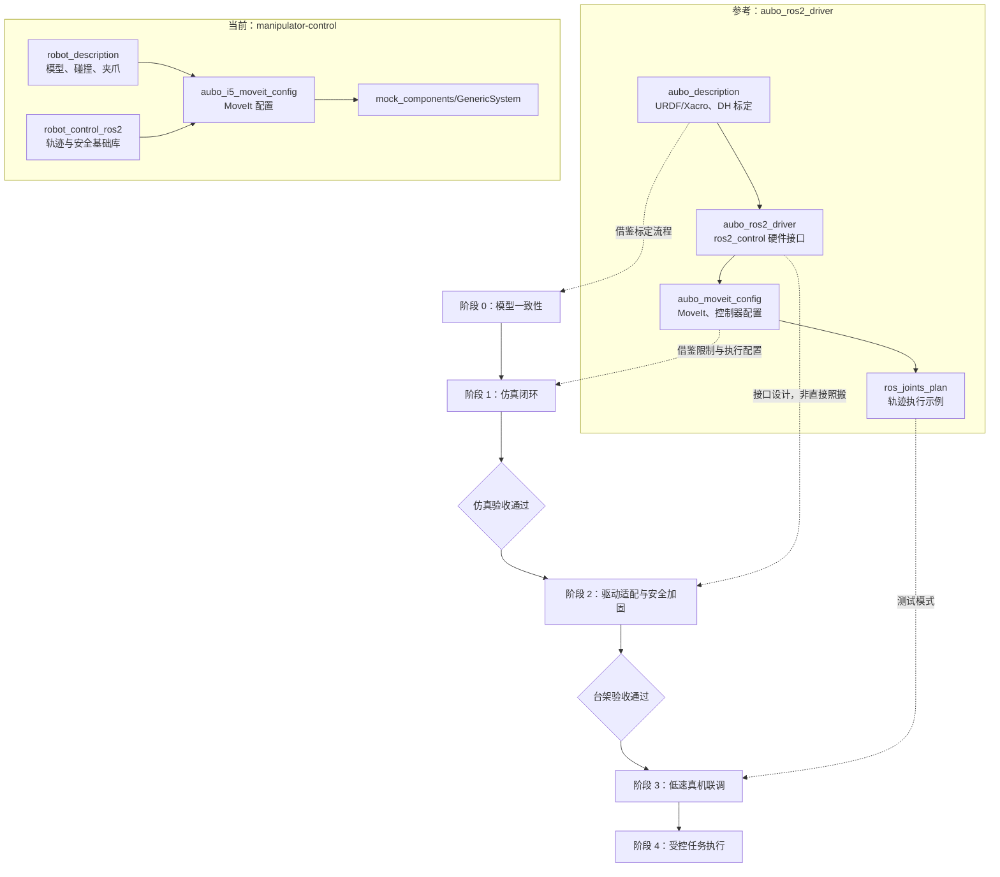

# AUBO i5：从仿真到真机的改造路线图

本文以 `D:\files\code\aubo_ros2_driver` 为参考，规划如何将本仓库的 AUBO i5 项目从当前的 MoveIt 仿真，逐步演进为可验证、可回退的真机控制系统。

> 范围：AUBO i5、ROS 2、`ros2_control`、MoveIt 2。任何真机动作都必须在风险评估、限速、急停可用和现场监护的条件下进行。

## 1. 总览图



## 2. 两个仓库的职责与差距

| 层级       | 当前仓库                                            | 参考仓库                                            | 应采取的动作                                                           |
| ---------- | --------------------------------------------------- | --------------------------------------------------- | ---------------------------------------------------------------------- |
| 机器人描述 | `robot_description`，包含机械臂、夹爪、网格和 Xacro | `aubo_description`（当前为未拉取内容的 Git 子模块） | 保留本仓库的夹爪/相机模型；借鉴标定 URDF 的组织及参数校验方式。        |
| 运动规划   | `aubo_i5_moveit_config`，使用 KDL，默认限速为 0.1   | `aubo_moveit_config`，含 OMPL、Pilz、控制器映射     | 不直接替换 SRDF；逐项对齐规划组、末端、碰撞矩阵和执行 action。         |
| 控制后端   | `mock_components/GenericSystem`，仅仿真             | `AuboHardwareInterface`，通过 RPC/RTDE 与控制柜通讯 | 先保留 mock 后端，再新增可选硬件后端；绝不让仿真启动命令隐式连接真机。 |
| 控制器     | 100 Hz，位置状态接口                                | 200 Hz，位置/速度状态接口、轨迹控制器               | 先提高仿真配置的完整性；控制周期和控制柜周期以实测为准。               |
| 轨迹/安全  | 有 `SafetyLimiter`、插值和轨迹缓冲等基础库          | 有单点轨迹示例和 Servo 通道                         | 将安全库放在发送目标前；MoveIt 不是物理安全系统。                      |

## 3. 对参考驱动的审计结论

参考仓库很适合作为接口、包结构和启动参数的蓝本，但不应直接复制到真机：

1. `aubo_description` 是 Git 子模块，目前参考目录中没有实际文件；需要先取得其锁定版本，不能假定主仓库中已有可用模型。
2. 硬件接口使用 RPC `30004` 和 RTDE `30010`，并在源码中直接写入登录凭据；本仓库改造时应改为 launch 参数或环境变量，禁止提交实际凭据。
3. 该接口在连接、登录及命令异常处缺少完整的失败处理，且有空的 `catch`；必须补齐错误上报、超时、断线停止、生命周期状态与测试。
4. 它导出位置/速度接口并以 Servo 命令执行位置目标；这要求 URDF、控制器、控制柜模式、周期和单位全部一致。接口名对上并不等于运动安全。

## 4. 实施步骤

### 阶段 0：基线与模型一致性

目标：让所有程序只使用一个、可重复生成的机器人描述。

1. 将 `arm.xacro` 作为机械臂动力学参数的单一来源；不要再人工维护与其漂移的 `aubo_i5_arm.urdf`。改为在构建或启动时由 Xacro 生成 URDF。
2. 为 Xacro 生成结果增加自动检查：XML 可解析、所有关节名称唯一、关节上下限合法、惯性矩阵正定并满足三角不等式。
3. 对比控制柜报告的机器人型号、关节零位方向、DH/标定补偿与本地模型。只有在确认相同型号后，才可采用参考仓库的标定流程。
4. 固化 `base_link`、`world`、TCP 和夹爪坐标系定义；用三个已知关节姿态验证 RViz 末端方向。

验收：RViz 无惯量错误；`robot_description`、MoveIt、`robot_state_publisher` 使用同一份展开 URDF；已记录模型版本和坐标系约定。

知识点：URDF/Xacro、刚体惯量、TF2、DH 参数、TCP、碰撞网格与视觉网格的区别。

### 阶段 1：仿真与 MoveIt 闭环

目标：在不接触真机的条件下验证“规划 → 控制器 → 反馈 → 可视化”闭环。

1. 保留 `mock_components/GenericSystem`，新增明确的 `use_fake_hardware:=true` 启动参数；默认保持仿真模式。
2. 调整 `ros2_controllers.yaml`：为轨迹控制器声明位置命令、位置/速度状态、`state_publish_rate`、`action_monitor_rate`、禁止部分关节目标及结束速度约束。参数应借鉴参考配置，但以当前 ROS 2 发行版支持的字段为准。
3. 将当前 `100` 的关节 URDF 速度上限替换为经厂商资料或控制柜配置确认的 rad/s 值；MoveIt 侧先维持低缩放率（建议速度 0.1、加速度 0.1）。
4. 对齐 `moveit_controllers.yaml` 的 action 名称、控制器名和六个关节列表；用 `FollowJointTrajectory` 发送已知的单关节、双关节和回零轨迹。
5. 增加自动化冒烟测试：启动描述、加载控制器、执行不碰撞轨迹、确认 `/joint_states` 回到目标误差阈值内。

验收：MoveIt 规划能稳定执行，控制器状态为 `active`，状态反馈与命令误差可解释，碰撞检查能拒绝预置障碍物路径。

知识点：`ros2_control` 生命周期、`JointTrajectoryController`、`FollowJointTrajectory` action、MoveIt planning scene、OMPL/Pilz、时间参数化。

### 阶段 2：真机驱动适配与安全加固

目标：以“新增后端”而不是“替换仿真”的方式接入硬件。

1. 在本仓库新增独立包，例如 `aubo_i5_hardware`，实现 `hardware_interface::SystemInterface`；不要把参考仓库源码直接混入 `aubo_i5_moveit_config`。
2. 先定义硬件接口契约：六关节名称和顺序、位置单位（rad）、速度单位（rad/s）、状态时间戳、控制周期、命令超时与控制柜模式。
3. 参考 `AuboHardwareInterface` 实现 `on_init`、`on_activate`、`read`、`write`，但加入：连接/登录结果检查、配置参数校验、异常日志、断线后拒绝写入、反初始化时退出 Servo 模式。
4. 把 IP、端口、用户名、密码、是否允许执行写命令声明为 launch 参数；敏感值只从现场环境变量或受限配置读取，绝不提交到 Git。
5. 在 `write()` 前串联安全门：控制器是否 active、机器人运行/安全模式是否允许、命令是否新鲜、位置/速度是否越限、急停或保护停机是否触发。
6. 先用离线 fake 模式运行同一硬件插件接口，再接控制柜但禁止写命令，最后才允许低速 Servo。

验收：断开网线、非法关节目标、控制柜保护停机和控制器停用均不会产生新的运动命令；任何失败有可读错误日志且可恢复。

知识点：ROS 2 生命周期节点、`pluginlib`、`hardware_interface`、RPC/RTDE、实时循环与非实时网络、故障模式与安全状态机。

### 阶段 3：低速真机联调

前置条件：安全围栏/安全距离、急停、现场监护、已知无碰撞姿态、控制柜处于制造商规定的远程控制与自动运行状态。

1. 将 MoveIt 缩放率设为 `0.05` 或更低，并为每个关节设定保守的速度、加速度和软限位。
2. 先只启用 `joint_state_broadcaster`，验证反馈角度、单位、关节顺序、正方向与 RViz 完全一致。
3. 启用轨迹控制器后，仅执行单关节小幅往返；每次只修改一个变量（关节、幅度、速度或控制周期）。
4. 执行六关节的安全“home”姿态，再执行短距离的笛卡尔轨迹；记录计划轨迹、实际轨迹、最大跟随误差和异常状态。
5. 验证夹爪作为独立执行器，避免将其控制接口混入六轴臂的轨迹控制器。

验收：重复测试中实际关节状态与目标在预设误差内，停机/恢复流程正确，TCP 在可接受误差内到达标定点。

知识点：关节正方向、跟随误差、软/硬限位、保护停机、笛卡尔路径、TCP 标定、风险评估。

### 阶段 4：受控任务执行与长期维护

1. 将“取物、放置、避障”等任务封装为明确的状态机：预检查、规划、用户确认、执行、结果校验、失败回退。
2. 使用规划场景维护工作台、相机、夹爪和工件的碰撞对象；动态障碍物未可靠接入前，不应自动执行。
3. 记录每次真机运行的模型版本、控制器配置、标定版本、速度缩放、关节状态与故障码。
4. 建立发布门禁：描述检查、配置检查、fake-hardware 回归、硬件接口单元测试、人工低速验收，全部通过后才能提升限速。

## 5. 推荐的目录与配置演进

```text
aubo_i5_ros2_control/src/
  robot_description/                 # 保留：模型、夹爪、传感器
  aubo_i5_moveit_config/             # 保留：规划、SRDF、控制器映射
  aubo_i5_hardware/                  # 新增：真机 SystemInterface
    include/
    src/
    config/
      hardware_defaults.yaml          # 不含凭据
    launch/
      aubo_control.launch.py          # fake/real 明确切换
    test/
  aubo_i5_bringup/                   # 新增：一键启动与运行模式
    launch/
      simulation.launch.py
      hardware.launch.py
      moveit.launch.py
```

建议的启动顺序：

1. `simulation.launch.py`：只启动 mock 硬件、控制器、`robot_state_publisher` 和 RViz。
2. `moveit.launch.py`：连接已启动的仿真或真机控制器，不重复生成机器人描述。
3. `hardware.launch.py`：要求显式提供 `robot_ip` 和 `enable_motion:=true`；若未显式开启，则只读状态或拒绝启动写接口。

## 6. 首批可执行工作清单

- [ ] 把展开 URDF 从手工文件改为 Xacro 单一来源，并加入惯性/关节校验。
- [ ] 补齐 fake-hardware 启动入口和控制器配置的状态接口、action 监控及测试。
- [ ] 对齐 MoveIt 的控制器 action、SRDF 规划组、TCP 和碰撞矩阵。
- [ ] 拉取并审计参考仓库的 `aubo_description` 子模块，确认其版本和许可证。
- [ ] 新建 `aubo_i5_hardware` 骨架，先实现只读状态反馈与连接错误处理。
- [ ] 完成仿真回归后，再实现受安全门保护的低速写命令。
- [ ] 现场完成模型/零位/TCP 标定及低速单关节验收后，才开始任务执行。

## 7. 不可跳过的原则

- 真机模型必须来自已验证的标定结果；不能用“RViz 看起来正确”代替标定。
- MoveIt 的碰撞检查和速度缩放是软件层保护，不能代替控制柜、急停和现场安全措施。
- 仿真与真机必须可以独立启动、独立回归；真机连接绝不能成为默认行为。
- 每次提升速度或扩大动作范围前，都要重新完成对应的验收门槛。
