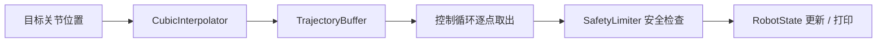

# 第 1 周：纯 C++ 控制基础库

## 本周目标

第 1 周的目标是先把控制逻辑从 ROS2 中解耦出来，做成可以单独理解、编译和测试的 C++ 控制基础库。这样后续 ROS2 节点只负责通信和系统集成，核心控制逻辑不直接绑定 ROS2 API。

对应代码位置：

```text
robot_control_ros2/src/robot_control
```

## 实现内容

### RobotState

文件：

```text
robot_control_ros2/src/robot_control/include/robot_state.hpp
robot_control_ros2/src/robot_control/src/robot_state.cpp
```

职责：

- 保存机器人自由度 `dof`
- 保存关节位置 `q`
- 保存关节速度 `dq`
- 提供状态设置、读取、打印和比较接口

它是后续轨迹点、目标状态、当前状态的统一数据结构。

### SafetyLimiter

文件：

```text
robot_control_ros2/src/robot_control/include/safety_limiter.hpp
robot_control_ros2/src/robot_control/src/safety_limiter.cpp
```

职责：

- 设置关节位置上下限
- 设置最大速度限制
- 检查状态是否安全
- 对越界位置和速度进行限幅

它解决的是“轨迹点进入控制循环前是否安全”的问题。

### CubicInterpolator

文件：

```text
robot_control_ros2/src/robot_control/include/cubic_interpolator.hpp
robot_control_ros2/src/robot_control/src/cubic_interpolator.cpp
```

职责：

- 根据起点状态、目标状态、总时长和采样周期生成轨迹
- 支持三次插值轨迹生成
- 保留五次插值接口
- 按索引读取离散轨迹点

它解决的是“从目标位置生成控制周期可执行轨迹”的问题。

### TrajectoryBuffer

文件：

```text
robot_control_ros2/src/robot_control/include/trajectory_buffer.hpp
robot_control_ros2/src/robot_control/src/trajectory_buffer.cpp
```

职责：

- 使用队列缓存轨迹点
- 支持 `push`、`pop`、`hasNext`、`size`、`clear`
- 模拟控制循环按周期消费轨迹点

### control_loop_demo

文件：

```text
robot_control_ros2/src/robot_control/examples/control_loop_demo.cpp
```

这个 demo 串联了状态、限幅、插值和轨迹缓存，用来演示：

```text
生成轨迹 -> 推入缓存 -> 控制循环逐点执行 -> 安全检查 -> 打印状态
```

## 系统链路



## 本周收获

这一周的重点不是写了几个类，而是建立了控制程序的基本分层：

- `RobotState` 表示控制对象的状态
- `CubicInterpolator` 负责生成平滑轨迹
- `TrajectoryBuffer` 负责缓存待执行轨迹点
- `SafetyLimiter` 负责执行前安全保护
- 控制循环负责按固定周期消费轨迹

## 当前限制

- 轨迹执行仍然是 demo，没有接真实硬件
- 控制循环只模拟状态消费，没有电机反馈
- 安全限幅只包含基础位置和速度限制
- 插值主要在关节空间完成，没有完整运动学规划
