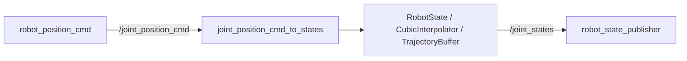

# 第 3 周：ROS2 控制节点与通信链路

## 本周目标

第 3 周的目标是把前两周的 C++ 控制思想接入 ROS2 系统。重点是掌握 ROS2 C++ 节点的基本模式：

- package 结构
- `rclcpp` 节点
- publisher / subscriber
- timer 控制循环
- 自定义消息
- parameter / config
- launch 文件
- C++ 控制库和 ROS2 节点的链接方式

对应代码位置：

```text
robot_control_ros2/src/robot_control_ros2
```

## 实现内容

### 基础 topic 练习

节点：

```text
joint_velocity_publisher
joint_velocity_subscriber
```

作用是练习 ROS2 publisher / subscriber 的基本写法。

### timer 控制循环

节点：

```text
timer_control_node
```

作用是理解控制节点通常依赖固定周期循环，而不是只在收到消息时计算。

### 速度到位置控制节点

节点：

```text
vel_to_pos_node
```

配置：

```text
robot_control_ros2/src/robot_control_ros2/config/vel_to_pos.yaml
```

作用：

- 读取速度命令
- 根据控制周期积分成位置
- 使用 yaml 保存控制参数

### 位置命令到 JointState

节点：

```text
joint_position_cmd_to_states
```

文件：

```text
robot_control_ros2/src/robot_control_ros2/src/joint_position_cmd_to_states.cpp
```

作用：

- 订阅 `/joint_position_cmd`
- 使用内部 `RobotState` 保存当前状态
- 使用速度限制和三次插值生成平滑状态
- 发布标准 `sensor_msgs/msg/JointState` 到 `/joint_states`

### 位置命令发布节点

节点：

```text
robot_position_cmd
```

文件：

```text
robot_control_ros2/src/robot_control_ros2/src/robot_position_cmd.cpp
```

作用是周期性发布 2 自由度关节目标位置，作为后续 RViz2 可视化闭环的输入。

## 控制链路



## 本周收获

这一周最重要的是区分 ROS2 节点中的角色：

- publisher 负责发布命令或状态
- subscriber 负责接收外部输入
- timer callback 适合实现固定周期控制循环
- parameter / yaml 适合保存控制参数
- launch 文件负责组织多个节点启动
- ROS2 节点层主要做通信、调度和系统集成
- 核心控制计算可以继续放在纯 C++ 库中

## 当前限制

- 控制节点仍然是 demo 级别，没有真实硬件反馈
- `/joint_states` 来源是模拟状态，不是编码器反馈
- 控制周期、速度限制和插值参数还比较简单
- 尚未接入标准 `ros2_control` 控制器接口
