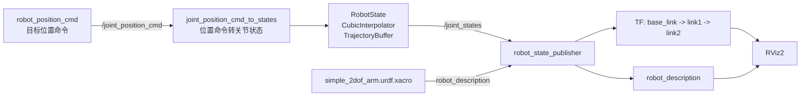

# 第 4 周：URDF、TF 与 RViz2 可视化闭环

## 本周目标

第 4 周的目标是完成一个最小 2 自由度机械臂可视化闭环。重点不是模型复杂度，而是把 URDF、joint state、robot_state_publisher、TF 和 RViz2 串起来。

对应代码位置：

```text
robot_control_ros2/src/simple_arm_description
```

## 实现内容

### URDF / xacro 模型

文件：

```text
robot_control_ros2/src/simple_arm_description/urdf/simple_2dof_arm.urdf.xacro
```

内容：

- 定义 `base_link`
- 定义 `link1`
- 定义 `link2`
- 定义 `joint1`
- 定义 `joint2`
- 设置关节旋转轴和关节上下限

### 显示 launch 文件

文件：

```text
robot_control_ros2/src/simple_arm_description/launch/simple_2dof_arm_display.launch.py
```

作用：

- 使用 `xacro` 生成 `robot_description`
- 启动 `robot_state_publisher`
- 启动 `rviz2`

### 与控制节点连接

第 4 周不是孤立打开 RViz2，而是连接第 3 周控制节点：

- `robot_position_cmd` 发布 `/joint_position_cmd`
- `joint_position_cmd_to_states` 发布 `/joint_states`
- `robot_state_publisher` 读取 `/joint_states` 并发布 TF
- RViz2 显示机器人模型和坐标系

## 系统链路图



## 为什么这叫可视化闭环

这个阶段的重点不是“打开了 RViz2”，而是形成了完整链路：

1. 控制节点产生关节目标命令
2. 状态转换节点生成平滑的关节状态
3. `/joint_states` 发布当前关节位置和速度
4. `robot_state_publisher` 根据 URDF 和 joint state 计算各 link 的 TF
5. RViz2 显示机器人模型和坐标变换结果

RViz2 是系统状态的可视化终点，而不是整个项目本身。

## 启动与验证命令

进入 ROS2 工作空间：

```bash
cd ~/cpp_practice/robot_control_ros2
```

编译：

```bash
colcon build
```

加载环境：

```bash
source install/setup.bash
```

启动 2 自由度机械臂显示：

```bash
ros2 launch simple_arm_description simple_2dof_arm_display.launch.py
```

另开终端，启动位置命令发布节点：

```bash
cd ~/cpp_practice/robot_control_ros2
source install/setup.bash
ros2 run robot_control_ros2 robot_position_cmd
```

再开一个终端，启动位置命令到关节状态的转换节点：

```bash
cd ~/cpp_practice/robot_control_ros2
source install/setup.bash
ros2 run robot_control_ros2 joint_position_cmd_to_states
```

检查 topic：

```bash
ros2 topic list
ros2 topic echo /joint_position_cmd
ros2 topic echo /joint_states
```

检查 TF：

```bash
ros2 run tf2_tools view_frames
```

RViz2 中建议添加或检查：

- `RobotModel`
- `TF`
- `Axes`
- Fixed Frame 设置为 `base_link`

## 当前效果

当前 demo 可以展示一个简单 2 自由度机械臂模型。控制节点发布关节目标后，状态转换节点发布 `/joint_states`，`robot_state_publisher` 根据 URDF 生成 link 之间的 TF，RViz2 可以显示机器人模型姿态变化。

## 当前限制

- URDF 模型是简单 2 自由度机械臂，不是复杂工业机械臂
- `/joint_states` 来自模拟节点，不是真实电机或编码器
- 控制节点还没有接入真实动力学模型
- 没有 Gazebo / Ignition 物理仿真
- 没有 MoveIt2 运动规划
- 没有 ros2_control 标准控制器接口
- 当前重点是验证“命令、状态、模型、TF、可视化”的基础闭环
