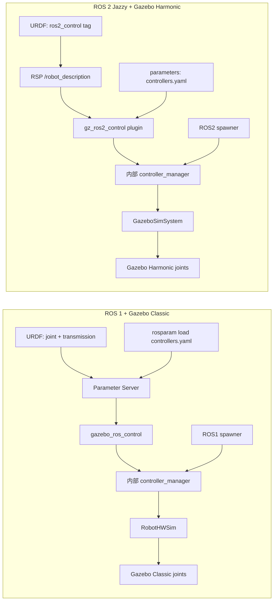

# ROS 1 流程与 ROS 2 对照

> [!warning] 定位
> ROS 1 的最后一个发行版 Noetic 已结束支持。此章用于理解旧项目、面试和迁移；新项目继续以 Ubuntu 24.04 + ROS 2 Jazzy 为主。不要将 ROS 1 的 `roslaunch`、参数服务器、Gazebo Classic 插件与当前 Jazzy 的 `ros2_control`/Gazebo Harmonic 混用。

## 1. ROS 1 的总链路

```mermaid
flowchart TD
  X[Xacro] --> P[ROS Parameter Server
/robot_description]
  P --> R[RSP]
  R --> TF[/tf 与 /tf_static]
  P --> G[Gazebo Classic spawn_model]
  G --> GP[gazebo_ros_control plugin]
  GP --> CM[内部 controller_manager]
  Y[rosparam load controllers.yaml] --> PS[Parameter Server]
  PS --> CM
  SP[controller_manager spawner] --> CM
  M[MoveIt 1 move_group] --> A[FollowJointTrajectory Action]
  A --> J[ROS1 JointTrajectoryController]
  J --> GP
```

ROS 1 最重要的不同是：**机器人描述和控制器 YAML 的中心是 Parameter Server，而不是 ROS 2 的参数 + transient-local topic 模型。**

## 2. Xacro 如何进入 ROS 1

典型 ROS 1 launch：

```xml
<launch>
  <arg name="robot" default="$(find my_robot_description)/urdf/robot.urdf.xacro"/>

  <param name="robot_description"
         command="$(find xacro)/xacro --inorder $(arg robot) use_gazebo:=true"/>

  <node pkg="robot_state_publisher" type="robot_state_publisher"
        name="robot_state_publisher"/>
</launch>
```

运行逻辑：

```text
roslaunch 启动 roscore（含 Parameter Server）
  -> roslaunch 执行 xacro 命令
  -> 将 Xacro 输出的 URDF XML 写入 Parameter Server 的 /robot_description
  -> RSP、Gazebo plugin、MoveIt 从参数服务器读取该值
```

ROS 1 中 `/robot_description` 通常是参数名，不是 RSP 重发布的 transient-local topic。迟到节点通过查询 Parameter Server 获取它；这与 Jazzy 的“RSP 参数 -> `/robot_description` transient-local topic -> subscriber”不同。

## 3. ROS 1 RSP 的过程

RSP 启动后从 Parameter Server 读取 `/robot_description`，解析 URDF。固定关节发布到 `/tf_static`，活动关节订阅 `/joint_states` 后发布到 `/tf`。它的 FK 职责与 ROS 2 RSP 相同：只做“URDF + joint states -> TF”，不控制机器人、不产生真实状态。

```text
Parameter Server /robot_description -> RSP
/joint_states -> RSP -> /tf
URDF fixed joints -> RSP -> /tf_static
```

## 4. ROS 1 Fake、Gazebo、真机的 ros_control

### 4.1 Fake execution：MoveIt 的展示工具

ROS 1 MoveIt 常见 `demo.launch` 会启用 `fake_execution:=true` 或 `moveit_fake_controller_manager`。它通常只让 RViz/MoveIt 显示轨迹，或用假的 joint state 更新模型；它不是完整 `ros_control` 硬件闭环，也不验证 Gazebo 物理或真机通信。

```text
MoveIt 1 -> fake controller manager -> RViz 显示/伪状态
```

它对应“快速验证规划”，不要误认为等同 ROS 2 的 `mock_components/GenericSystem + ros2_control_node`。

### 4.2 Gazebo Classic：gazebo_ros_control

ROS 1 Gazebo 常使用 Gazebo Classic 与 `gazebo_ros_control`：

```xml
<transmission name="trans_joint1">
  <type>transmission_interface/SimpleTransmission</type>
  <joint name="joint1">
    <hardwareInterface>hardware_interface/EffortJointInterface</hardwareInterface>
  </joint>
  <actuator name="motor1">
    <hardwareInterface>hardware_interface/EffortJointInterface</hardwareInterface>
    <mechanicalReduction>1</mechanicalReduction>
  </actuator>
</transmission>

<gazebo>
  <plugin name="gazebo_ros_control" filename="libgazebo_ros_control.so">
    <robotNamespace>/my_robot</robotNamespace>
    <robotParam>/robot_description</robotParam>
  </plugin>
</gazebo>
```

关键差异：ROS 1 用 `<transmission>` 将 joint 和 actuator/hardware interface 关联；ROS 2 `ros2_control` 用 `<ros2_control>` 和 command/state interface 描述硬件。Gazebo Classic plugin 从 Parameter Server 指定的 `robotParam` 读取 URDF，解析 transmission，创建 `RobotHWSim` 和内部 `controller_manager`。

控制器 YAML 通常通过 launch 单独放入 Parameter Server：

```xml
<rosparam file="$(find my_robot_control)/config/controllers.yaml" command="load"/>

<node pkg="controller_manager" type="spawner" name="spawner"
      args="joint_state_controller arm_controller"/>
```

流程是：

```text
rosparam load controllers.yaml
  -> Parameter Server 中出现 /arm_controller/type 等参数
Gazebo spawn 模型
  -> gazebo_ros_control 创建内部 manager/RobotHWSim
controller_manager spawner
  -> 调用该 manager 的 ROS 服务
  -> load/configure/start ROS1 controller
```

这与当前 Gazebo Sim 的关系很相似：Gazebo plugin 内部承载 manager，外部 spawner 激活 controller；但 ROS 1 配置通过 Parameter Server + transmission，ROS 2 Jazzy 通过 description topic + `<ros2_control>` + `gz_ros2_control`。

### 4.3 ROS 1 真机：RobotHW + 自己写控制循环

ROS 1 没有与 ROS 2 `ros2_control_node` 完全等价的标准通用可执行程序。真机通常由厂商驱动或你自己的 hardware node 完成：

```cpp
hardware_interface::RobotHW robot_hw;
controller_manager::ControllerManager cm(&robot_hw, nh);

while (ros::ok()) {
  const ros::Duration period = ...;
  robot_hw.read(now, period);   // 编码器/控制柜 -> JointStateInterface
  cm.update(now, period);       // controller 计算 command
  robot_hw.write(now, period);  // command -> 控制柜/驱动器
  rate.sleep();
}
```

厂商 driver 经常把这套模式封装起来。核心仍是 `read -> controller_manager.update -> write`，但启动、参数、生命周期和接口 API 比 ROS 2 更依赖具体驱动。

## 5. ROS 1 MoveIt 1 执行流程

```text
RViz/程序 -> move_group
  -> request adapters
  -> OMPL / Pilz 等规划器
  -> time parameterization 与验证
  -> MoveIt controller manager
  -> /arm_controller/follow_joint_trajectory
  -> ROS1 JointTrajectoryController
  -> RobotHW / gazebo_ros_control
```

`moveit_controllers.yaml` 同样只告诉 MoveIt “哪个 controller 管哪些 joints、action 在哪里”；它不替代 `controllers.yaml`，后者才是 ros_control controller 的 type、joint、PID 参数等配置。

## 6. ROS 1 与当前 ROS 2 Jazzy 对照表

| 问题 | ROS 1 | ROS 2 Jazzy（当前工程） |
|---|---|---|
| 启动工具 | `roslaunch` + XML launch | `ros2 launch` + Python launch |
| 全局配置中心 | ROS Master / Parameter Server | 节点参数 + DDS topic/service/action |
| URDF 交付 | `/robot_description` 参数 | RSP 参数后重发布 transient-local topic |
| RSP | 参数读 URDF，发 TF | 参数读 URDF，重发 description，发 TF |
| 控制框架 | `ros_control` | `ros2_control` |
| 真机硬件基类 | `hardware_interface::RobotHW` | `hardware_interface::SystemInterface` |
| 通用 manager node | 常由驱动自己写循环 | `ros2_control_node` 提供通用宿主 |
| Gazebo | Gazebo Classic + `gazebo_ros_control` | Gazebo Harmonic + `gz_ros2_control` |
| 硬件建模 | `<transmission>` | `<ros2_control>` + command/state interface |
| controller 启动 | ROS1 spawner / services | ROS2 spawner / lifecycle services |
| 通信策略 | TCPROS/UDPROS，少量 transport 选项 | DDS QoS 显式匹配 |
| 真机安全 | 驱动/节点自行设计 | 生命周期、接口、diagnostics 仍需自行设计 |

## 7. 重点对照：`transmission + gazebo_ros_control` 与 `<ros2_control> + gz_ros2_control`

这两套写法解决的是相同问题：让标准控制器能读写 Gazebo 中的关节。但模型描述、插件、配置来源和 manager 宿主不同。

### 7.1 一眼看懂的数据流



### 7.2 URDF 关节接口写法对照

#### ROS 1：`<transmission>`

ROS 1 的关节本身仍在普通 URDF `<joint>` 中。控制接口主要通过 transmission 将 joint 与 actuator 联系，并声明 hardware interface：

```xml
<joint name="joint1" type="revolute">
  <parent link="base_link"/>
  <child link="link1"/>
  <axis xyz="0 0 1"/>
</joint>

<transmission name="trans_joint1">
  <type>transmission_interface/SimpleTransmission</type>
  <joint name="joint1">
    <hardwareInterface>hardware_interface/EffortJointInterface</hardwareInterface>
  </joint>
  <actuator name="motor1">
    <hardwareInterface>hardware_interface/EffortJointInterface</hardwareInterface>
    <mechanicalReduction>1</mechanicalReduction>
  </actuator>
</transmission>
```

`gazebo_ros_control` 读取 transmission，并创建对应的 `JointStateInterface`、Effort/Velocity/Position 类接口（具体支持取决于 Classic 版本与插件）。传动比、actuator 等信息在 ROS 1 模型中更显式。

#### ROS 2：`<ros2_control>`

ROS 2 直接以硬件组件为中心，逐关节声明可写 command interface 和可读 state interface：

```xml
<ros2_control name="GazeboSimSystem" type="system">
  <hardware>
    <plugin>gz_ros2_control/GazeboSimSystem</plugin>
  </hardware>
  <joint name="joint1">
    <command_interface name="position"/>
    <state_interface name="position"/>
    <state_interface name="velocity"/>
  </joint>
</ros2_control>
```

含义是：上层 controller 可写 `joint1/position`，可读 `joint1/position` 与 `joint1/velocity`。`GazeboSimSystem` 将它们接到 Gazebo Harmonic 的关节。ROS 2 中 transmission 并非在所有简单场景都需要；是否需要取决于机械传动和 hardware plugin 的实现，而不是照搬 ROS 1 XML。

### 7.3 Gazebo 插件写法对照

#### ROS 1 Gazebo Classic

```xml
<gazebo>
  <plugin name="gazebo_ros_control" filename="libgazebo_ros_control.so">
    <robotNamespace>/my_robot</robotNamespace>
    <robotParam>/robot_description</robotParam>
    <controlPeriod>0.01</controlPeriod>
  </plugin>
</gazebo>
```

它从 ROS 1 Parameter Server 的 `/robot_description` 读取 URDF，解析 transmission，建立 `RobotHWSim` 与内部 ROS1 controller manager。

#### ROS 2 Jazzy Gazebo Harmonic

```xml
<gazebo>
  <plugin filename="libgz_ros2_control-system.so"
          name="gz_ros2_control::GazeboSimROS2ControlPlugin">
    <parameters>/absolute/path/ros2_controllers.yaml</parameters>
  </plugin>
</gazebo>
```

它从被 create 到 Gazebo 的模型中解析 `<ros2_control>`，建立 `GazeboSimSystem` 与内部 ROS2 controller manager；`<parameters>` 提供 controller YAML 路径。Jazzy 下官方示例使用 `libgz_ros2_control-system.so`，项目中若写成省略 `lib`/`.so` 的形式，必须以 Gazebo 插件加载日志为准验证。

### 7.4 控制器 YAML 如何到达 manager

| 环节 | ROS 1 | ROS 2 Jazzy Gazebo |
|---|---|---|
| YAML 注入 | `<rosparam file="controllers.yaml" command="load"/>` | `<parameters>/absolute/path/ros2_controllers.yaml</parameters>` |
| 存放位置 | 全局 Parameter Server | Gazebo plugin 创建的 manager 节点参数 |
| controller 类型字段 | `type: effort_controllers/JointPositionController` 等 | `type: joint_trajectory_controller/JointTrajectoryController` 等 |
| 真正创建 | ROS1 spawner 调用 manager service | ROS2 spawner 调用 manager service |

两边都要记住：**YAML 只提供 type 和参数；spawner 才实际 load/configure/start（ROS 1）或 load/configure/activate（ROS 2）controller。**

ROS 1 常见 YAML 形态：

```yaml
joint_state_controller:
  type: joint_state_controller/JointStateController
  publish_rate: 50
joint1_position_controller:
  type: effort_controllers/JointPositionController
  joint: joint1
  pid: {p: 100.0, i: 0.01, d: 10.0}
```

ROS 2 当前项目的 YAML 形态：

```yaml
controller_manager:
  ros__parameters:
    arm_controller:
      type: joint_trajectory_controller/JointTrajectoryController
arm_controller:
  ros__parameters:
    joints: [joint1, joint2]
    command_interfaces: [position]
    state_interfaces: [position, velocity]
```

### 7.5 controller manager 谁来承载

| 场景 | ROS 1 | ROS 2 Jazzy |
|---|---|---|
| Gazebo | `gazebo_ros_control` plugin 内部创建 ROS1 manager | `gz_ros2_control` plugin 内部创建 ROS2 manager |
| Fake | MoveIt fake controller manager 或具体 fake hardware 节点 | `ros2_control_node + mock_components/GenericSystem` |
| 真机 | 厂商/自写 `RobotHW` 节点中手写 `ControllerManager` 循环 | `ros2_control_node + SystemInterface` |

这里是 ROS 2 的工程化优势之一：Fake 和真机都可以用统一 `ros2_control_node` 宿主，减少每个项目重复手写 manager 循环；Gazebo 则由插件在仿真进程中托管，避免外部进程重复控制同一模型。

### 7.6 同一目标的启动片段对照

#### ROS 1 Gazebo Classic

```xml
<param name="robot_description" command="$(find xacro)/xacro $(find my_robot)/urdf/robot.xacro"/>
<rosparam file="$(find my_robot_control)/config/controllers.yaml" command="load"/>
<node pkg="gazebo_ros" type="spawn_model" name="spawn"
      args="-urdf -param robot_description -model my_robot"/>
<node pkg="controller_manager" type="spawner" name="spawner"
      args="joint_state_controller joint1_position_controller"/>
```

#### ROS 2 Jazzy Gazebo Harmonic

```python
# Command(xacro ...) -> RSP parameter -> transient-local /robot_description
robot_state_publisher = Node(... parameters=[robot_description])
spawn_robot = Node(package="ros_gz_sim", executable="create",
                   arguments=["-name", "my_robot", "-topic", "robot_description"])
jsb_spawner = Node(package="controller_manager", executable="spawner",
                   arguments=["joint_state_broadcaster", "-c", "/controller_manager"])
arm_spawner = Node(package="controller_manager", executable="spawner",
                   arguments=["arm_controller", "-c", "/controller_manager"])
```

ROS 2 中不需要在 launch 外单独 `rosparam load`；Gazebo plugin 经 `<parameters>` 拿到 YAML。Fake/真机时则由外部 `ros2_control_node` 的 `parameters=[controllers_yaml]` 加载 YAML。

### 7.7 迁移旧项目时的检查清单

- [ ] 将 ROS 1 `<transmission>` 的每个 joint/interface 需求整理为 ROS 2 command/state interface。
- [ ] 不复制 `libgazebo_ros_control.so`，替换为 Jazzy 的 `gz_ros2_control`。
- [ ] 不复制 `rosparam` 与 Parameter Server 的 description 依赖，改由 RSP transient-local description topic。
- [ ] 将 ROS1 controller type、topic command 语义和 PID 配置逐项映射到 ROS2 controllers。
- [ ] 把 ROS1 `RobotHW::read/update/write` 迁移为 Jazzy `SystemInterface` 生命周期和 read/write。
- [ ] 重新验证 joint 名、单位、TF、controller action，不假设 ROS 1 launch 可直接迁移。

## 8. 面试背诵

**问：ROS 1 和 ROS 2 的控制链路最大区别是什么？**  
答：ROS 1 以 ROS Master 和 Parameter Server 为中心，URDF 与 controller YAML 常由 roslaunch/rosparam 放到参数服务器；Gazebo Classic 用 transmission 和 gazebo_ros_control。ROS 2 基于 DDS，Jazzy 中 RSP 将 description 以 transient-local topic 重发布，ros2_control 用 `<ros2_control>` 声明 command/state interface，通用 `ros2_control_node` 承载 controller manager，Gazebo Harmonic 用 gz_ros2_control。两者控制核心都遵循 read-update-write，但配置传递、插件接口和通信模型不同。

**问：为什么不能把 ROS 1 的 Gazebo 控制插件复制到 Jazzy？**  
答：`gazebo_ros_control` 面向 Gazebo Classic 和 ROS 1 的 transmission/Parameter Server 模型；Gazebo Classic 未面向 Ubuntu 24.04/Jazzy 发布。Jazzy 应使用 Gazebo Harmonic、`gz_ros2_control` 与 `<ros2_control>`，否则会遇到 ABI、插件、接口和启动机制不兼容。
