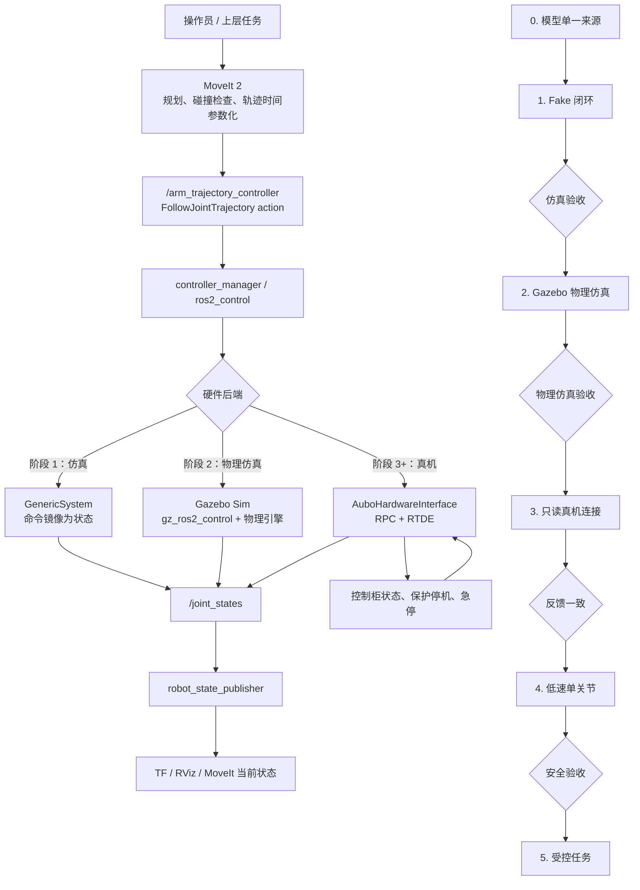
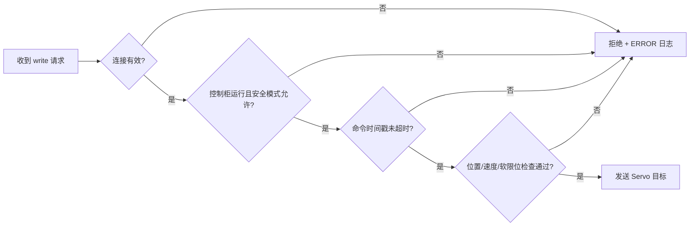

# AUBO 参考驱动审计与仿真到真机实施手册

> [!abstract] 本笔记的目标
> 基于 `D:\files\code\aubo_ros2_driver` 的实现经验，把当前仓库的 AUBO i5 从 **RViz/MoveIt 仿真** 逐步升级为 **可测试、可回退、低速安全接入真机** 的 ROS 2 系统。本文给出每一步要改什么、为什么改、如何验证，以及失败后如何停止。

> [!danger] 真机动作前提
> 本文中的真机步骤不是“复制命令即可运行”。必须有现场监护、可用急停、明确的安全空间、厂家规定的控制柜模式，并且先通过前一阶段的验收。MoveIt 的碰撞检测和速度缩放不能替代实体安全措施。

## 1. 一图看懂：最终系统与迁移顺序



这张图的关键是：**规划器永远只面对标准的 ROS 2 控制器接口；仿真与真机的差异只放在 `ros2_control` 硬件后端。** 因此，仿真验证通过的 MoveIt、控制器和任务节点可以复用到真机，但仍要重新做动力学、标定与安全验证。

## 2. 参考仓库到底提供了什么

参考根目录：`D:\files\code\aubo_ros2_driver`

| 组件                                | 观察到的职责                                                                   | 对当前项目的价值                   | 迁移原则                         |
| --------------------------------- | ------------------------------------------------------------------------ | -------------------------- | ---------------------------- |
| `aubo_ros2_driver`                | 自定义 `hardware_interface::SystemInterface`；通过 RPC 与 RTDE 读取状态、发送 Servo 目标 | 真机通讯与 `ros2_control` 接口的参考 | 借鉴架构；不要原样复制。                 |
| `aubo_moveit_config`              | MoveIt 启动、运动学、关节限位、OMPL/Pilz、控制器映射                                       | 对齐 MoveIt 执行链路的参考          | 逐项对比，不覆盖本仓库的夹爪、相机、SRDF。      |
| `aubo_description`                | 官方/参考机器人描述及标定脚本                                                          | 校验型号和标定流程                  | 它是 Git 子模块，当前目录未检出；先锁定版本再使用。 |
| `ros_joints_plan`                 | 点到点关节轨迹示例                                                                | 真机联调中最小动作测试的参考             | 先改造成低速、可中止、参数化的测试节点。         |
| `aubo_msgs`、`aubo_dashboard_msgs` | 控制柜服务、状态消息定义                                                             | 后续诊断与运维接口的参考               | 先建立最小运动闭环，再按需求接入。            |

### 2.1 参考驱动中必须修正的地方

不要将参考仓库直接当作生产驱动，原因如下：

1. `aubo_hardware_interface.cpp` 中存在硬编码登录凭据；凭据必须改成现场环境变量或受保护的参数文件，绝不提交 Git。
2. RPC/RTDE 的 `connect()`、`login()`、订阅和 Servo 调用需要逐项检查返回值；连接失败必须进入 `ERROR` 状态，不能继续发送命令。
3. `write()` 中捕获异常但没有报告的写法不可接受；必须记录错误、停止继续写入，并通知上层控制器。
4. 参考实现使用 RPC `30004` 和 RTDE `30010`；端口、SDK 版本和控制柜软件版本须与现场设备确认，不能假设完全一致。
5. 真机周期、Servo 指令频率和 `controller_manager` 的 `update_rate` 必须通过实测确定。简单把 `100 Hz` 改成 `200 Hz` 不是性能优化。

> [!warning] 结论
> 可复用的是 **接口分层、启动参数、控制器结构与测试策略**；不能直接复用的是 **网络连接、认证、控制周期、限位和标定数据**。

## 3. 当前工程基线：先确认我们在哪里

当前 AUBO 相关代码位于：

```text
aubo_i5_ros2_control/src/
  robot_description/
    urdf/arm.xacro                 # 机械臂本体参数
    urdf/aubo_i5.xacro             # 机械臂 + 夹爪组合
    urdf/aubo_i5_arm.urdf          # 当前 MoveIt 引用的展开模型
  aubo_i5_moveit_config/
    config/aubo_i5.urdf.xacro      # 当前 ros2_control 模型入口
    config/aubo_i5.ros2_control.xacro
    config/ros2_controllers.yaml
    config/joint_limits.yaml
```

当前 `aubo_i5.ros2_control.xacro` 使用 `mock_components/GenericSystem`。其含义是：控制器收到位置命令后，仿真后端把命令镜像为关节状态；它能验证 MoveIt 与控制器接口，但**不会连接控制柜，也不能代表实际动力学或安全性**。

## 4. 实施前的统一约定

在开始改代码前，先建立以下表格，并保存到团队文档。任何参数未确认时，真机阶段停止。

| 项目 | 必须确认的值 | 如何确认 |
| --- | --- | --- |
| 机器人型号 | AUBO i5 的具体型号/代际/控制柜版本 | 铭牌、控制柜信息、厂家文档。 |
| 关节顺序 | `shoulder → upperArm → foreArm → wrist1 → wrist2 → wrist3` 是否与控制柜一致 | 只读反馈下逐关节小幅手动点动比对。 |
| 单位 | ROS 全部使用 rad、rad/s、m；控制柜接口是否同单位 | SDK 文档 + 只读反馈数值验证。 |
| 零位与正方向 | 每个关节的零位、正方向、机械限位 | 示教器与 RViz 同步对比。 |
| TCP | 法兰、夹爪末端、工具中心点之间的变换 | 厂家工具参数 + 三点/四点标定。 |
| 网络 | IP、网段、RPC/RTDE 端口、超时 | 在部署主机使用只读网络测试确认。 |
| 安全 | 急停、保护停机、速度上限、工作空间 | 现场风险评估和控制柜配置。 |

## 5. 阶段 0：模型与配置单一来源

### 目标

解决“RViz 看到一个模型、MoveIt 读取另一个模型、真机又是第三套标定参数”的根源问题。

### 需要完成的改动

1. 以 `robot_description/urdf/arm.xacro` 为机械臂参数的唯一来源。
2. 让 `aubo_i5_moveit_config/config/aubo_i5.urdf.xacro` 包含顶层 `aubo_i5.xacro` 或其共享宏；不再手动维护同一机械臂的独立 `aubo_i5_arm.urdf`。
3. 保留已修复的 `upperArm_Link` 惯量；其他 link 也执行同一套惯量检查。
4. 明确 `world → base_link → ... → wrist3_Link → TCP` 的 TF 链。夹爪和相机应使用固定关节接到相应的父 link。
5. 把机器人型号、URDF Git 提交号、标定文件版本写到启动日志中，便于复现实验。

### 必须通过的检查

在 Linux ROS 2 工作空间中执行（以下 `<ws>` 为工作空间根目录）：

```bash
cd <ws>
source /opt/ros/jazzy/setup.bash
colcon build --packages-select robot_description aubo_i5_moveit_config
source install/setup.bash

# 展开 xacro：需按最终包名和文件位置调整
ros2 run xacro xacro \
  $(ros2 pkg prefix robot_description)/share/robot_description/urdf/aubo_i5.xacro \
  > /tmp/aubo_i5.urdf
check_urdf /tmp/aubo_i5.urdf
```

预期结果：Xacro 展开成功；`check_urdf` 没有 XML、树结构或 link/joint 定义错误；RViz 不再报告 `unrealistic inertia`。

### 失败时如何定位

| 现象 | 首先检查 | 处理方式 |
| --- | --- | --- |
| RViz 仍提示 `upperArm_Link` 惯量不真实 | MoveIt 实际加载的 `robot_description` | 打印参数，确认不是旧的 install 空间或 `aubo_i5_arm.urdf`。 |
| `check_urdf` 报 link 多父节点 | 顶层 Xacro 是否重复 include | 每个 link 只能有一个父 joint。 |
| TF 中缺 `world` 或 TCP | 固定 joint、`robot_state_publisher`、静态 TF | 只保留一种 world 到 base 的发布方式。 |
| 模型方向与示教器不同 | joint origin 的 `rpy` 和 axis | 在只读/仿真模式一次只检查一个关节。 |

知识点：[[25-robot_state_publisher-RSP详解]]、URDF/Xacro、刚体惯量、TF2、DH 参数、TCP。

## 6. 阶段 1：先做可重复的 Fake 硬件闭环

### 目标

让以下链路在**完全不连接真机**的情况下工作：

```text
MoveIt 规划
  → FollowJointTrajectory
  → arm_trajectory_controller
  → GenericSystem
  → /joint_states
  → robot_state_publisher / RViz
```

### 具体工作

1. 在启动文件显式声明 `use_fake_hardware`，默认值为 `true`。
2. 把真实硬件和 fake 硬件做成同一份 Xacro 的条件分支：

```xml
<xacro:if value="$(arg use_fake_hardware)">
  <hardware>
    <plugin>mock_components/GenericSystem</plugin>
  </hardware>
</xacro:if>
<xacro:unless value="$(arg use_fake_hardware)">
  <hardware>
    <plugin>aubo_i5_hardware/AuboHardwareInterface</plugin>
    <param name="robot_ip">$(arg robot_ip)</param>
  </hardware>
</xacro:unless>
```

3. 轨迹控制器必须使用六个机械臂关节，且名称、顺序、控制器 YAML、MoveIt YAML、URDF 中完全一致。
4. Fake 阶段建议轨迹控制器至少声明：位置 command interface、位置/速度 state interface、状态发布速率和 action 监控速率。
5. `joint_limits.yaml` 的速度应使用真实量纲（rad/s），不要沿用 `100` 这类不具物理意义的占位值。初始执行缩放保持 `0.1` 或更低。

### 建议的控制器配置目标形态

```yaml
controller_manager:
  ros__parameters:
    update_rate: 100
    joint_state_broadcaster:
      type: joint_state_broadcaster/JointStateBroadcaster
    arm_trajectory_controller:
      type: joint_trajectory_controller/JointTrajectoryController

arm_trajectory_controller:
  ros__parameters:
    joints: [shoulder_joint, upperArm_joint, foreArm_joint,
             wrist1_joint, wrist2_joint, wrist3_joint]
    command_interfaces: [position]
    state_interfaces: [position, velocity]
    state_publish_rate: 50.0
    action_monitor_rate: 20.0
    allow_partial_joints_goal: false
```

> [!note] 为什么阶段 1 不急着上 Gazebo
> `GenericSystem` 能以最低复杂度验证 MoveIt、控制器、关节名称、action 和 TF。Gazebo 用于验证动力学、接触和传感器时再加入；同时调 Gazebo、MoveIt 和真机接口会使故障定位失控。

### 验收命令

```bash
# 终端 1：启动 fake 后端与控制器（以最终 bringup 包为准）
ros2 launch aubo_i5_bringup simulation.launch.py

# 终端 2：检查控制器
ros2 control list_controllers
ros2 control list_hardware_interfaces

# 终端 3：观察反馈；不应该全为 NaN，也不应该没有消息
ros2 topic echo /joint_states --once

# 终端 4：检查轨迹 action 是否存在
ros2 action list | grep follow_joint_trajectory
```

通过条件：`joint_state_broadcaster` 和 `arm_trajectory_controller` 均为 `active`；MoveIt 能规划并执行无碰撞路径；RViz 中实际姿态随 `/joint_states` 更新。

知识点：[[22-MoveIt与ros2_control加载执行全流程]]、[[24-ros2_control_node详解]]、`FollowJointTrajectory`、`JointTrajectoryController`、OMPL、时间参数化。

## 7. 阶段 2：Gazebo 物理仿真

### 目标

Fake 后端只验证接口，不计算质量、惯量、重力、碰撞接触或传感器。Gazebo 阶段的目标是让同一份 Xacro 以 `gz_ros2_control` 作为后端运行，从而验证物理属性、关节限制、碰撞模型、工作台和相机/夹爪的仿真集成。

### 具体工作

1. 新建 `aubo_i5_gazebo` 包，或在现有 `robot_description` 中新增 Gazebo 专用 Xacro；不要把 Gazebo 插件直接写死在纯 RViz 模型中。
2. 在顶层 Xacro 引入 `hardware_type:=fake|gazebo|real` 参数：

```xml
<xacro:if value="${hardware_type == 'gazebo'}">
  <gazebo>
    <plugin filename="gz_ros2_control-system"
            name="gz_ros2_control::GazeboSimROS2ControlPlugin">
      <parameters>$(find aubo_i5_moveit_config)/config/ros2_controllers.yaml</parameters>
    </plugin>
  </gazebo>
</xacro:if>
```

3. 为每个 link 检查质量、质心、惯量和 collision 网格。视觉 DAE 用于显示，collision STL 用于接触；不要让高面数视觉网格承担碰撞计算。
4. 建立包含地面、工作台、机械臂、夹爪和可选相机的 world；机器人以固定 base 安装到工作台时，Gazebo 与 TF 中的安装位姿必须一致。
5. 使用与 Fake 模式相同的 `arm_trajectory_controller`、关节顺序和 MoveIt controller mapping；差别应仅在硬件后端。
6. 若使用 Jazzy，优先采用 Gazebo Harmonic 与 `ros_gz_sim`/`gz_ros2_control`；不要把 Gazebo Classic 插件和 Gazebo Sim 插件混用。

### 推荐启动顺序

```bash
# 终端 1：启动 world、机器人和 gz_ros2_control
ros2 launch aubo_i5_gazebo aubo_i5_gazebo.launch.py

# 终端 2：确认 Gazebo 内部的 controller_manager 已出现
ros2 control list_controllers
ros2 topic echo /joint_states --once

# 终端 3：启动 MoveIt；它只连接控制器，不重复 spawn 机器人
ros2 launch aubo_i5_bringup moveit.launch.py hardware_type:=gazebo
```

### Gazebo 验收用例

| 用例 | 操作 | 通过标准 |
| --- | --- | --- |
| 重力稳定性 | 不发命令，观察 10 秒 | 固定基座不漂移；关节不因异常惯量抖动或爆炸。 |
| 单关节轨迹 | MoveIt 发送小幅轨迹 | Gazebo、`/joint_states` 和 RViz 姿态一致。 |
| 关节限位 | 规划接近软限位的目标 | 规划或控制器拒绝越界目标，不穿透机械限位。 |
| 工作台碰撞 | 在 planning scene 和 Gazebo 中放置同一张工作台 | MoveIt 拒绝碰撞路径；Gazebo 中无明显穿模。 |
| 夹爪/相机 | 分别启动各自控制或传感器插件 | 不影响六轴轨迹控制器，话题与 TF 可用。 |

> [!important] Gazebo 的定位
> Gazebo 用来发现模型、接触、惯量和系统集成问题；它不能替代真机标定或安全认证。Gazebo 轨迹通过后，仍需先进入只读真机阶段。

知识点：Gazebo Harmonic、SDF/URDF 转换、`gz_ros2_control`、`ros_gz_sim`、碰撞网格、接触参数、传感器插件。

## 8. 阶段 3：新建真机硬件包，但先只读

### 目标

新增一个隔离的真机包，而不破坏已经验收的仿真入口。

建议目录：

```text
aubo_i5_ros2_control/src/aubo_i5_hardware/
  include/aubo_i5_hardware/aubo_hardware_interface.hpp
  src/aubo_hardware_interface.cpp
  hardware_interface_plugin.xml
  config/hardware_defaults.yaml
  launch/aubo_control.launch.py
  test/test_connection_validation.cpp
  test/test_safety_gate.cpp
```

### 接口职责

| 生命周期函数 | 必须做什么 | 绝不能做什么 |
| --- | --- | --- |
| `on_init()` | 校验 6 个关节、接口类型、IP/端口/超时参数 | 直接运动或假定配置正确。 |
| `on_activate()` | 建立连接、登录、订阅真实反馈；将命令初值设为当前关节值 | 连接失败后仍返回成功；一激活就发送非零位移。 |
| `read()` | 以线程安全方式复制最新位置、速度和状态时间戳 | 用陈旧状态伪装成正常反馈。 |
| `write()` | 仅在安全门通过、命令新鲜且控制柜允许时发送位置目标 | 吞掉异常；在断线、急停或保护停机时发送命令。 |
| `on_deactivate()` | 停止 Servo/退出控制模式、释放连接、报告结果 | 留下持续的 Servo 会话。 |

### 安全门的最小逻辑



建议在 `write()` 前检查：

- 网络连接和 RTDE 数据时间戳；
- 机器人运行模式和安全模式；
- 急停、保护停机、远程控制状态；
- 全部关节命令是否有限值；
- 软限位、最大单周期位移、最大速度；
- `enable_motion` 是否由操作者显式设置为 `true`。

### 配置与凭据

提交到仓库的配置只允许包含非敏感默认值：

```yaml
robot_ip: ""
rpc_port: 30004
rtde_port: 30010
connect_timeout_ms: 1000
command_timeout_ms: 100
enable_motion: false
```

运行时从环境变量或本机不提交的文件传入敏感信息。代码必须在 IP 为空、凭据缺失或 `enable_motion:=false` 时拒绝运动命令。

### 只读联调验收

1. 首次连接时 `enable_motion:=false`。
2. 只启动状态订阅和 `joint_state_broadcaster`，不要启动轨迹控制器。
3. 手动在示教器上小幅点动一个关节，确认 `/joint_states` 的关节名、单位、方向和 RViz 一致。
4. 断开网络，确认节点转入错误状态，且没有继续发布“看似正常”的新鲜状态。
5. 触发控制柜保护停机，确认 ROS 日志和硬件状态明确反映不可执行状态。

通过条件：在任何通信异常或安全状态异常下，节点均拒绝写命令；恢复后须显式重新激活，不能自动继续运动。

## 9. 阶段 4：低速真机运动的逐项操作

> [!warning] 本阶段只能在阶段 0–2 的验收记录齐全后执行。

### 8.1 现场启动前检查表

- [ ] 急停按钮可触及且确认可用。
- [ ] 机械臂工作空间内无人、无松散物体、无未建模障碍物。
- [ ] 夹爪为空载或已知载荷，工具和 TCP 已确认。
- [ ] 示教器显示正常运行、远程控制与厂家要求的模式。
- [ ] `robot_ip` 指向正确设备；网络未经过不稳定 Wi-Fi。
- [ ] 启动参数显示 `enable_motion:=true` 是操作者明确提供的。
- [ ] MoveIt 初始速度和加速度缩放不高于 `0.05`。
- [ ] 当前关节角与规划起始状态一致；不一致时先同步，禁止强行执行。

### 8.2 动作顺序

1. **仅反馈**：在 RViz 中观察真实关节状态 30 秒，无跳变或方向错误。
2. **单关节小幅动作**：每次一个关节、幅度不超过 2°、低速往返；确认命令方向和实际方向一致。
3. **安全 home 姿态**：只使用已人工验证无碰撞的关节空间姿态。
4. **双关节协调动作**：低速验证控制器插值和末端轨迹是否符合预期。
5. **短距离笛卡尔动作**：在空载、无障碍区域内，先用 1–2 cm 小步长验证 TCP。
6. **夹爪动作**：与六轴轨迹分开测试，确认夹爪不会被误纳入 arm 的六关节控制器。

每一步都应记录：启动命令、URDF/标定版本、速度缩放、起止关节角、控制柜状态、实际最大误差、是否触发任何报警。

### 8.3 立即停止的条件

出现以下任一情况，立即停止并退回只读状态：

- 关节实际方向与 RViz/命令方向不一致；
- 关节反馈跳变、卡顿或明显超出预期；
- 控制器报告跟随误差、路径偏差或 action 超时；
- TCP 与标定点偏差不可解释；
- 网络、控制柜状态或安全状态不稳定；
- 人员进入工作空间，或急停/保护停机触发。

## 10. 阶段 5：把任务层接到已验证的执行链路

本仓库已有 `robot_control_ros2/src/robot_control` 中的轨迹缓冲、插值、限幅和雅可比工具。建议把它们用在 MoveIt 之上的任务层，而不是绕过 `ros2_control` 直接向硬件发送关节数组：

```text
任务状态机
  → 生成目标位姿或关节目标
  → MoveIt 碰撞检查与规划
  → SafetyLimiter 二次检查
  → FollowJointTrajectory
  → ros2_control 硬件接口
```

任务状态机至少包含：`预检查 → 规划 → 操作者确认 → 执行 → 结果校验 → 成功/回退`。动态障碍物、视觉抓取和自动恢复应在基础闭环稳定后再加入。

## 11. 建议的五个代码提交里程碑

| 提交 | 只包含什么 | 验收证据 |
| --- | --- | --- |
| `model-single-source` | Xacro 单一来源、URDF 检查、惯量修复 | `check_urdf`、RViz 截图/日志。 |
| `fake-control-loop` | fake 启动入口、控制器配置、MoveIt action 对齐 | `list_controllers`、轨迹成功日志。 |
| `gazebo-physics-loop` | Gazebo world、`gz_ros2_control`、碰撞与物理参数 | 重力稳定、轨迹、限位与碰撞用例记录。 |
| `hardware-readonly` | 硬件包、连接参数、只读反馈、断线测试 | `/joint_states` 对比、断线错误日志。 |
| `hardware-safe-motion` | 安全门、显式使能、低速写入、停机流程 | 现场验收记录与回退验证。 |

这种拆分能保证：真机问题不会破坏仿真；任何回归都能明确定位到模型、控制器、驱动或任务层。

## 12. 第一周可立即开始的任务

1. 建立 `aubo_i5_bringup` 包，提供明确的 `simulation.launch.py`，默认 fake 模式。
2. 将 MoveIt 用到的机械臂模型改为从 Xacro 展开，去除 `aubo_i5_arm.urdf` 的双维护风险。
3. 新建 `aubo_i5_gazebo` 包，先完成固定底座、地面和单关节物理仿真。
4. 增加 `check_urdf`、Xacro 展开、Gazebo spawn 和控制器启动的自动检查脚本。
5. 整理现场参数表（型号、IP、零位、TCP、控制柜版本），但不要在仓库中提交凭据。
6. 拉取并审计参考仓库的 `aubo_description` 子模块；确认其许可证、机器人型号与本项目网格/坐标系是否匹配。

## 13. 相关笔记

- [[04-AUBO-i5仿真到真机部署]]：现有 AUBO 总体部署说明。
- [[13-实验3-AUBO-i5建模-Gazebo与MoveIt配置]]：模型和仿真练习。
- [[14-实验4-机械臂真机接口-标定与安全验证]]：真机操作实验。
- [[22-MoveIt与ros2_control加载执行全流程]]：规划到执行的内部机制。
- [[24-ros2_control_node详解]]：controller manager 与硬件接口。
- [[29-AUBO-i5从ROS1风格迁移到Jazzy实施方案]]：面向 Jazzy 的迁移方案。
