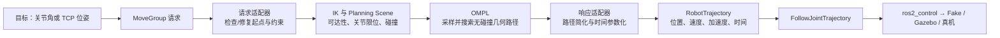

# OMPL 与 MoveIt 规划管线学习手册

> [!abstract] 学习目标
> 不是实现一个新的 RRT，而是能在当前 AUBO i5 项目中回答四个问题：**请求如何进入 MoveIt？OMPL 如何找到无碰撞路径？路径如何变成可执行轨迹？失败时应该修改哪个层？**

## 1. 先建立正确心智模型



各层只负责一类问题：

| 层 | 输入/输出 | 主要负责 | 不负责 |
| --- | --- | --- | --- |
| IK | TCP 目标 → 一组关节角 | 找到满足位姿的关节姿态 | 绕开障碍物。 |
| Planning Scene | 机器人状态 + 障碍物 | 碰撞、附着物、允许碰撞矩阵 | 控制电机。 |
| OMPL | 起点、目标、状态有效性检查 | 在配置空间中搜索无碰撞几何路径 | 速度、加速度、控制柜通讯。 |
| 时间参数化 | 几何路径 | 加入时间、速度、加速度约束 | 让路径避开障碍物。 |
| 控制器 | `JointTrajectory` | 跟踪时间序列并给出反馈 | 重新规划。 |

> [!important] 最重要的区别
> **OMPL 返回的是“几何路径”。** 只有在时间参数化之后，它才成为控制器可以执行的轨迹。若 MoveIt 显示“Plan 成功”，但控制器失败，问题通常不在 RRT，而在限位、时间参数化、控制器或硬件状态。

## 2. 与当前项目逐文件对应

| 当前文件                                                   | 学习时要看什么                                   | 修改风险                 |
| ------------------------------------------------------ | ----------------------------------------- | -------------------- |
| `aubo_i5_moveit_config/config/ompl_planning.yaml`      | planner 类型、`range`、`goal_bias`、碰撞离散化参数    | 中：改动会影响规划速度和路径质量。    |
| `aubo_i5_moveit_config/config/kinematics.yaml`         | `arm` 规划组、KDL、搜索分辨率、超时                    | 中：IK 求解失败会表现为规划失败。   |
| `aubo_i5_moveit_config/config/joint_limits.yaml`       | 速度/加速度限制和默认缩放                             | 高：参数过大可能使仿真/真机执行不安全。 |
| `aubo_i5_moveit_config/config/moveit_controllers.yaml` | action 名称、关节列表、控制器映射                      | 高：不匹配时“规划成功但不执行”。    |
| `aubo_i5_moveit_config/config/ros2_controllers.yaml`   | `JointTrajectoryController` 的接口和控制频率      | 高：决定执行后端如何跟踪轨迹。      |
| `aubo_i5_moveit_config/launch/move_group.launch.py`    | OMPL pipeline、request adapters、规划场景参数如何加载 | 中：是定位“配置没有生效”的入口。    |

## 3. 七天学习与实验计划

每天 60–90 分钟；每次只改变一个变量，保留终端日志、RViz 截图和 YAML diff。

### Day 1：跑通一次请求的完整路径

目标：识别“规划”和“执行”是两件事。

1. 使用 Fake 模式启动 AUBO MoveIt 和控制器。
2. 在 RViz 中选择 `arm` 规划组，设置一个无障碍且可达的关节目标。
3. 依次点击 `Plan`、`Execute`；分别记录规划耗时、轨迹点数、执行结果。
4. 用以下命令观察控制器与 action：

```bash
ros2 control list_controllers
ros2 action list | grep follow_joint_trajectory
ros2 topic echo /joint_states --once
```

验收：能指出 `Plan` 后产生的是 `RobotTrajectory`，`Execute` 后才会向 `FollowJointTrajectory` action 发送目标。

阅读：MoveIt 的 [Motion Planning 概念说明](https://moveit.picknik.ai/main/doc/concepts/motion_planning.html)。

### Day 2：理解规划场景与碰撞

目标：知道“无碰撞”由谁判断。

1. 在 RViz Planning Scene 添加一个盒子，放在机械臂直线路径上。
2. 对相同起点和目标分别在“无盒子”和“有盒子”下规划。
3. 观察：是否失败、是否找到绕行路径、路径长度和规划时间如何变化。
4. 再把盒子紧贴末端目标，观察失败是否来自目标碰撞。

验收：能区分三种失败：起点碰撞、目标碰撞、两者之间无可行通道。

阅读：MoveIt 的 [规划绕障碍物教程](https://moveit.picknik.ai/main/doc/tutorials/planning_around_objects/planning_around_objects.html)。

### Day 3：理解 IK、关节空间和笛卡尔空间

目标：知道“末端目标不可达”为什么会在 OMPL 之前失败。

1. 在 RViz 中把末端交互标记移动到明显超出工作空间的位置。
2. 记录错误信息；再换成关节目标，验证关节空间目标不需要同样的 IK 步骤。
3. 把末端移到可达边缘，重复规划 5 次，观察可能出现的不同 IK 解或不同路径。
4. 阅读 `kinematics.yaml`，解释 `kinematics_solver_timeout` 和 `search_resolution` 的含义。

验收：能解释“IK 无解”“IK 有解但碰撞”“IK 有解且无碰撞但 OMPL 超时”的差别。

扩展阅读：MoveIt 的 [配置说明中 IK 部分](https://moveit.picknik.ai/main/doc/how_to_guides/moveit_configuration/moveit_configuration_tutorial.html)。

### Day 4：理解 RRTConnect，而不是背算法名

目标：理解采样规划器为什么不保证每次路径相同。

1. 在 `ompl_planning.yaml` 确认默认 planner，常见配置名为 `RRTConnectkConfigDefault`。
2. 同一起点、目标、障碍物重复规划 10 次，记录耗时和路径形状。
3. 将 `planning_time` 分别设为很小值（例如 0.1 s）和较大值（例如 5 s）进行对比；一次只改该参数。
4. 观察狭窄通道场景：时间不够时可能失败；成功后路径通常不是最短直线。

RRTConnect 的直觉：从起点和目标各生长一棵随机树；每次向随机采样点延伸，尝试让两棵树连接。它优先追求“尽快找到一条可行路”，不是“第一条路就是最优路”。

验收：能解释随机性、规划时间和障碍物复杂度为何影响成功率。

阅读：OMPL 的 [Primer](https://ompl.kavrakilab.org/OMPL_Primer.pdf) 中关于采样、局部连接器和树/路线图的章节；不需要通读证明。

### Day 5：阅读并小心修改 `ompl_planning.yaml`

目标：理解参数作用，而不是盲调。

优先掌握以下参数：

| 参数 | 含义 | 常见现象 | 调整原则 |
| --- | --- | --- | --- |
| `planning_time` / 请求中的 allowed planning time | 允许搜索的最长时间 | 太短：频繁超时；太长：失败反馈慢 | 先用默认值，狭窄场景再逐步增加。 |
| `range` | 树单次扩展的步长 | 太大：易跨过窄通道；太小：扩展慢 | 保持 `0.0` 让 OMPL 自动估计，除非有对照实验。 |
| `goal_bias` | 采样目标附近的概率 | 太低：接近目标慢；太高：探索不足 | 先使用默认值，通常不作为第一调参项。 |
| `longest_valid_segment_fraction` | 碰撞检查时对一条边的离散粒度 | 太大：可能漏碰撞；太小：很慢 | 小障碍物/窄缝时适度减小并测量耗时。 |
| `enforce_joint_model_state_space` | 强制关节空间规划 | 路径约束下可能更慢或行为不同 | 仅在理解约束采样后试验。 |

实验规则：复制一份基线 YAML；每次只改变一个参数；至少重复 5 次；记录成功率、平均规划时间和路径长度。不要把一次“刚好成功”当成优化。

阅读：MoveIt 官方 [OMPL Planner 配置](https://moveit.picknik.ai/main/doc/examples/ompl_interface/ompl_interface_tutorial.html)，其中明确说明碰撞离散化精度与性能/漏检风险的权衡。

### Day 6：理解 Request/Response adapters 与时间参数化

目标：定位“几何路径已找到，但轨迹仍不可执行”的问题。

1. 在 `move_group.launch.py` 找到 `request_adapters` 字符串，按顺序写出每个 adapter 的作用。
2. 重点理解：`FixStartStateBounds`、`FixStartStateCollision`、`FixStartStatePathConstraints`、`AddTimeOptimalParameterization`。
3. 故意让当前关节状态略超限，观察 adapter 是否能修正；严重超限时应拒绝，而不是强行执行。
4. 对比修改前后的 `joint_limits.yaml`：速度、加速度、缩放率会如何影响轨迹持续时间。

验收：能解释 adapter 顺序为什么重要，以及 AddTimeOptimalParameterization 与 OMPL 的职责边界。

阅读：MoveIt 官方 [Planning Adapter 教程](https://moveit.picknik.ai/main/doc/examples/planning_adapters/planning_adapters_tutorial.html)。

### Day 7：把同一规划迁移到 Gazebo，并形成故障树

目标：验证规划层和执行层的边界。

1. 使用 `hardware_type:=gazebo` 启动 Gazebo，确保与 Fake 使用同一 URDF、控制器 YAML 与 MoveIt 配置。
2. 在 Fake 和 Gazebo 上执行同一个安全的关节目标。
3. 若 Fake 成功而 Gazebo 失败，先检查惯量、关节阻尼、碰撞网格、控制器接口和仿真时间，而不是先换 RRT planner。
4. 写出自己的故障树：

```text
无法执行
├─ 没有规划结果：IK / 起点 / 目标 / 碰撞 / OMPL 时间
├─ 有规划但 action 不存在：MoveIt controller mapping
├─ action 被拒绝：关节列表、接口、起始状态、controller 状态
├─ Gazebo 抖动或穿模：惯量、碰撞模型、物理参数
└─ 真机拒绝：硬件状态、安全门、限位、网络或控制柜模式
```

验收：能用日志和话题把故障归属到一个层，而不是笼统地说“OMPL 不行”。

## 4. 三个必做小项目

### 项目 A：规划成功率基线表

选择 3 个场景：空场景、单障碍物、窄通道。每场景重复 10 次，记录：成功次数、平均规划时间、最长时间、路径点数、是否执行成功。输出一张 Markdown 表即可。

目的：建立“随机采样规划有波动”的直觉，并让调参从猜测变成对比。

### 项目 B：碰撞离散化对比

在小障碍物附近规划，分别使用默认和更细的 `longest_valid_segment_fraction`。比较是否仍能找到明显穿过障碍物的路径、规划耗时变化多少。

目的：理解碰撞检查分辨率不是越高越好，也不是越低越安全。

### 项目 C：Plan 与 Execute 的分层排障

人为制造三类问题：不可达 TCP、控制器未激活、关节限位过低。对每类记录 RViz 提示、`move_group` 日志、`ros2 control list_controllers` 结果，并给出正确修复层。

目的：形成工程排障能力；这是接入 Gazebo 和真机前最有价值的训练。

## 5. 何时学习 Pilz、STOMP、CHOMP 与约束规划

在 RRTConnect + Planning Scene + 时间参数化能熟练排障前，不需要急着换算法。

| 需求 | 下一步学习 |
| --- | --- |
| 点到点、直线、圆弧等工业确定性动作 | Pilz Industrial Motion Planner。 |
| 想在已有可行路径上优化平滑度/代价 | CHOMP 或 STOMP。 |
| 末端必须沿直线、平面或严格保持姿态 | OMPL Constrained Planning / Path Constraints。 |
| 大量重复、环境基本固定的查询 | PRM/LazyPRM 的持久路线图。 |

官方入口：MoveIt 的 [Constrained Planning 指南](https://moveit.picknik.ai/main/doc/how_to_guides/using_ompl_constrained_planning/ompl_constrained_planning.html) 与 [规划管线教程](https://moveit.picknik.ai/main/doc/examples/motion_planning_pipeline/motion_planning_pipeline_tutorial.html)。

## 6. 学完后的自测问题

能不看资料回答下面问题，就达到当前项目所需深度：

1. 为什么末端目标需要 IK，而关节目标通常不需要？
2. 为什么相同的请求会得到不同 RRTConnect 路径？
3. `longest_valid_segment_fraction` 影响什么安全/性能权衡？
4. “Plan 成功、Execute 失败”时，最先检查哪三个对象？
5. MoveIt、OMPL、时间参数化、`JointTrajectoryController` 各自的边界是什么？
6. 为什么 Gazebo 通过不代表可以直接接真机？

## 7. 推荐阅读顺序

1. [Motion Planning 概念](https://moveit.picknik.ai/main/doc/concepts/motion_planning.html)：先了解请求、约束、planner 选择。
2. [OMPL Planner 配置](https://moveit.picknik.ai/main/doc/examples/ompl_interface/ompl_interface_tutorial.html)：带着自己的 YAML 学参数。
3. [Planning Adapters](https://moveit.picknik.ai/main/doc/examples/planning_adapters/planning_adapters_tutorial.html)：理解预处理、后处理和时间参数化。
4. [MoveIt 配置指南](https://moveit.picknik.ai/main/doc/how_to_guides/moveit_configuration/moveit_configuration_tutorial.html)：把 YAML、launch、控制器连接起来。
5. [OMPL Primer](https://ompl.kavrakilab.org/OMPL_Primer.pdf)：最后补算法直觉，不必一开始读论文。

相关本地笔记：[[22-MoveIt与ros2_control加载执行全流程]]、[[30-AUBO参考驱动-仿真到真机实施手册]]、[[13-实验3-AUBO-i5建模-Gazebo与MoveIt配置]]。
